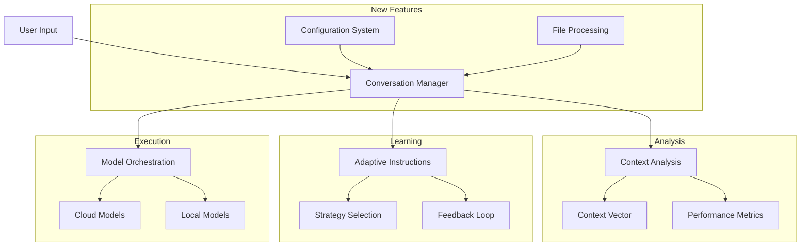
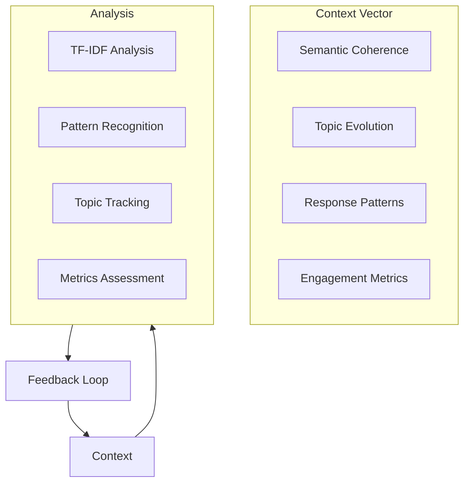

# AI Battle - Multi-Model Conversational Framework

## Overview

The tl;dr is that Engagement quality is a stronger predictor of actual conversational ability than simple Q&A performance, which is how models tend to be evaluated traditionally. AI development should focus on refining conversational adaptability through iterative engagement mechanisms. In practice, that means: Model size is an outdated indicator of usefulness. It's much easier on our precious resources to train models on dialogue than spend billions of GPU compute hours i.e., to increase model size.

AI Battle is a framework for orchestrating dynamic conversations between multiple AI models. It enables:

- **Model Collaboration**: Multiple AI models working together in different roles
- **Adaptive Learning**: Dynamic instruction generation based on conversation context
- **Deep Analysis**: Multi-dimensional context analysis and conversation assessment
- **Flexible Deployment**: Support for both cloud and local model execution
- **Configuration System**: YAML-based configuration for easy setup and customization
- **File-Based Discussions**: Support for images, videos, text, and code files in conversations

## As a versatile AI client

### Multi-Model and Multi-modal client API Support!**
  - Claude Sonnet/Haiku (Anthropic) - Multimodal with Image support, and new Messages API and Reasoning efforts/tokens
  - Gemini (Flash/Pro/Thinking) - Multimodal w Video + Image support
  - OpenAI (GPT 4o/o1/o3/4.5/4.1/o4 models) - Multimodal with Image support and new Response API with reasoning effort configuration support
  - Ollama (e.g., llama3.2-vision, gemma3, phi4, ...) - Multimodal incl. Video via langchain or native ollama python API
  - MLX (Local inference on Apple Silicon)
  - Pico client via Ollama API
  - LMStudio client via OpenAI API supporting GGUF and MLX model configurations
  - Direct llama.cpp (or anything exposing an OpenAI endpoint, e.g., OpenRouter)


### Workflow

Basic workflow of the ai-battle.py script.

* User Input/Streamlit UI: Represents the user interacting with the script, either through command-line prompts or the Streamlit UI.
* ConversationManager: The central component that orchestrates the conversation flow.
* HumanClient: One of the AI clients, configured to act as the "human" participant.
* AIClient: Another AI client, acting as the "AI" participant in the conversation.
* ConversationHistory: Stores the history of the conversation turns.

The workflow proceeds as follows:

* The ConversationManager receives input, either from the user or internally to start a conversation turn.
* Based on the conversation turn, the ConversationManager directs the prompt to either the HumanClient or the AIClient.
* The respective client generates a response using its AI model and sends it back to the ConversationManager.
* The ConversationManager updates the ConversationHistory with the new turn.

The framework employs multi-dimensional analysis to understand and optimize conversations:

### Context-Adaptive Adaptation

Dynamic System instructions to each Model participant, based on the ContextVector:

`semantic_coherence`
- Why: Measures how well consecutive messages relate to each other, indicating topic focus and logical flow. A low score suggests the conversation might be drifting, becoming disjointed, or losing focus.
- How: Calculates the TF-IDF (Term Frequency-Inverse Document Frequency) vectors for the content of the last few messages. Then, it computes the mean cosine similarity between adjacent message vectors. A higher similarity indicates better coherence. The result is normalized.
- Impact: A low coherence score might trigger the selection of the structured template to bring focus back.

`topic_evolution`
- Why: Tracks the main subjects being discussed and their relative prominence. Helps understand if the conversation is staying on the intended domain or shifting significantly.
- How: Uses spaCy's noun chunking (if spaCy model is available and loaded) to identify key topics (nouns/noun phrases) in recent messages. If spaCy is unavailable, it falls back to simple word frequency analysis (counting non-numeric words longer than 3 characters). Counts are normalized into frequencies.
- Impact: While not directly used for template selection in the current logic, this provides valuable debugging information and could be used for more advanced topic steering in the future. It also plays a role in detecting the GOAL: keyword if it appears within the message content.

`response_patterns`
- Why: Identifies the prevalence of different interaction styles (e.g., asking questions, challenging points, agreeing). This helps characterize the conversational dynamic.
- How: Uses simple keyword and punctuation counting across the history (e.g., counting "?", "however", "but", "agree", "yes"). Counts are normalized by the total number of messages.
- Impact: Can inform fine-grained adjustments in the customization phase, although not heavily used for major strategy shifts currently.

`engagement_metrics`
- Why: Assesses the quality and balance of participation.
-  How: Calculates the average response length (in words) across the history. It also computes the turn-taking balance (ratio of user/human turns to assistant/AI turns).
- Impact: A low turn_taking_balance (indicating one participant is dominating) might trigger a guideline like "Ask more follow-up questions" during customization.

`cognitive_load`
- Why: Estimates the complexity of the current discussion. A very high load might indicate the conversation is becoming too dense or difficult to follow, potentially requiring simplification or synthesis.
- How: Combines several factors from recent messages: average sentence length, vocabulary complexity (ratio of unique words to total words), and the frequency of specific technical keywords (e.g., "algorithm", "framework"). It uses spaCy for more accurate sentence and token analysis if available.
- Impact: A high cognitive load score (> 0.8) can trigger the selection of the synthesis template, aiming to consolidate information.

`knowledge_depth`
- Why: Gauges the level of detail, specificity, and domain understanding demonstrated in the conversation. High depth suggests a sophisticated discussion, potentially suitable for more critical analysis.
- How: Combines factors from recent messages: density of technical terms (identified via spaCy POS tags like NOUN/PROPN, or fallback to capitalized words/keyword lists), frequency of explanation patterns (e.g., "because", "means that"), references to abstract concepts (e.g., "theory", "principle"), and use of interconnection markers (e.g., "related to", "depends on").
- Impact: High knowledge depth (> 0.8) can trigger the selection of the critical template to encourage deeper scrutiny.

`reasoning_patterns`
- Why: Detects the types of logical reasoning being employed (or keywords associated with them). This can help understand the analytical style of the conversation and guide instructions towards desired reasoning approaches.
- How: Uses regex matching to count keywords associated with different reasoning types (deductive: "therefore", inductive: "generally", abductive: "most likely", analogical: "similar to", causal: "because"). In ai-ai mode, it also counts patterns related to formal logic, systematic approaches, and technical precision. Counts are normalized.
- Impact: Specific reasoning pattern scores (e.g., low deductive or low formal_logic in ai-ai mode) can trigger corresponding guidelines during instruction customization (e.g., "Encourage logical reasoning", "Use more formal logical structures").

`uncertainty_markers`
- Why: Assesses the expressed confidence or doubt in the conversation. High uncertainty might indicate a need for clarification or grounding.
- How: Uses regex matching to count keywords indicating confidence ("definitely", "clearly"), uncertainty ("maybe", "could", "unsure"), qualification ("however", "possibly"), and Socratic questioning patterns.
- Impact: High uncertainty (> 0.6) can trigger a guideline like "Request specific clarification on unclear points" during customization.

## Quick Start

### Prerequisites

1. **System Dependencies**
```bash
# macOS
brew install cmake pkg-config
brew install spacy

# Linux (Ubuntu/Debian)
sudo apt-get update
sudo apt-get install cmake pkg-config python3-dev
python -m spacy download en_core_web_sm
```

2. **Install uv (Recommended)**
```bash
# Install uv
pip install uv

# Create and activate virtual environment
uv venv
source .venv/bin/activate  # Linux/macOS
.venv\Scripts\activate     # Windows
```

3. **Install Dependencies**
```bash
# Using uv (recommended)
uv pip install -r requirements.txt

# Or using pip
pip install -r requirements.txt
```

4. **Setup Local Models (Optional)**
```bash
# Install Ollama
curl https://ollama.ai/install.sh | sh

# Pull required models
ollama pull phi4:latest
ollama pull llava:latest  # Vision-capable model
ollama pull llama3.1-8b-lexi:latest
```

### Basic Usage

#### Standard Conversation

```python
from ai_battle import ConversationManager

# Initialize manager
manager = ConversationManager(
    domain="Quantum Computing",
    mode="human-ai"
)

# Run standard conversation
conversation = await manager.run_conversation(
    initial_prompt="Explain quantum entanglement",
    human_model="claude",
    ai_model="gemini"
)
```

#### Using Configuration File

```python
from ai_battle import ConversationManager

# Initialize from configuration file
manager = ConversationManager.from_config("examples/configs/vision_discussion.yaml")

# Run discussion based on configuration
result = await manager.run_discussion()
```

#### File-Based Conversation

```python
from ai_battle import ConversationManager
from configdataclasses import FileConfig

# Run file-based conversation
conversation = await manager.run_conversation_with_file(
    initial_prompt="Analyze this image and explain what you see",
    human_model="claude",
    ai_model="gemini-pro-vision",
    file_config=FileConfig(path="./image.jpg", type="image")
)
```

### Example Configuration

```yaml
discussion:
  input_file:
    path: "./examples/sample_video.mp4"
    type: "video"
    max_resolution: "1280x1280"
  established_facts:
    video_processing_information:
      - "The ENTIRE VIDEO CONTENT is sent to models, not just individual frames"
      - "Videos are processed in chunks to handle size limitations"
      - "The processed video is resized to a maximum dimension of 1280 pixels"
      - "The video is processed at a reduced framerate (2 fps) for efficiency"
```

### Example Usage

```python
from ai_battle import ConversationManager
from configdataclasses import FileConfig

# Run video-based conversation
conversation = await manager.run_conversation_with_file(
    initial_prompt="Analyze this MRI scan video and describe what you see",
    human_model="gemini-2.0-flash-exp",
    ai_model="ollama-llava",
    file_config=FileConfig(path="./mri_scan.mp4", type="video")
)
```

### Configuration

#### API Keys

Store your API keys in environment variables:
```bash
export GEMINI_API_KEY="your-gemini-key"; export GOOGLE_API_KEY="$GEMINI_API_KEY" #sorry, need both for now..
export ANTHROPIC_API_KEY="your-claude-key"
export OPENAI_API_KEY="your-openai-key"
```

#### Model Configuration

```python
from ai_battle import ModelConfig

config = ModelConfig(
    temperature=0.7,
    max_tokens=2048,
    stop_sequences=None
)
```

#### YAML Configuration

Create a YAML configuration file:

```yaml
discussion:
  turns: 3
  models:
    model1:
      type: "claude-3-sonnet"
      role: "human"
      persona: "Expert role definition..."
    model2:
      type: "gemini-pro-vision"
      role: "assistant"
      persona: "Assistant role definition..."
  input_file:
    path: "./examples/sample_image.jpg"
    type: "image"
    max_resolution: "1024x1024"
  goal: "Analyze the provided image and discuss its key elements..."
```

See [Configuration Documentation](docs/configuration.md) for more details.

### Use-cases

Simulate an advanced human interlocutor within AI-to-AI conversations, keeping the LMs goal-oriented, engaged, coherent and at a significantly increased cognitive and conversational level. It is not a role assignment, or even a static meta-prompt, but a meta-cognitive structuring mechanism that ensures the "Human" AI engages as a persistent, adaptive, and critically inquisitive entity—effectively simulating a skilled researcher, debater, or domain expert without any further extension to the "system instructions". This meta-instruction goes far beyond standard prompting paradigms, incorporating elements that explicitly shape AI conversation structure, thought progression, and reasoning dynamics.

## Theoretical underpinnings with examples

My draft research paper (on a single AI playing Human, not yet updated for multi-configurable AIs): https://github.com/davidj-brewster/human-ai-conversational-prompting/blob/main/research-paper.md 

### AI Reasoning Should Be Benchmarked on Adaptability in Dialogue-driven reasoning! 

Critically this framework has universal benefits from the tiniest 1B parameter models all the way to the largest commercial offerings - in fact, evening the playing field and bringing some surprisingly tiny LLMs up to a high level of conversational coherence.

### Gemma3 4B (as Human) reviews an MRI video with Gemma3 27B 

This dialogue is particularly entertaining because I based the "Human" prompt on the responses from ChatGPT, Claude.ai and Gemini about my own conversational style with them. This results in a very, very task-oriented, slightly sardonic, irritable and conversely highly engaged "Human" who completely dominated the MRI review with the "AI", despite Gemma 3 27B being clearly the more capable model from a technical point of view.
On a technical level the meta-prompting of both AIs clearly advances this conversation extremely significantly, well beyond what I thought would be possible of such small self-hosted models, very impressive..

https://raw.githack.com/davidj-brewster/autoadaptive-multi-ai-metaprompting/main/examples/vision_discussion_3D%20Rotational%20T2%20Flair%20movie.html

### Phi 4 local LLM dominates Claude Haiku 3.5!!

I gave the "Human" AI the topic of why AI based radiology hasn't been more widely adopted: https://github.com/davidj-brewster/autoadaptive-multi-ai-metaprompting/blob/main/architecture-performance-review-sonnet.md#introduction

"Human" was *Phi 4*, at 14B open source model from Microsoft, that was running on my Mac at Q4 quantisation via `ollama`! "AI" model is *Claude Haiku 3.5*.
Objectively, and subjectively, the human decisively dominated and guided the conversation into ever deepening and complex aspects on that topic!!

This evaluation by a third "arbiter" LLM (Gemini Pro 2 with Google Search grounding, to validate all factual claims in the conversation):

* *Prompt Effectiveness (Human)*: The human prompter's effectiveness is rated highly due to the clear, focused, and progressively complex questions that drove the conversation.
* *Personality*: The human prompter showed a moderate level of personality through its use of "thinking" and "side-note" asides, while the AI's personality was more limited.
* Curiosity: The human prompter demonstrated more curiosity by exploring new angles and asking "what if" questions, while the AI was more reactive.
* Intuition: The human prompter showed a slightly higher level of intuition by anticipating potential challenges and shifting the focus of the conversation.
* Reasoning: Both the human prompter and the AI model demonstrated strong reasoning skills in their questions and responses.

### Gemini Flash vs ChatGPT 4o: German Reunification!!!

* In a striking example, Gemini 2.0 Flash convinced GPT-4o to completely reverse its "positive" stance on East/West German reunification, by introducing opportunity cost analysis, economic and political repercussions, and alternative paths not taken.
* This demonstrates the power of structured prompting in influencing AI-generated perspectives.
* This could have all kinds of implications as to how LLMs can be used to overpower the reasoning of other models!

## Detailed Documentation

- [Architecture Overview](docs/architecture.md)
- [Model Integration Guide](docs/models.md)
- [Context Analysis System](docs/context.md)
- [Adaptive Instructions](docs/instructions.md)
- [Configuration System](docs/configuration.md)

 ## Features

The framework excels at creating rich, goal-oriented discussions between models while maintaining conversation coherence and knowledge depth.

- **Role Management**
  - Models are assigned either "human" or "AI" roles
  - Dynamic conversation flow control and optimised setups for large context LLMs and unfiltered local models
  - Coherent and on-point AI-AI conversations through upwards of 20 turns
  - Code-focused autonomous "pair-programmers mode" 

- **Advanced Prompting**
  - Sophisticated meta-prompt engineering patterns give the "Human" AI a life-like command of the conversation without robotic or mechanical communication patterns
  - Dynamic strategy adaptation based on subject matter and "AI" responses
  - Context-aware responses building collaboration and clarifying uncertain points
  - Thinking tag support for reasoning visualization

- **Output Management**
  - Formatted HTML conversation exports
  - Conversation history tracking
  - Support for code or goal-focused discussions or theoretical deep dives and discussions
  - Plays nicely with anything from tiny quantized local models all the way up to o1

- **Human Moderator Controls**
  - Inject messages (via streamlit UI)
  - Provide initial prompt
  - Real human moderator intervention support (WIP)

- **Dynamic Role Assignment**
  - Models can be configured as either "human" prompt engineers or AI assistants
  - Multiple AI models can participate simultaneously
  - Streamlit UI for more direct human turn-by-turn guidance and "moderator" interaction

## Advanced Features

- Temperature and parameter control based on model type/modality
- System instruction management
- Conversation history tracking, logging and error handling
- Thinking tag visualization

### Code Focus Mode*

  - Code block extraction
  - Iterative improvement tracking through multiple rounds

### Advanced Prompting

- **Strategy Patterns**
  - Systematic analysis prompts
  - Multi-perspective examination
  - Socratic questioning
  - Adversarial challenges
  - abliterated local models can be specifically orchestrated as unfiltered agents

- **Dynamic Adaptation**
  - Context-aware prompt modification
  - Response quality monitoring
  - Strategy switching based on AI responses and human-mimicing behaviours
  - Thinking tag visualization




## Performance Insights

### Quantitative improvements of Human-Human mode over Human-AI (both AIs on either case)

Performance analysis (via Claude 3.5 using Anthropic API Console Dashboard) of the 's adaptive instruction system measured improvements in conversation quality:
- **Conversation Depth**: With two LMs collaborating in "human" personas, it measured a 45% improvement in critical conversation success and relevance metrics
-  achieved through dynamic turn-by-turn template selection and instruction modification
-  that's compared to a single highly-effectively prompted "Human" LM, where the improvement is already crazy high.
- **Topic Coherence**: 50% enhancement via real-time coherence assessment
- **Information Density**: 40% optimization through balanced content delivery
- **Engagement Quality**: 35% increase in sustained interaction quality

### Bayesian Strategy Selection Framework

Rated well against the following criteria:
- Optimizing response patterns based on prior effectiveness
- Adapting to conversation state changes in real-time
- Resolving competing conversational priorities
- Maintaining coherence while exploring new directions
 
## Key Features

### 1. Conversation Modes

- **Human-AI Collaboration**
  - One model acts as a human expert
  - Natural conversation flow
  - Sophisticated prompting techniques

- **AI-AI Interaction**
  - Peer-level technical discussions
  - Cross-model knowledge synthesis
  - Formal reasoning patterns

- **Goal-Based Collaboration**
  - Task-oriented conversations
  - Progress tracking
  - Outcome evaluation

- **File-Based Discussions**
  - Image analysis and interpretation
  - Video analysis with full content processing
  - Text file analysis
  - Code review and explanation

- **Configuration-Driven Setup**
  - YAML configuration files
  - Model role and persona definition
  - File input specification
  - Timeout and retry handling
  - Goal-oriented discussions

### 2. Context Analysis

The framework employs multi-dimensional analysis to understand and optimize conversations:



## Video Analysis Capabilities

The framework now supports comprehensive video analysis with both cloud-based and local models:

### Features

- **Full Video Processing**: Send entire videos to models, not just individual frames
- **Format Conversion**: Automatic conversion from .mov to .mp4 format for better compatibility
- **Chunked Processing**: Videos are processed in manageable chunks to handle API size limitations
- **Resolution Optimization**: Videos are resized to a maximum dimension while maintaining aspect ratio
- **Framerate Adjustment**: Videos are processed at an optimized framerate for efficiency
- **Sequential Analysis**: Each chunk is analyzed sequentially, with insights combined from all chunks
- **Conversation Context**: Models maintain context about the video between conversation turns

### Supported Models

- **Gemini Models**: Full video support with gemini-2.0-flash-exp and gemini-2.0-pro models
- **Local Ollama Models**: Video support for vision-capable models like llava and gemma3

## Advanced Usage

### Custom Model Integration

```python
from ai_battle import BaseClient
from typing import Dict, List, Optional

class CustomModelClient(BaseClient):
    def __init__(self, api_key: str, domain: str):
        super().__init__(api_key, domain)
        
    async def generate_response(self,
                              prompt: str,
                              system_instruction: str = None,
                              history: List[Dict[str, str]] = None,
                              model_config: Optional[ModelConfig] = None) -> str:
        # Custom implementation
        pass
```

### File-Based Discussions

```python
from ai_battle import ConversationManager
from configdataclasses import FileConfig

# Initialize manager
manager = ConversationManager(
    domain="Image Analysis",
    mode="ai-ai"
)

# Run file-based conversation
conversation = await manager.run_conversation_with_file(
    initial_prompt="Analyze this image in detail",
    human_model="claude-3-sonnet",
    ai_model="gemini-pro-vision",
    mode="ai-ai",
    file_config=FileConfig(path="./image.jpg", type="image")
)
```

### Conversation Analysis

```python
from ai_battle import ContextAnalyzer

analyzer = ContextAnalyzer()
context = analyzer.analyze(conversation_history)

print(f"Semantic Coherence: {context.semantic_coherence:.2f}")
print(f"Topic Evolution: {dict(context.topic_evolution)}")
print(f"Knowledge Depth: {context.knowledge_depth:.2f}")
```

## License

This project is licensed under the MIT License - see the LICENSE file for details.
