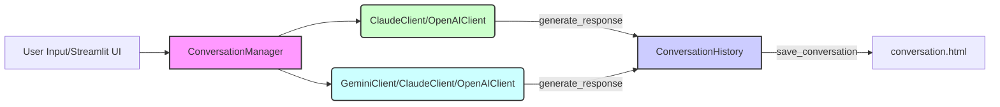
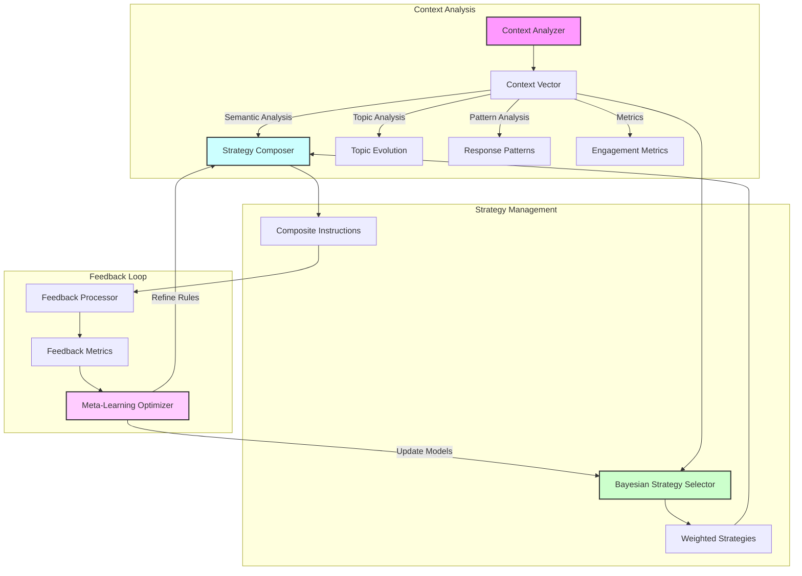

# AI Battle - Multi-Model Conversational Framework

A Python framework for orchestrating conversations between multiple AI models (Claude, Gemini, OpenAI, MLX) where one model acts as a "human" prompt engineer while others respond as AI assistants.

## Features

- **Multi-Model Support**
  - Claude (Anthropic)
  - Gemini (Google)
  - OpenAI (GPT models)
  - MLX (Local inference)
  - Ollama integration

- **Role Management**
  - Models can play either "human" or "AI" roles
  - Real human moderator intervention support
  - Dynamic conversation flow control

- **Advanced Prompting**
  - Sophisticated prompt engineering patterns
  - Dynamic strategy adaptation
  - Context-aware responses
  - Thinking tag support for reasoning visualization

- **Output Management**
  - HTML conversation export
  - Filtered view options
  - Conversation history tracking
  - Support for code-focused discussions

## Workflow Architecture



This diagram illustrates the basic workflow of the `ai-battle.py` script.

-   **User Input/Streamlit UI:** Represents the user interacting with the script, either through command-line prompts or the Streamlit UI.
-   **ConversationManager:** The central component that orchestrates the conversation flow.
-   **HumanClient (ClaudeClient/OpenAIClient):**  One of the AI clients, configured to act as the "human" participant.
-   **AIClient (GeminiClient/ClaudeClient/OpenAIClient):** Another AI client, acting as the "AI" participant in the conversation.
-   **ConversationHistory:**  Stores the history of the conversation turns.
-   **HTMLFile (conversation.html):** The output file where the conversation is saved in HTML format.

The workflow proceeds as follows:

1.  The `ConversationManager` receives input, either from the user or internally to start a conversation turn.
2.  Based on the conversation turn, the `ConversationManager` directs the prompt to either the `HumanClient` or the `AIClient`.
3.  The respective client generates a response using its AI model and sends it back to the `ConversationManager`.
4.  The `ConversationManager` updates the `ConversationHistory` with the new turn.
5.  Optionally, the `ConversationHistory` can be saved to an HTML file using the `save_conversation` function.

## Adaptive Instruction System

The framework includes a sophisticated adaptive instruction system that dynamically generates and evolves instructions for the "human" role based on conversation context and effectiveness.



### Components

1. **Context Analysis**
   - Analyzes conversation semantics, topic evolution, and response patterns
   - Generates multi-dimensional context vectors
   - Tracks engagement metrics and cognitive load

2. **Strategy Management**
   - Uses Bayesian inference for strategy selection
   - Dynamically composes instruction sets
   - Resolves conflicts between competing strategies
   - Maintains strategy effectiveness history

3. **Feedback Processing**
   - Measures instruction effectiveness
   - Tracks adherence to guidelines
   - Analyzes response innovation and reasoning depth
   - Provides metrics for strategy optimization

4. **Meta-Learning**
   - Continuously optimizes strategy selection
   - Refines composition rules
   - Adjusts context importance weights
   - Learns patterns across conversations

### Key Features

- **Multi-dimensional Context Analysis:** Considers semantic coherence, topic evolution, response patterns, and engagement metrics
- **Bayesian Strategy Selection:** Probabilistic selection of instruction strategies based on context and historical effectiveness
- **Dynamic Strategy Composition:** Combines multiple strategies with appropriate weights and modifiers
- **Continuous Learning:** Adapts and improves instruction generation through feedback and meta-learning
- **Coherence Maintenance:** Ensures generated instructions remain consistent and effective

## Requirements

```python
pip install -r requirements.txt
```

## Feature Details

### Role Management

- **Dynamic Role Assignment**
  - Models can be configured as either "human" prompt engineers or AI assistants
  - Switch roles mid-conversation
  - Multiple AI models can participate simultaneously
  ```python
  # Example: Configure Claude as human, Gemini as AI
  manager = ConversationManager()
  await manager.run_conversation(
      human_model="claude",
      ai_model="gemini",
      initial_prompt="Let's discuss quantum computing"
  )
  # Moderator intervention
  await manager.moderator_intervention(
      "Let's focus more on practical applications"
  )
  # Example system instructions for "human" role
  system_instruction = """
  Approach topics systematically:
  1. Initial exploration
  2. Deep dive analysis
  3. Challenge assumptions
  4. Synthesize insights
  """
  # Example thinking tag in response
  "<thinking>Consider edge cases in quantum error correction</thinking>"