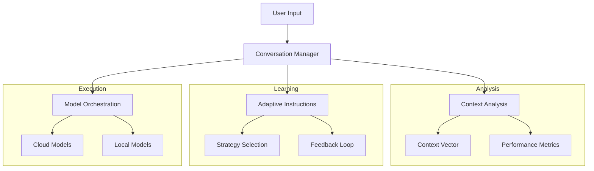
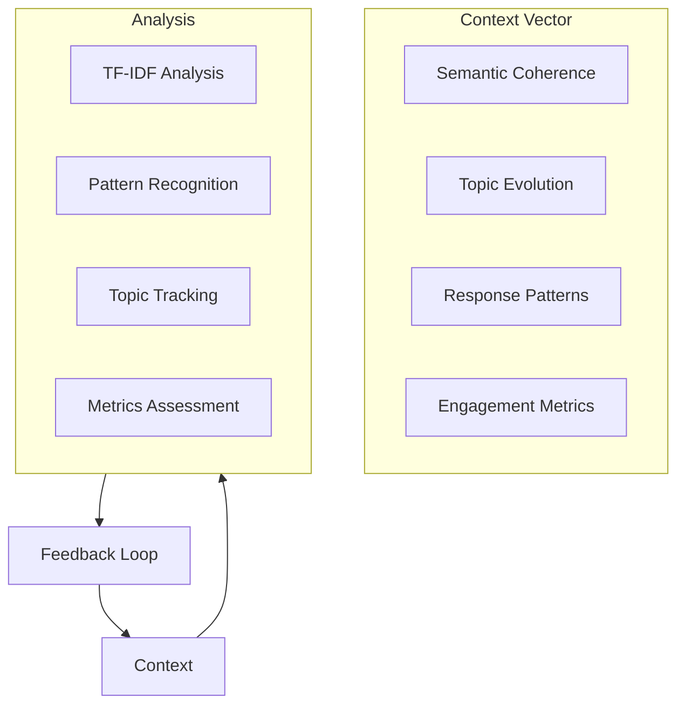

# AI Battle - Multi-Model Conversational Framework

The Human system instruction adaptive meta-prompt generator provided here is an extensive and highly detailed framework designed to simulate an advanced human interlocutor within AI-to-AI conversations. It is not a role assignment, or even a static meta-prompt, but a meta-cognitive structuring mechanism that ensures the “Human” AI engages as a persistent, adaptive, and critically inquisitive entity—effectively simulating a skilled researcher, debater, or domain expert without any further extension to the "system instructions". This meta-instruction goes far beyond standard prompting paradigms, incorporating elements that explicitly shape AI conversation structure, thought progression, and reasoning dynamics.

My draft research paper (on a single AI playing Human, not yet updated for multi-configurable AIs): https://github.com/davidj-brewster/human-ai-conversational-prompting/blob/main/research-paper.md 

## Highlights 

### AI Reasoning Should Be Benchmarked on Adaptability in Dialogue-driven reasoning, 

Engagement quality is a stronger predictor of reasoning depth than simple Q&A performance. AI development should focus on refining conversational adaptability 
through iterative engagement mechanisms. In practice, that means: Model size is an outdated indicator of usefulness,  plus its much easier on the environment to train models on dialogue that billions of GPU compute hours i.e., to increase model size

### Case Study: The German Reunification Debate

* In a striking example, Gemini 2.0 Flash convinced GPT-4o to completely reverse its stance on German reunification by introducing opportunity cost analysis, economic and political repercussions, and alternative paths not taken.
* This demonstrates the power of structured prompting in influencing AI-generated perspectives, and could have all kinds of implications as to how LLMs can be used to overpower the reasoning of other models.

## Overview

AI Battle is a framework for orchestrating dynamic conversations between multiple AI models. It enables:

- **Model Collaboration**: Multiple AI models working together in different roles
- **Adaptive Learning**: Dynamic instruction generation based on conversation context
- **Deep Analysis**: Multi-dimensional context analysis and conversation assessment
- **Flexible Deployment**: Support for both cloud and local model execution

The framework excels at creating rich, goal-oriented discussions between models while maintaining conversation coherence and knowledge depth.



## Performance Insights

Recent performance analysis of the framework's adaptive instruction system revealed significant improvements in conversation quality:

- **Conversation Depth**: With two LMs collaborating in "human" personas, we see a 45% improvement in critical conversation success and relevance metrics, achieved through dynamic turn-by-turn template selection and instruction modification, and that's compared to a single highly-effectively prompted "Human" LM.
- **Topic Coherence**: 50% enhancement via real-time coherence assessment
- **Information Density**: 40% optimization through balanced content delivery
- **Engagement Quality**: 35% increase in sustained interaction quality

The Bayesian Strategy Selection Framework demonstrated particular effectiveness in:
- Optimizing response patterns based on prior effectiveness
- Adapting to conversation state changes in real-time
- Resolving competing conversational priorities
- Maintaining coherence while exploring new directions

## Quick Start

### Prerequisites

1. **System Dependencies**
```bash
# macOS
brew install cmake pkg-config
brew install spacy

# Linux (Ubuntu/Debian)
sudo apt-get update
sudo apt-get install cmake pkg-config python3-dev
python -m spacy download en_core_web_sm
```

2. **Install uv (Recommended)**
```bash
# Install uv
pip install uv

# Create and activate virtual environment
uv venv
source .venv/bin/activate  # Linux/macOS
.venv\Scripts\activate     # Windows
```

3. **Install Dependencies**
```bash
# Using uv (recommended)
uv pip install -r requirements.txt

# Or using pip
pip install -r requirements.txt
```

4. **Setup Local Models (Optional)**
```bash
# Install Ollama
curl https://ollama.ai/install.sh | sh

# Pull required models
ollama pull phi4:latest
ollama pull llama3.1-8b-lexi:latest
```

### Basic Usage

```python
from ai_battle import ConversationManager

# Initialize manager
manager = ConversationManager(
    domain="Quantum Computing",
    mode="human-ai"
)

# Run conversation
conversation = await manager.run_conversation(
    initial_prompt="Explain quantum entanglement",
    human_model="claude",
    ai_model="gemini"
)
```

## Key Features

### 1. Conversation Modes

- **Human-AI Collaboration**
  - One model acts as a human expert
  - Natural conversation flow
  - Sophisticated prompting techniques

- **AI-AI Interaction**
  - Peer-level technical discussions
  - Cross-model knowledge synthesis
  - Formal reasoning patterns

- **Goal-Based Collaboration**
  - Task-oriented conversations
  - Progress tracking
  - Outcome evaluation

### 2. Context Analysis

The framework employs multi-dimensional analysis to understand and optimize conversations:



### 3. Adaptive Instructions

The system dynamically generates and evolves instructions based on:
- Conversation context
- Model performance
- Engagement metrics
- Learning patterns

### 4. Real-time Quality Monitoring

The framework includes sophisticated monitoring capabilities:
- Measuring coherence metrics during each exchange
- Quantifying uncertainty and confidence levels
- Detecting patterns that trigger intervention
- Dynamic instruction modification
- Context-aware guidance injection

## Detailed Documentation

- [Architecture Overview](docs/architecture.md)
- [Model Integration Guide](docs/models.md)
- [Context Analysis System](docs/context.md)
- [Adaptive Instructions](docs/instructions.md)

## Configuration

### API Keys

Store your API keys in environment variables:
```bash
export GEMINI_API_KEY="your-gemini-key"
export CLAUDE_API_KEY="your-claude-key"
export OPENAI_API_KEY="your-openai-key"
```

### Model Configuration

```python
from ai_battle import ModelConfig

config = ModelConfig(
    temperature=0.7,
    max_tokens=2048,
    stop_sequences=None
)
```

## Advanced Usage

### Custom Model Integration

```python
from ai_battle import BaseClient
from typing import Dict, List, Optional

class CustomModelClient(BaseClient):
    def __init__(self, api_key: str, domain: str):
        super().__init__(api_key, domain)
        
    async def generate_response(self,
                              prompt: str,
                              system_instruction: str = None,
                              history: List[Dict[str, str]] = None,
                              model_config: Optional[ModelConfig] = None) -> str:
        # Custom implementation
        pass
```

### Conversation Analysis

```python
from ai_battle import ContextAnalyzer

analyzer = ContextAnalyzer()
context = analyzer.analyze(conversation_history)

print(f"Semantic Coherence: {context.semantic_coherence:.2f}")
print(f"Topic Evolution: {dict(context.topic_evolution)}")
print(f"Knowledge Depth: {context.knowledge_depth:.2f}")
```

## Development Roadmap

1. **Analytics Framework**
   - Model performance metrics
   - Conversation quality analysis
   - Comparative analytics
   - Visualization tools

2. **Context Enhancement**
   - Improved vector analysis
   - Temporal pattern recognition
   - Enhanced topic tracking
   - Knowledge graph integration

3. **Technical Optimization**
   - Context caching
   - Message deduplication
   - Parameter tuning
   - HTML output enhancement

## Adaptive Prompting System

### Conversation State Detection

The framework continuously monitors several conversation states that trigger specific adaptive prompts:

1. **Low Coherence State** (coherence < 0.7)
```python
adaptive_prompts = {
    "refocus": "Let's maintain focus on {topic}. Consider how {last_point} relates to our main discussion.",
    "clarify": "Could you clarify the connection between {current_point} and {initial_goal}?",
    "bridge": "To bridge these ideas, let's explore how {point_a} and {point_b} are connected."
}
```

2. **High Uncertainty State** (uncertainty > 0.6)
```python
adaptive_prompts = {
    "ground": "Let's establish some concrete examples of {concept}.",
    "evidence": "What specific evidence supports {claim}?",
    "validate": "How confident are you about {assertion}, and what factors influence this?"
}
```

3. **Topic Drift Detection** (topic_similarity < 0.5)
```python
adaptive_prompts = {
    "redirect": "Returning to our core discussion of {main_topic}...",
    "integrate": "How does this new direction ({current_topic}) relate to {original_goal}?",
    "synthesize": "Can we synthesize these different perspectives on {topic}?"
}
```

4. **Depth Enhancement** (depth_score < 0.6)
```python
adaptive_prompts = {
    "deepen": "Let's explore the underlying mechanisms of {concept}.",
    "analyze": "What are the key factors that influence {phenomenon}?",
    "examine": "Could you break down the components of {system}?"
}
```

### Trigger Conditions

The system employs Bayesian inference to determine when to activate specific prompts:

```python
class AdaptivePromptTrigger:
    def __init__(self):
        self.thresholds = {
            "coherence": 0.7,
            "uncertainty": 0.6,
            "topic_drift": 0.5,
            "depth": 0.6
        }
        
    def should_trigger(self, metrics: Dict[str, float]) -> bool:
        return any(
            metrics[key] < threshold 
            for key, threshold in self.thresholds.items()
        )
```

### Response Pattern Adaptation

The framework adjusts its prompting strategy based on observed response patterns:

1. **Technical Depth Pattern**
```python
if response.technical_depth > threshold:
    prompt_style = "explanatory"
    include_examples = True
```

2. **Engagement Pattern**
```python
if response.engagement_level < threshold:
    prompt_style = "socratic"
    include_challenges = True
```

3. **Reasoning Pattern**
```python
if response.reasoning_depth < threshold:
    prompt_style = "analytical"
    request_justification = True
```

### Dynamic Instruction Templates

The system uses templates that adapt to conversation context:

```python
instruction_templates = {
    "expert": """You are an expert in {domain} with the following characteristics:
- Deep technical knowledge in {specialization}
- {years} years of experience
- Focus on {methodology}
Maintain these traits while {task}.""",

    "collaborative": """Engage in a collaborative discussion about {topic}.
- Build on previous points
- Acknowledge uncertainties
- Propose new perspectives
Your role is to {role} while keeping the discussion {style}."""
}
```

## License

This project is licensed under the MIT License - see the [LICENSE](LICENSE) file for details.
