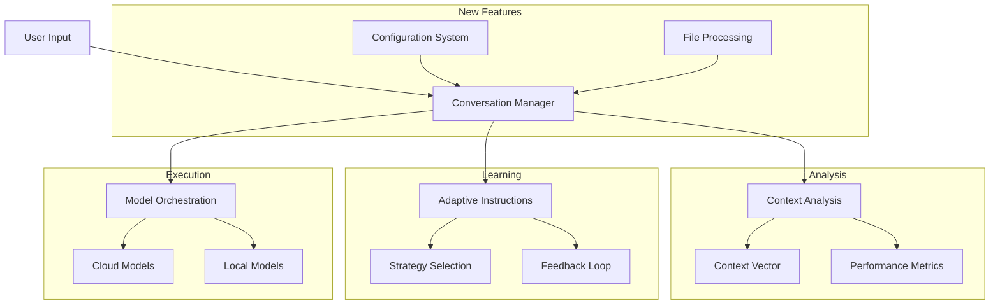
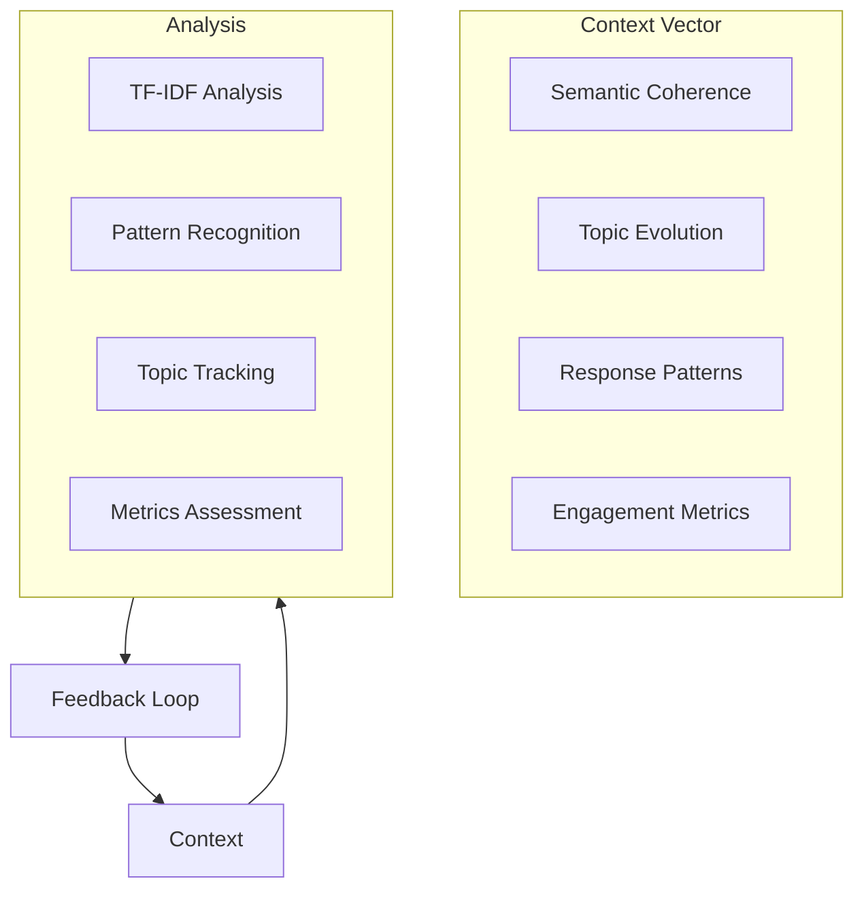

# AI Battle - Multi-Model Conversational Framework

The Human system instruction adaptive meta-prompt generator provided here is an extensive and highly detailed framework designed to simulate an advanced human interlocutor within AI-to-AI conversations. It is not a role assignment, or even a static meta-prompt, but a meta-cognitive structuring mechanism that ensures the "Human" AI engages as a persistent, adaptive, and critically inquisitive entity—effectively simulating a skilled researcher, debater, or domain expert without any further extension to the "system instructions". This meta-instruction goes far beyond standard prompting paradigms, incorporating elements that explicitly shape AI conversation structure, thought progression, and reasoning dynamics.

My draft research paper (on a single AI playing Human, not yet updated for multi-configurable AIs): https://github.com/davidj-brewster/human-ai-conversational-prompting/blob/main/research-paper.md 

### AI Reasoning Should Be Benchmarked on Adaptability in Dialogue-driven reasoning! 

Engagement quality is a stronger predictor of reasoning depth than simple Q&A performance. AI development should focus on refining conversational adaptability 
through iterative engagement mechanisms. In practice, that means: Model size is an outdated indicator of usefulness,  plus its much easier on the environment to train models on dialogue that billions of GPU compute hours i.e., to increase model size

### Phi 4 local LLM dominates Claude Haiku 3.5!!

I gave the "Human" AI the topic of why AI based radiology hasn't been more widely adopted: https://github.com/davidj-brewster/autoadaptive-multi-ai-metaprompting/blob/main/architecture-performance-review-sonnet.md#introduction

"Human" was *Phi 4*, at 14B open source model from Microsoft, that was running on my Mac at Q4 quantisation via `ollama`! "AI" model is *Claude Haiku 3.5*.
Objectively, and subjectively, the human decisively dominated and guided the conversation into ever deepening and complex aspects on that topic!!

This evaluation by a third "arbiter" LLM (Gemini Pro 2 with Google Search grounding, to validate all factual claims in the conversation):

* *Prompt Effectiveness (Human)*: The human prompter's effectiveness is rated highly due to the clear, focused, and progressively complex questions that drove the conversation.
* *Personality*: The human prompter showed a moderate level of personality through its use of "thinking" and "side-note" asides, while the AI's personality was more limited.
* Curiosity: The human prompter demonstrated more curiosity by exploring new angles and asking "what if" questions, while the AI was more reactive.
* Intuition: The human prompter showed a slightly higher level of intuition by anticipating potential challenges and shifting the focus of the conversation.
* Reasoning: Both the human prompter and the AI model demonstrated strong reasoning skills in their questions and responses.

### Gemini Flash vs ChatGPT 4o: German Reunification!!!

* In a striking example, Gemini 2.0 Flash convinced GPT-4o to completely reverse its "positive" stance on East/West German reunification, by introducing opportunity cost analysis, economic and political repercussions, and alternative paths not taken.
* This demonstrates the power of structured prompting in influencing AI-generated perspectives.
* This could have all kinds of implications as to how LLMs can be used to overpower the reasoning of other models!

## Overview

AI Battle is a framework for orchestrating dynamic conversations between multiple AI models. It enables:

- **Model Collaboration**: Multiple AI models working together in different roles
- **Adaptive Learning**: Dynamic instruction generation based on conversation context
- **Deep Analysis**: Multi-dimensional context analysis and conversation assessment
- **Flexible Deployment**: Support for both cloud and local model execution
- **Configuration System**: YAML-based configuration for easy setup and customization
- **File-Based Discussions**: Support for images, videos, text, and code files in conversations

The framework excels at creating rich, goal-oriented discussions between models while maintaining conversation coherence and knowledge depth.

 ## Features

- **Multi-Model API Support**
  - Claude (Anthropic)
  - Gemini (Google) - Video + Image input
  - OpenAI (GPT/o1 models)
  - MLX (Local inference on Apple Silicon)
  - Ollama/Pico integration - Video + Image input (e.g., llama2-vision, gemma3)
  - llama.cpp integration

- **Role Management**
  - Models are assigned either "human" or "AI" roles
  - Dynamic conversation flow control and optimised setups for large context LLMs and unfiltered local models
  - Coherent and on-point AI-AI conversations through upwards of 20 turns
  - Code-focused autonomous "pair-programmers mode" 

- **Advanced Prompting**
  - Sophisticated meta-prompt engineering patterns give the "Human" AI a life-like command of the conversation without robotic or mechanical communication patterns
  - Dynamic strategy adaptation based on subject matter and "AI" responses
  - Context-aware responses building collaboration and clarifying uncertain points
  - Thinking tag support for reasoning visualization

- **Output Management**
  - Formatted HTML conversation exports
  - Conversation history tracking
  - Support for code or goal-focused discussions or theoretical deep dives and discussions
  - Plays nicely with anything from tiny quantized local models all the way up to o1

- **Human Moderator Controls**
  - Inject messages (via streamlit UI)
  - Provide initial prompt
  - Real human moderator intervention support (WIP)

 - **Moderator intervention**

```
  python
  await manager.moderator_intervention(
      "Let's focus more on practical applications"
  )
```

- **Dynamic Role Assignment**
  - Models can be configured as either "human" prompt engineers or AI assistants
  - Multiple AI models can participate simultaneously
  - Streamlit UI for more direct human turn-by-turn guidance and "moderator" interaction

## Advanced Features

- Temperature and parameter control based on model type
- System instruction management
- Conversation history tracking, logging and error handling
- Real-time human moderation
- Thinking tag visualization

 - **Code Focus Mode**
  - Code block extraction
  - Iterative improvement tracking through multiple rounds

### Advanced Prompting

- **Strategy Patterns**
  - Systematic analysis prompts
  - Multi-perspective examination
  - Socratic questioning
  - Adversarial challenges
  - abliterated local models can be specifically orchestrated as unfiltered agents

- **Dynamic Adaptation**
  - Context-aware prompt modification
  - Response quality monitoring
  - Strategy switching based on AI responses and human-mimicing behaviours
  - Thinking tag visualization




## Performance Insights

### Quantitative improvements of Human-Human mode over Human-AI (both AIs on either case)

Performance analysis (via Claude 3.5 using Anthropic API Console Dashboard) of the 's adaptive instruction system measured improvements in conversation quality:
- **Conversation Depth**: With two LMs collaborating in "human" personas, it measured a 45% improvement in critical conversation success and relevance metrics
-  achieved through dynamic turn-by-turn template selection and instruction modification
-  that's compared to a single highly-effectively prompted "Human" LM, where the improvement is already crazy high.
- **Topic Coherence**: 50% enhancement via real-time coherence assessment
- **Information Density**: 40% optimization through balanced content delivery
- **Engagement Quality**: 35% increase in sustained interaction quality

### Bayesian Strategy Selection Framework

Rated well against the following criteria:
- Optimizing response patterns based on prior effectiveness
- Adapting to conversation state changes in real-time
- Resolving competing conversational priorities
- Maintaining coherence while exploring new directions

## Quick Start

### Prerequisites

1. **System Dependencies**
```bash
# macOS
brew install cmake pkg-config
brew install spacy

# Linux (Ubuntu/Debian)
sudo apt-get update
sudo apt-get install cmake pkg-config python3-dev
python -m spacy download en_core_web_sm
```

2. **Install uv (Recommended)**
```bash
# Install uv
pip install uv

# Create and activate virtual environment
uv venv
source .venv/bin/activate  # Linux/macOS
.venv\Scripts\activate     # Windows
```

3. **Install Dependencies**
```bash
# Using uv (recommended)
uv pip install -r requirements.txt

# Or using pip
pip install -r requirements.txt
```

4. **Setup Local Models (Optional)**
```bash
# Install Ollama
curl https://ollama.ai/install.sh | sh

# Pull required models
ollama pull phi4:latest
ollama pull llava:latest  # Vision-capable model
ollama pull llama3.1-8b-lexi:latest
```

### Basic Usage

#### Standard Conversation

```python
from ai_battle import ConversationManager

# Initialize manager
manager = ConversationManager(
    domain="Quantum Computing",
    mode="human-ai"
)

# Run standard conversation
conversation = await manager.run_conversation(
    initial_prompt="Explain quantum entanglement",
    human_model="claude",
    ai_model="gemini"
)
```

#### Using Configuration File

```python
from ai_battle import ConversationManager

# Initialize from configuration file
manager = ConversationManager.from_config("examples/configs/vision_discussion.yaml")

# Run discussion based on configuration
result = await manager.run_discussion()
```

#### File-Based Conversation

```python
from ai_battle import ConversationManager
from configdataclasses import FileConfig

# Run file-based conversation
conversation = await manager.run_conversation_with_file(
    initial_prompt="Analyze this image and explain what you see",
    human_model="claude",
    ai_model="gemini-pro-vision",
    file_config=FileConfig(path="./image.jpg", type="image")
)
```

## Key Features

### 1. Conversation Modes

- **Human-AI Collaboration**
  - One model acts as a human expert
  - Natural conversation flow
  - Sophisticated prompting techniques

- **AI-AI Interaction**
  - Peer-level technical discussions
  - Cross-model knowledge synthesis
  - Formal reasoning patterns

- **Goal-Based Collaboration**
  - Task-oriented conversations
  - Progress tracking
  - Outcome evaluation

- **File-Based Discussions**
  - Image analysis and interpretation
  - Video analysis with full content processing
  - Text file analysis
  - Code review and explanation

- **Configuration-Driven Setup**
  - YAML configuration files
  - Model role and persona definition
  - File input specification
  - Timeout and retry handling
  - Goal-oriented discussions

### 2. Context Analysis

The framework employs multi-dimensional analysis to understand and optimize conversations:



### 3. Adaptive Instructions

The system dynamically generates and evolves instructions based on:
- Conversation context
- Model performance
- Engagement metrics
- Learning patterns

### 4. Real-time Quality Monitoring

The framework includes sophisticated monitoring capabilities:
- Measuring coherence metrics during each exchange
- Quantifying uncertainty and confidence levels
- Detecting patterns that trigger intervention
- Dynamic instruction modification
- Context-aware guidance injection

## Video Analysis Capabilities

The framework now supports comprehensive video analysis with both cloud-based and local models:

### Features

- **Full Video Processing**: Send entire videos to models, not just individual frames
- **Format Conversion**: Automatic conversion from .mov to .mp4 format for better compatibility
- **Chunked Processing**: Videos are processed in manageable chunks to handle API size limitations
- **Resolution Optimization**: Videos are resized to a maximum dimension while maintaining aspect ratio
- **Framerate Adjustment**: Videos are processed at an optimized framerate for efficiency
- **Sequential Analysis**: Each chunk is analyzed sequentially, with insights combined from all chunks
- **Conversation Context**: Models maintain context about the video between conversation turns

### Supported Models

- **Gemini Models**: Full video support with gemini-2.0-flash-exp and gemini-2.0-pro models
- **Local Ollama Models**: Video support for vision-capable models like llava and gemma3

### Example Configuration

```yaml
discussion:
  input_file:
    path: "./examples/sample_video.mp4"
    type: "video"
    max_resolution: "1280x1280"
  established_facts:
    video_processing_information:
      - "The ENTIRE VIDEO CONTENT is sent to models, not just individual frames"
      - "Videos are processed in chunks to handle size limitations"
      - "The processed video is resized to a maximum dimension of 1280 pixels"
      - "The video is processed at a reduced framerate (2 fps) for efficiency"
```

### Example Usage

```python
from ai_battle import ConversationManager
from configdataclasses import FileConfig

# Run video-based conversation
conversation = await manager.run_conversation_with_file(
    initial_prompt="Analyze this MRI scan video and describe what you see",
    human_model="gemini-2.0-flash-exp",
    ai_model="ollama-llava",
    file_config=FileConfig(path="./mri_scan.mp4", type="video")
)
```

## Detailed Documentation

- [Architecture Overview](docs/architecture.md)
- [Model Integration Guide](docs/models.md)
- [Context Analysis System](docs/context.md)
- [Adaptive Instructions](docs/instructions.md)
- [Configuration System](docs/configuration.md)

## Configuration

### API Keys

Store your API keys in environment variables:
```bash
export GEMINI_API_KEY="your-gemini-key"
export CLAUDE_API_KEY="your-claude-key"
export OPENAI_API_KEY="your-openai-key"
```

### Model Configuration

```python
from ai_battle import ModelConfig

config = ModelConfig(
    temperature=0.7,
    max_tokens=2048,
    stop_sequences=None
)
```

### YAML Configuration

Create a YAML configuration file:

```yaml
discussion:
  turns: 3
  models:
    model1:
      type: "claude-3-sonnet"
      role: "human"
      persona: "Expert role definition..."
    model2:
      type: "gemini-pro-vision"
      role: "assistant"
      persona: "Assistant role definition..."
  input_file:
    path: "./examples/sample_image.jpg"
    type: "image"
    max_resolution: "1024x1024"
  goal: "Analyze the provided image and discuss its key elements..."
```

See [Configuration Documentation](docs/configuration.md) for more details.

## Advanced Usage

### Custom Model Integration

```python
from ai_battle import BaseClient
from typing import Dict, List, Optional

class CustomModelClient(BaseClient):
    def __init__(self, api_key: str, domain: str):
        super().__init__(api_key, domain)
        
    async def generate_response(self,
                              prompt: str,
                              system_instruction: str = None,
                              history: List[Dict[str, str]] = None,
                              model_config: Optional[ModelConfig] = None) -> str:
        # Custom implementation
        pass
```

### File-Based Discussions

```python
from ai_battle import ConversationManager
from configdataclasses import FileConfig

# Initialize manager
manager = ConversationManager(
    domain="Image Analysis",
    mode="ai-ai"
)

# Run file-based conversation
conversation = await manager.run_conversation_with_file(
    initial_prompt="Analyze this image in detail",
    human_model="claude-3-sonnet",
    ai_model="gemini-pro-vision",
    mode="ai-ai",
    file_config=FileConfig(path="./image.jpg", type="image")
)
```

### Conversation Analysis

```python
from ai_battle import ContextAnalyzer

analyzer = ContextAnalyzer()
context = analyzer.analyze(conversation_history)

print(f"Semantic Coherence: {context.semantic_coherence:.2f}")
print(f"Topic Evolution: {dict(context.topic_evolution)}")
print(f"Knowledge Depth: {context.knowledge_depth:.2f}")
```

## Development Roadmap

1. **Analytics Framework**
   - ✅ Configuration system
   - ✅ File-based discussions
   - ✅ Vision model support
   - ✅ Local model vision capabilities
   - ✅ Full video analysis with cloud and local models
   - ⏳ Additional features:
   - Model performance metrics
   - Conversation quality analysis
   - Comparative analytics
   - Visualization tools

2. **Context Enhancement**
   - Improved vector analysis
   - Temporal pattern recognition
   - Enhanced topic tracking
   - Knowledge graph integration

3. **Technical Optimization**
   - Context caching
   - Message deduplication
   - Parameter tuning
   - HTML output enhancement

## Adaptive Prompting System

### Conversation State Detection

The framework continuously monitors several conversation states that trigger specific adaptive prompts:

1. **Low Coherence State** (coherence < 0.7)
```python
adaptive_prompts = {
    "refocus": "Let's maintain focus on {topic}. Consider how {last_point} relates to our main discussion.",
    "clarify": "Could you clarify the connection between {current_point} and {initial_goal}?",
    "bridge": "To bridge these ideas, let's explore how {point_a} and {point_b} are connected."
}
```

2. **High Uncertainty State** (uncertainty > 0.6)
```python
adaptive_prompts = {
    "ground": "Let's establish some concrete examples of {concept}.",
    "evidence": "What specific evidence supports {claim}?",
    "validate": "How confident are you about {assertion}, and what factors influence this?"
}
```

3. **Topic Drift Detection** (topic_similarity < 0.5)
```python
adaptive_prompts = {
    "redirect": "Let's return to our discussion of {original_topic}.",
    "connect": "How does {current_topic} relate to our original focus on {original_topic}?",
    "integrate": "Can we integrate these insights about {current_topic} with our main discussion of {original_topic}?"
}
```

## License

This project is licensed under the MIT License - see the LICENSE file for details.
