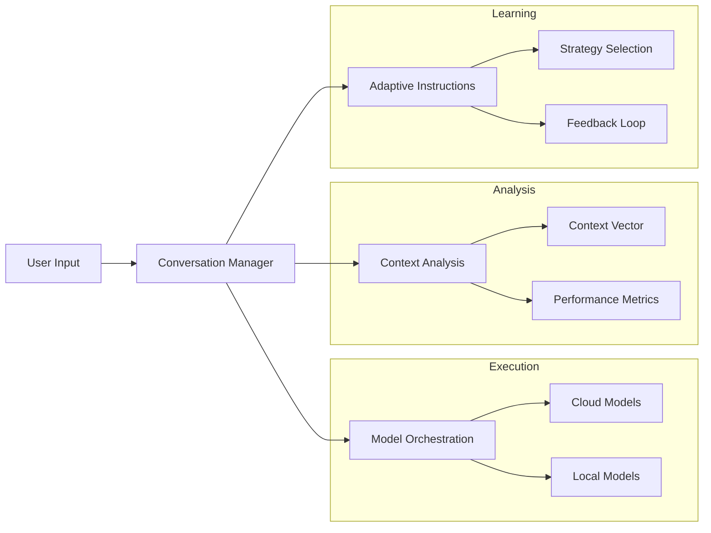

# AI Battle - Multi-Model Conversational Framework

## Overview

AI Battle is a sophisticated framework for orchestrating dynamic conversations between multiple AI models. It enables:

- **Model Collaboration**: Multiple AI models working together in different roles
- **Adaptive Learning**: Dynamic instruction generation based on conversation context
- **Deep Analysis**: Multi-dimensional context analysis and conversation assessment
- **Flexible Deployment**: Support for both cloud and local model execution

The framework excels at creating rich, goal-oriented discussions between models while maintaining conversation coherence and knowledge depth.



## Quick Start

### Prerequisites

1. **System Dependencies**
```bash
# macOS
brew install cmake pkg-config
brew install spacy

# Linux (Ubuntu/Debian)
sudo apt-get update
sudo apt-get install cmake pkg-config python3-dev
python -m spacy download en_core_web_sm
```

2. **Install uv (Recommended)**
```bash
# Install uv
pip install uv

# Create and activate virtual environment
uv venv
source .venv/bin/activate  # Linux/macOS
.venv\Scripts\activate     # Windows
```

3. **Install Dependencies**
```bash
# Using uv (recommended)
uv pip install -r requirements.txt

# Or using pip
pip install -r requirements.txt
```

4. **Setup Local Models (Optional)**
```bash
# Install Ollama
curl https://ollama.ai/install.sh | sh

# Pull required models
ollama pull phi4:latest
ollama pull llama3.1-8b-lexi:latest
```

### Basic Usage

```python
from ai_battle import ConversationManager

# Initialize manager
manager = ConversationManager(
    domain="Quantum Computing",
    mode="human-ai"
)

# Run conversation
conversation = await manager.run_conversation(
    initial_prompt="Explain quantum entanglement",
    human_model="claude",
    ai_model="gemini"
)
```

## Key Features

### 1. Conversation Modes

- **Human-AI Collaboration**
  - One model acts as a human expert
  - Natural conversation flow
  - Sophisticated prompting techniques

- **AI-AI Interaction**
  - Peer-level technical discussions
  - Cross-model knowledge synthesis
  - Formal reasoning patterns

- **Goal-Based Collaboration**
  - Task-oriented conversations
  - Progress tracking
  - Outcome evaluation

### 2. Context Analysis

The framework employs multi-dimensional analysis to understand and optimize conversations:

```mermaid
graph TB
    subgraph Context Vector
        SC[Semantic Coherence]
        TE[Topic Evolution]
        RP[Response Patterns]
        EM[Engagement Metrics]
    end
    
    subgraph Analysis
        TF[TF-IDF Analysis]
        PA[Pattern Recognition]
        TA[Topic Tracking]
        MA[Metrics Assessment]
    end
    
    Context Vector --> Analysis
    Analysis --> Feedback[Feedback Loop]
    Feedback --> Context Vector
```

### 3. Adaptive Instructions

The system dynamically generates and evolves instructions based on:
- Conversation context
- Model performance
- Engagement metrics
- Learning patterns

## Detailed Documentation

- [Architecture Overview](docs/architecture.md)
- [Model Integration Guide](docs/models.md)
- [Context Analysis System](docs/context.md)
- [Adaptive Instructions](docs/instructions.md)

## Configuration

### API Keys

Store your API keys in environment variables:
```bash
export GEMINI_API_KEY="your-gemini-key"
export CLAUDE_API_KEY="your-claude-key"
export OPENAI_API_KEY="your-openai-key"
```

### Model Configuration

```python
from ai_battle import ModelConfig

config = ModelConfig(
    temperature=0.7,
    max_tokens=2048,
    stop_sequences=None
)
```

## Advanced Usage

### Custom Model Integration

```python
from ai_battle import BaseClient
from typing import Dict, List, Optional

class CustomModelClient(BaseClient):
    def __init__(self, api_key: str, domain: str):
        super().__init__(api_key, domain)
        
    async def generate_response(self,
                              prompt: str,
                              system_instruction: str = None,
                              history: List[Dict[str, str]] = None,
                              model_config: Optional[ModelConfig] = None) -> str:
        # Custom implementation
        pass
```

### Conversation Analysis

```python
from ai_battle import ContextAnalyzer

analyzer = ContextAnalyzer()
context = analyzer.analyze(conversation_history)

print(f"Semantic Coherence: {context.semantic_coherence:.2f}")
print(f"Topic Evolution: {dict(context.topic_evolution)}")
print(f"Knowledge Depth: {context.knowledge_depth:.2f}")
```

## Development Roadmap

1. **Analytics Framework**
   - Model performance metrics
   - Conversation quality analysis
   - Comparative analytics
   - Visualization tools

2. **Context Enhancement**
   - Improved vector analysis
   - Temporal pattern recognition
   - Enhanced topic tracking
   - Knowledge graph integration

3. **Technical Optimization**
   - Context caching
   - Message deduplication
   - Parameter tuning
   - HTML output enhancement

## Contributing

Contributions are welcome! Please read our [Contributing Guidelines](CONTRIBUTING.md) before submitting pull requests.

## License

This project is licensed under the MIT License - see the [LICENSE](LICENSE) file for details.