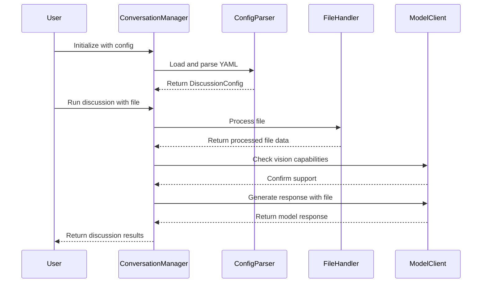

# Project Plan: Enhanced Multi-Model Discussion Framework

## Overview

This document outlines the plan for extending the AI Battle framework to support file-based discussions and enhanced configuration capabilities. The implementation will be structured in phases to ensure maintainable, testable code while preserving the framework's core strengths in meta-prompting and model orchestration.

## Technical Architecture

### New Components

1. **File Processing System**
   - Image handling with resolution preservation
   - Video processing and frame extraction
   - Text file processing and chunking
   - MIME type detection and validation
   - File content integration with conversation context

2. **Configuration Manager**
   ```yaml
   discussion:
     turns: 3  # Number of back-and-forth exchanges
     models:
       model1:
         type: "claude-3YS-sonnet"  # Model identifier
         role: "human"            # Role in conversation
         persona: |               # Persona-based system_ nstructions
           You are a neurological radiologist with the following characteristics:
            - 15 years of clinical experience
            - Specialization in advanced imaging techniques
            - Research focus on early detection patterns
            - Known for innovative diagnostic approaches
            [Additional persona details integrated into role prompt]
       model2:
         type: "gemini-pro"
         role: "assistant"
         persona: |
           You are an AI assistant with the following characteristics:
            - Deep expertise in medical imaging analysis
            - Collaborative approach to diagnosis
            - Evidence-based reasoning methodology
            [Additional persona details integrated into role prompt]
      
      timeouts:
        request: 300             # Request timeout in seconds
        retry_count: 3           # Number of retries
        notify_on:
          - timeout              # Notify on timeout
          - retry               # Notify on retry
          - error              # Notify on error
     
     input_file:
       path: "./scan.mp4"        # Path to input file
       type: "video"            # image, video, or text
        max_resolution: "4K"     # Maximum resolution to maintain
       
     goal: |
       Analyze the provided brain scan video sequence and discuss potential abnormalities,
       focusing on regions of concern and possible diagnostic implications.
   ```

3. **Enhanced Context Manager**
   - File content vectorization
   - Multi-modal context handling
   - Content-aware prompt generation
   - Goal-oriented discussion tracking

### Integration Points

1. **Model Client Enhancements**
   - Vision capabilities for image-enabled models
   - File content streaming for large texts
   - Model-specific content preprocessing
   - Capability detection and routing

2. **Conversation Flow Updates**
   - Turn management based on configuration
   - Role-specific instruction handling
   - Goal progress tracking
   - File context maintenance

## Implementation Phases

### Phase 1: Configuration System (Week 1)
- [ ] YAML configuration parser
- [ ] Configuration validation
- [ ] Model capability detection
- [ ] System instruction management
- [ ] Timeout and retry handling
- [ ] Persona integration

### Phase 2: File Processing (Week 2)
- [ ] Image processing implementation
  - Resolution preservation
  - Format conversion if needed
  - Size optimization
- [ ] Video processing implementation
  - Frame extraction
  - Resolution management
  - Format handling
  - Streaming optimization
- [ ] Text file handling
  - Content chunking
  - Format detection
  - Encoding management
- [ ] Content integration with context

### Phase 3: Model Integration (Week 3)
- [ ] Vision model support
- [ ] File content streaming
- [ ] Model-specific optimizations
- [ ] Response format standardization

### Phase 4: Conversation Enhancement (Week 4)
- [ ] Turn management system
- [ ] Goal tracking implementation
- [ ] Progress metrics
- [ ] Output formatting updates

## Testing Strategy

1. **Unit Tests**
   - Configuration parsing
   - File processing
   - Model integration
   - Turn management

2. **Integration Tests**
   - End-to-end file discussions
   - Multi-model interactions
   - Configuration scenarios
   - Error handling

3. **Performance Testing**
   - Large file handling
   - Memory usage optimization
   - Response time benchmarking
   - Resource utilization

## Technical Considerations

### File Processing
- Maximum file sizes
- Supported formats
- Processing optimization
- Memory management

### Model Capabilities
- Vision support detection
- Content type compatibility
- Local Ollama model vision support
- Token limit management
- Cost optimization

### Error Handling
- File access issues
- Model API failures
- Configuration errors
- Content processing problems

## Future Extensions

1. **Analytics Enhancement**
   - File discussion metrics
   - Model performance comparison
   - Goal achievement tracking
   - Quality assessment

2. **UI Integration**
   - File upload interface
   - Configuration editor
   - Discussion visualization
   - Progress tracking

3. **Advanced Features**
   - Multiple file support
   - Real-time file updates
   - Custom model integration
   - Enhanced analytics

## Commit Strategy

### Phase 1
Note: Development is being done on the `configuration-features` branch

1. Basic configuration system
2. Model capability detection
3. System instruction management
4. Configuration validation

### Phase 2
1. Image processing core
2. Text file handling
3. Content integration
4. Processing optimization

### Phase 3
1. Vision model support
2. Content streaming
3. Model optimizations
4. Response standardization

### Phase 4
1. Turn management
2. Goal tracking
3. Progress metrics
4. Output formatting

## Success Metrics

1. **Technical Metrics**
   - File processing speed
   - Memory efficiency
   - Response times
   - Error rates

2. **User Experience**
   - Configuration ease
   - File handling reliability
   - Discussion coherence
   - Goal achievement

3. **Code Quality**
   - Test coverage
   - Documentation completeness
   - Error handling robustness
   - Maintainability

## Getting Started

1. **Configuration File**
   Create a YAML file (e.g., `discussion_config.yaml`):
   ```yaml
   discussion:
     turns: 3
     models:
       model1:
         type: "claude-3-sonnet"
         role: "human"
         persona: "Expert role definition..."
       model2:
         type: "gemini-pro"
         role: "assistant"
         persona: "Assistant role definition..."
     input_file:
       path: "./input.jpg"
       type: "image"
     goal: "Discussion objective..."
   ```

2. **Running a Discussion**
   ```python
   from ai_battle import ConversationManager
   
   # Initialize with config
   manager = ConversationManager.from_config("discussion_config.yaml")
   
   # Run discussion
   result = await manager.run_discussion()
   ```

This implementation plan ensures systematic development while maintaining the framework's core strengths in meta-prompting and model orchestration. Each phase builds upon the previous one, allowing for regular testing and validation of new features.

## Status Tracking

### Current Status
- Project Plan Created: ✅ 
- Initial Requirements Gathered: ✅
- Branch Created (configuration-features): ✅
- Development Started: 🔄

### Phase 1 Progress
- [x] Branch Created
- [ ] YAML Configuration Parser
- [ ] Configuration Validation
- [ ] Other tasks in progress...

## Implementation Summary

The following sections have been implemented according to the plan:

### 1. Configuration System Implementation

- Enhanced `configuration.py` with a comprehensive model capability detection function that supports:
  - Cloud models (Claude, GPT-4o, Gemini)
  - Local Ollama vision models (llava, bakllava, gemma3, etc.)

- Updated `configdataclasses.py` to support the YAML configuration structure with:
  - TimeoutConfig, FileConfig, ModelConfig, and DiscussionConfig classes
  - Validation logic for each configuration component

- Added `from_config` factory method to ConversationManager for configuration-driven setup

### 2. File Processing Implementation

- Enhanced `file_handler.py` to support various file types:
  - Images with automatic resizing to 1024x1024 max resolution
  - Videos with key frame extraction
  - Text files with chunking for large content
  - Code files with syntax highlighting and line numbers

- Added file type detection and validation logic
- Implemented media processing with proper error handling

### 3. Model Client Enhancements

- Updated all model client classes in `model_clients.py` to support vision capabilities:
  - Added file data parameter to generate_response methods
  - Implemented model-specific file content formatting for each API
  - Added support for Ollama vision models

- Created adapter methods in BaseClient for consistent file handling across different model types
- Added lightweight file references to avoid duplicating large file data in conversation history

### 4. Conversation Flow Updates

- Added `run_conversation_with_file` method to ConversationManager in `ai-battle.py`
- Updated `run_conversation_turn` to handle file data
- Implemented capability checking to ensure models support the provided file type
- Added graceful degradation for non-vision models

### 5. Documentation and Examples

- Created comprehensive documentation in `docs/configuration.md`
- Added example configuration in `examples/configs/vision_discussion.yaml`
- Created example script in `examples/run_vision_discussion.py`
- Updated README in `examples/README.md` with usage instructions

## Testing Instructions

To test the implementation:

1. Create a sample image file at `examples/sample_image.jpg`
2. Run the example script:
   ```bash
   python examples/run_vision_discussion.py
   ```
3. Check the generated HTML file for the conversation results

## Key Implementation Decisions

1. **Image Resizing**: All images are automatically resized to a maximum of 1024x1024 pixels to ensure compatibility with model APIs and reduce bandwidth usage.

2. **Ollama Vision Support**: Added specific detection for Ollama vision models (llava, bakllava, gemma3, etc.) to enable local vision capabilities.

3. **File Reference System**: Implemented a lightweight file reference system to avoid duplicating large file data in conversation history.

4. **Graceful Degradation**: Added fallback mechanisms for when vision-capable models are not available, converting images to text descriptions.

5. **Code File Support**: Added special handling for code files with syntax highlighting and line numbers to improve code analysis capabilities.

## Future Enhancements

1. **Multiple File Support**: Extend the framework to support multiple files in a single conversation.

2. **Advanced Video Processing**: Improve video processing with more sophisticated frame extraction and analysis.

3. **Custom File Processors**: Add support for custom file processors to handle specialized file types.

4. **Interactive File Exploration**: Enable interactive exploration of files during conversations.

5. **File Content Vectorization**: Implement file content vectorization for more sophisticated analysis and retrieval.

## Status Update

- [x] Configuration System Implementation
- [x] File Processing Implementation
- [x] Model Client Enhancements
- [x] Conversation Flow Updates
- [x] Documentation and Examples
- [ ] Testing and Validation
- [ ] Performance Optimization
- [ ] Additional Features

## Implementation Details

This section provides detailed implementation guidance for the configuration system and file-based vision support.

> **IMPORTANT**: As implementation progresses, do NOT remove the original plan from this file. This document should be appended to with current progress, not arbitrarily modified or deleted. The original plan serves as a reference point and should be preserved throughout development.

### Configuration System Implementation

#### 1. Enhanced Configuration Data Classes

Update `configdataclasses.py` to fully support the YAML configuration structure:

```python
from dataclasses import dataclass, field
from typing import Dict, List, Optional, Union, Any

@dataclass
class TimeoutConfig:
    request: int = 300
    retry_count: int = 3
    notify_on: List[str] = field(default_factory=lambda: ["timeout", "retry", "error"])

@dataclass
class FileConfig:
    path: str
    type: str  # "image", "video", or "text"
    max_resolution: Optional[str] = None

@dataclass
class ModelConfig:
    type: str  # Model identifier (e.g., "claude-3-sonnet", "gemini-pro")
    role: str  # Role in conversation (e.g., "human", "assistant")
    persona: str  # Persona-based system instructions
    
@dataclass
class DiscussionConfig:
    turns: int = 3
    models: Dict[str, ModelConfig] = field(default_factory=dict)
    timeouts: Optional[TimeoutConfig] = None
    input_file: Optional[FileConfig] = None
    goal: Optional[str] = None
```

#### 2. Configuration Parser Implementation

Create a robust configuration parser in `configuration.py`:

```python
import yaml
from typing import Dict, Any, Optional
from configdataclasses import DiscussionConfig, ModelConfig, TimeoutConfig, FileConfig

def load_config(config_path: str) -> DiscussionConfig:
    """Load and parse YAML configuration file."""
    with open(config_path, 'r') as f:
        config_data = yaml.safe_load(f)
    
    return parse_config(config_data)

def parse_config(config_data: Dict[str, Any]) -> DiscussionConfig:
    """Parse configuration dictionary into DiscussionConfig object."""
    discussion_data = config_data.get('discussion', {})
    
    # Parse models
    models = {}
    for model_id, model_data in discussion_data.get('models', {}).items():
        models[model_id] = ModelConfig(
            type=model_data.get('type'),
            role=model_data.get('role'),
            persona=model_data.get('persona', '')
        )
    
    # Parse timeouts
    timeouts = None
    if 'timeouts' in discussion_data:
        timeouts_data = discussion_data['timeouts']
        timeouts = TimeoutConfig(
            request=timeouts_data.get('request', 300),
            retry_count=timeouts_data.get('retry_count', 3),
            notify_on=timeouts_data.get('notify_on', ["timeout", "retry", "error"])
        )
    
    # Parse input file
    input_file = None
    if 'input_file' in discussion_data:
        file_data = discussion_data['input_file']
        input_file = FileConfig(
            path=file_data.get('path'),
            type=file_data.get('type'),
            max_resolution=file_data.get('max_resolution')
        )
    
    return DiscussionConfig(
        turns=discussion_data.get('turns', 3),
        models=models,
        timeouts=timeouts,
        input_file=input_file,
        goal=discussion_data.get('goal')
    )
```

#### 3. Model Capability Detection

Implement a comprehensive capability detection function that includes Ollama models:

```python
def detect_model_capabilities(model_type: str) -> Dict[str, bool]:
    """Detect capabilities of specified model."""
    capabilities = {
        "vision": False,
        "streaming": False,
        "function_calling": False
    }
    
    # Vision-capable models
    vision_models = [
        "claude-3-sonnet", "claude-3-opus", "claude-3-haiku",
        "gpt-4-vision", "gpt-4o", 
        "gemini-pro-vision", "gemini-1.5-pro"
    ]
    
    # Ollama vision-capable models
    ollama_vision_models = [
        "gemma3", "llava", "bakllava", "moondream", "llava-phi3"
    ]
    
    # Check if it's an Ollama model with vision support
    if "ollama" in model_type.lower():
        for vision_model in ollama_vision_models:
            if vision_model in model_type.lower():
                capabilities["vision"] = True
                break
    else:
        # Check cloud model vision capabilities
        for prefix in vision_models:
            if model_type.startswith(prefix):
                capabilities["vision"] = True
                break
    
    return capabilities
```

### File Processing Implementation

#### 1. Ollama-Specific Vision Support

Update the OllamaClient class in `model_clients.py` to handle vision capabilities:

```python
def generate_response(self,
                     prompt: str,
                     system_instruction: str = None,
                     history: List[Dict[str, str]] = None,
                     role: str = None,
                     mode: str = None,
                     file_data: Dict[str, Any] = None,
                     model_config: Optional[ModelConfig] = None) -> str:
    """Generate a response from Ollama model with vision support."""
    # ... existing code ...
    
    # Check if this is a vision-capable model and we have image data
    is_vision_model = any(vm in self.model.lower() for vm in ["gemma3", "llava", "bakllava", "moondream", "llava-phi3"])
    
    if is_vision_model and file_data and file_data["type"] in ["image", "video"]:
        # For Ollama vision models, we need to format the request differently
        if file_data["type"] == "image":
            # Format for image input
            response = self.client.chat(
                model=self.model,
                messages=history,
                images=[file_data["base64"]],
                options={
                    "num_ctx": 4096,
                    "temperature": 0.7,
                }
            )
        elif file_data["type"] == "video":
            # For video, use key frames
            key_frames = [frame["base64"] for frame in file_data["key_frames"]]
            # Use first frame or a selection of frames depending on model capabilities
            response = self.client.chat(
                model=self.model,
                messages=history,
                images=[key_frames[0]],  # Most Ollama models only support one image at a time
                options={
                    "num_ctx": 4096,
                    "temperature": 0.7,
                }
            )
    else:
        # Standard text-only response
        # ... existing code ...
    
    return response.message.content
```

### Implementation Sequence Diagram

