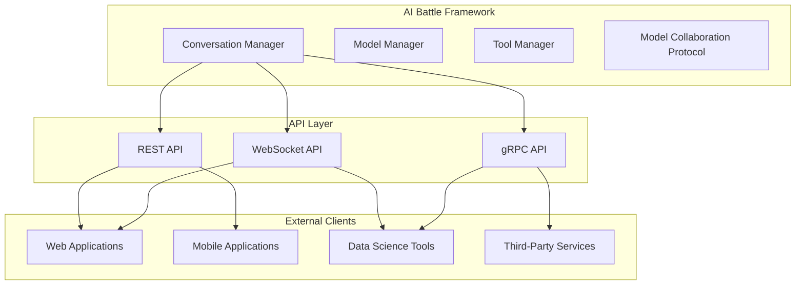

# API Integration Plan: Exposing Model APIs for External Integration

This plan focuses on extending the AI Battle framework to expose OpenAI and Ollama APIs for easier integration with existing clients, enabling "super reasoning" through model collaboration on complex problems.

## 1. Current Limitations

The current framework is primarily designed as a standalone system, with limited capabilities for:

- External API access to the framework's functionality
- Integration with existing client applications
- Standardized interfaces for model collaboration
- Exposing the framework's capabilities as services

## 2. API Integration Architecture

### 2.1 High-Level Architecture



### 2.2 API Design Principles

1. **Unified Interface**: Provide a consistent API regardless of the underlying model provider
2. **Stateless and Stateful Options**: Support both stateless (single request) and stateful (conversation) interactions
3. **Extensibility**: Design for easy addition of new models and capabilities
4. **Performance**: Optimize for low latency and high throughput
5. **Security**: Implement robust authentication and authorization
6. **Observability**: Include comprehensive logging, metrics, and tracing

## 3. REST API Implementation

### 3.1 Core Endpoints

#### 3.1.1 Models Endpoint

```
GET /api/v1/models
```

Returns a list of available models with their capabilities:

```json
{
  "models": [
    {
      "id": "claude-3-sonnet",
      "provider": "anthropic",
      "capabilities": ["text", "image", "conversation"],
      "max_tokens": 200000,
      "pricing": {
        "input": 0.00000163,
        "output": 0.00000551
      }
    },
    {
      "id": "gemini-pro",
      "provider": "google",
      "capabilities": ["text", "image", "video", "conversation"],
      "max_tokens": 32768,
      "pricing": {
        "input": 0.000000125,
        "output": 0.000000375
      }
    },
    {
      "id": "ollama-phi4",
      "provider": "ollama",
      "capabilities": ["text", "conversation"],
      "max_tokens": 4096,
      "pricing": {
        "input": 0.0,
        "output": 0.0
      }
    }
  ]
}
```

#### 3.1.2 Completions Endpoint

```
POST /api/v1/completions
```

Request:

```json
{
  "model": "claude-3-sonnet",
  "prompt": "Explain quantum computing in simple terms",
  "max_tokens": 1000,
  "temperature": 0.7,
  "system_instruction": "You are a helpful assistant that explains complex topics simply."
}
```

Response:

```json
{
  "id": "cmpl-123abc",
  "model": "claude-3-sonnet",
  "content": "Quantum computing is like...",
  "usage": {
    "prompt_tokens": 12,
    "completion_tokens": 156,
    "total_tokens": 168
  }
}
```

#### 3.1.3 Conversations Endpoint

```
POST /api/v1/conversations
```

Request:

```json
{
  "models": [
    {
      "id": "ollama-phi4",
      "role": "human"
    },
    {
      "id": "claude-3-sonnet",
      "role": "assistant"
    }
  ],
  "initial_prompt": "Let's discuss the implications of quantum computing on cryptography",
  "mode": "human-ai",
  "rounds": 3,
  "system_instruction": "This is a technical discussion between experts."
}
```

Response:

```json
{
  "conversation_id": "conv-456def",
  "status": "in_progress",
  "messages": [
    {
      "role": "system",
      "content": "This is a technical discussion between experts."
    },
    {
      "role": "human",
      "model": "ollama-phi4",
      "content": "Let's discuss the implications of quantum computing on cryptography"
    }
  ],
  "next_model": "claude-3-sonnet",
  "next_role": "assistant"
}
```

#### 3.1.4 Conversation Messages Endpoint

```
POST /api/v1/conversations/{conversation_id}/messages
```

Request:

```json
{
  "content": "What about Shor's algorithm specifically?",
  "role": "human",
  "model": "ollama-phi4"
}
```

Response:

```json
{
  "message_id": "msg-789ghi",
  "role": "human",
  "model": "ollama-phi4",
  "content": "What about Shor's algorithm specifically?",
  "created_at": "2025-03-23T08:15:00Z"
}
```

#### 3.1.5 Collaborative Reasoning Endpoint

```
POST /api/v1/collaborative-reasoning
```

Request:

```json
{
  "primary_model": "ollama-phi4",
  "secondary_model": "claude-3-sonnet",
  "prompt": "Develop a novel approach to quantum-resistant cryptography",
  "system_instruction": "You are a cryptography researcher exploring new approaches.",
  "collaboration_strategy": "iterative_refinement",
  "max_iterations": 5
}
```

Response:

```json
{
  "reasoning_id": "reas-101jkl",
  "status": "completed",
  "iterations": [
    {
      "model": "ollama-phi4",
      "content": "Initial approach: ...",
      "stuck_indicators": ["uncertainty", "limited_detail"]
    },
    {
      "model": "claude-3-sonnet",
      "content": "Refinement suggestions: ...",
      "focus_areas": ["mathematical_foundation", "implementation_details"]
    },
    {
      "model": "ollama-phi4",
      "content": "Improved approach: ...",
      "stuck_indicators": []
    }
  ],
  "final_result": "A novel approach to quantum-resistant cryptography would involve...",
  "usage": {
    "primary_model_tokens": 1245,
    "secondary_model_tokens": 867,
    "total_tokens": 2112
  }
}
```

### 3.2 Authentication and Authorization

Implement token-based authentication:

```python
from fastapi import Depends, FastAPI, HTTPException, status
from fastapi.security import OAuth2PasswordBearer

oauth2_scheme = OAuth2PasswordBearer(tokenUrl="token")

app = FastAPI()

def get_current_user(token: str = Depends(oauth2_scheme)):
    user = authenticate_token(token)
    if not user:
        raise HTTPException(
            status_code=status.HTTP_401_UNAUTHORIZED,
            detail="Invalid authentication credentials",
            headers={"WWW-Authenticate": "Bearer"},
        )
    return user

@app.post("/api/v1/completions")
async def create_completion(request: CompletionRequest, current_user = Depends(get_current_user)):
    # Check if user has access to the requested model
    if not has_model_access(current_user, request.model):
        raise HTTPException(
            status_code=status.HTTP_403_FORBIDDEN,
            detail=f"No access to model: {request.model}"
        )
    
    # Process the completion request
    return await process_completion_request(request)
```

## 4. WebSocket API for Real-time Collaboration

### 4.1 WebSocket Endpoints

#### 4.1.1 Conversation WebSocket

```
WebSocket /api/v1/ws/conversations/{conversation_id}
```

This endpoint allows real-time updates to conversations, including:
- New messages from any participant
- Typing indicators
- Model thinking/reasoning steps
- Tool use notifications

Example client code:

```javascript
const ws = new WebSocket(`wss://api.aibattle.com/api/v1/ws/conversations/${conversationId}`);

ws.onopen = () => {
  console.log('Connected to conversation');
  
  // Send authentication
  ws.send(JSON.stringify({
    type: 'auth',
    token: 'your-auth-token'
  }));
};

ws.onmessage = (event) => {
  const data = JSON.parse(event.data);
  
  switch (data.type) {
    case 'message':
      console.log(`New message from ${data.role} (${data.model}): ${data.content}`);
      break;
    case 'thinking':
      console.log(`${data.model} is thinking: ${data.content}`);
      break;
    case 'tool_use':
      console.log(`${data.model} is using tool: ${data.tool}`);
      break;
  }
};

// Send a new message
function sendMessage(content) {
  ws.send(JSON.stringify({
    type: 'message',
    content: content
  }));
}
```

#### 4.1.2 Collaborative Reasoning WebSocket

```
WebSocket /api/v1/ws/collaborative-reasoning/{reasoning_id}
```

This endpoint provides real-time updates on collaborative reasoning sessions, including:
- Model reasoning steps
- Stuck detection events
- Handoffs between models
- Intermediate results

## 5. gRPC API for High-Performance Integration

### 5.1 Protocol Buffers Definition

```protobuf
syntax = "proto3";

package aibattle;

service AIBattle {
  // Model information
  rpc ListModels(ListModelsRequest) returns (ListModelsResponse);
  
  // Completions
  rpc CreateCompletion(CompletionRequest) returns (CompletionResponse);
  
  // Streaming completions
  rpc CreateCompletionStream(CompletionRequest) returns (stream CompletionChunk);
  
  // Conversations
  rpc CreateConversation(CreateConversationRequest) returns (Conversation);
  rpc GetConversation(GetConversationRequest) returns (Conversation);
  rpc AddMessage(AddMessageRequest) returns (Message);
  
  // Collaborative reasoning
  rpc CreateCollaborativeReasoning(CollaborativeReasoningRequest) returns (CollaborativeReasoning);
  rpc GetCollaborativeReasoning(GetCollaborativeReasoningRequest) returns (CollaborativeReasoning);
  rpc StreamCollaborativeReasoning(GetCollaborativeReasoningRequest) returns (stream CollaborativeReasoningUpdate);
}

message ListModelsRequest {
  string provider = 1;  // Optional filter by provider
}

message ListModelsResponse {
  repeated Model models = 1;
}

message Model {
  string id = 1;
  string provider = 2;
  repeated string capabilities = 3;
  int32 max_tokens = 4;
  Pricing pricing = 5;
}

message Pricing {
  double input = 1;
  double output = 2;
}

message CompletionRequest {
  string model = 1;
  string prompt = 2;
  int32 max_tokens = 3;
  double temperature = 4;
  string system_instruction = 5;
  repeated Message history = 6;
  FileData file_data = 7;
}

message CompletionResponse {
  string id = 1;
  string model = 2;
  string content = 3;
  Usage usage = 4;
}

message CompletionChunk {
  string id = 1;
  string model = 2;
  string content = 3;
  bool is_final = 4;
}

message CreateConversationRequest {
  repeated ParticipantModel models = 1;
  string initial_prompt = 2;
  string mode = 3;
  int32 rounds = 4;
  string system_instruction = 5;
  FileData file_data = 6;
}

message ParticipantModel {
  string id = 1;
  string role = 2;
}

message Conversation {
  string id = 1;
  string status = 2;
  repeated Message messages = 3;
  string next_model = 4;
  string next_role = 5;
}

message GetConversationRequest {
  string conversation_id = 1;
}

message AddMessageRequest {
  string conversation_id = 1;
  string content = 2;
  string role = 3;
  string model = 4;
}

message Message {
  string id = 1;
  string role = 2;
  string model = 3;
  string content = 4;
  string created_at = 5;
}

message FileData {
  string type = 1;
  string mime_type = 2;
  bytes content = 3;
  string path = 4;
}

message CollaborativeReasoningRequest {
  string primary_model = 1;
  string secondary_model = 2;
  string prompt = 3;
  string system_instruction = 4;
  string collaboration_strategy = 5;
  int32 max_iterations = 6;
  FileData file_data = 7;
}

message CollaborativeReasoning {
  string id = 1;
  string status = 2;
  repeated ReasoningIteration iterations = 3;
  string final_result = 4;
  Usage usage = 5;
}

message ReasoningIteration {
  string model = 1;
  string content = 2;
  repeated string stuck_indicators = 3;
  repeated string focus_areas = 4;
}

message GetCollaborativeReasoningRequest {
  string reasoning_id = 1;
}

message CollaborativeReasoningUpdate {
  string reasoning_id = 1;
  string update_type = 2;  // "new_iteration", "stuck_detected", "handoff", "completion"
  ReasoningIteration iteration = 3;
}

message Usage {
  int32 prompt_tokens = 1;
  int32 completion_tokens = 2;
  int32 total_tokens = 3;
}
```

## 6. Client SDK Implementation

### 6.1 Python SDK

```python
import requests
import websocket
import json
import threading
import uuid

class AIBattleClient:
    """Python SDK for the AI Battle API."""
    
    def __init__(self, api_key, base_url="https://api.aibattle.com"):
        self.api_key = api_key
        self.base_url = base_url
        self.headers = {
            "Authorization": f"Bearer {api_key}",
            "Content-Type": "application/json"
        }
    
    def list_models(self, provider=None):
        """List available models."""
        params = {}
        if provider:
            params["provider"] = provider
            
        response = requests.get(
            f"{self.base_url}/api/v1/models",
            headers=self.headers,
            params=params
        )
        response.raise_for_status()
        return response.json()
    
    def create_completion(self, model, prompt, max_tokens=1000, temperature=0.7, 
                         system_instruction=None, history=None, file_data=None):
        """Create a completion."""
        payload = {
            "model": model,
            "prompt": prompt,
            "max_tokens": max_tokens,
            "temperature": temperature
        }
        
        if system_instruction:
            payload["system_instruction"] = system_instruction
            
        if history:
            payload["history"] = history
            
        if file_data:
            payload["file_data"] = file_data
            
        response = requests.post(
            f"{self.base_url}/api/v1/completions",
            headers=self.headers,
            json=payload
        )
        response.raise_for_status()
        return response.json()
    
    def create_conversation(self, models, initial_prompt, mode="human-ai", 
                           rounds=3, system_instruction=None, file_data=None):
        """Create a new conversation."""
        payload = {
            "models": models,
            "initial_prompt": initial_prompt,
            "mode": mode,
            "rounds": rounds
        }
        
        if system_instruction:
            payload["system_instruction"] = system_instruction
            
        if file_data:
            payload["file_data"] = file_data
            
        response = requests.post(
            f"{self.base_url}/api/v1/conversations",
            headers=self.headers,
            json=payload
        )
        response.raise_for_status()
        return response.json()
    
    def add_message(self, conversation_id, content, role, model):
        """Add a message to a conversation."""
        payload = {
            "content": content,
            "role": role,
            "model": model
        }
        
        response = requests.post(
            f"{self.base_url}/api/v1/conversations/{conversation_id}/messages",
            headers=self.headers,
            json=payload
        )
        response.raise_for_status()
        return response.json()
    
    def create_collaborative_reasoning(self, primary_model, secondary_model, prompt,
                                     system_instruction=None, collaboration_strategy="iterative_refinement",
                                     max_iterations=5, file_data=None):
        """Create a collaborative reasoning session."""
        payload = {
            "primary_model": primary_model,
            "secondary_model": secondary_model,
            "prompt": prompt,
            "collaboration_strategy": collaboration_strategy,
            "max_iterations": max_iterations
        }
        
        if system_instruction:
            payload["system_instruction"] = system_instruction
            
        if file_data:
            payload["file_data"] = file_data
            
        response = requests.post(
            f"{self.base_url}/api/v1/collaborative-reasoning",
            headers=self.headers,
            json=payload
        )
        response.raise_for_status()
        return response.json()
    
    def connect_to_conversation(self, conversation_id, on_message=None, on_thinking=None, on_tool_use=None):
        """Connect to a conversation via WebSocket."""
        ws = websocket.WebSocketApp(
            f"wss://{self.base_url.replace('https://', '')}/api/v1/ws/conversations/{conversation_id}",
            on_message=lambda ws, msg: self._handle_ws_message(ws, msg, on_message, on_thinking, on_tool_use),
            on_open=lambda ws: ws.send(json.dumps({"type": "auth", "token": self.api_key}))
        )
        
        thread = threading.Thread(target=ws.run_forever)
        thread.daemon = True
        thread.start()
        
        return ws
    
    def _handle_ws_message(self, ws, message, on_message, on_thinking, on_tool_use):
        """Handle WebSocket messages."""
        data = json.loads(message)
        
        if data["type"] == "message" and on_message:
            on_message(data)
        elif data["type"] == "thinking" and on_thinking:
            on_thinking(data)
        elif data["type"] == "tool_use" and on_tool_use:
            on_tool_use(data)
```

## 7. Example Use Cases

### 7.1 Super Reasoning with Model Collaboration

```python
from aibattle_client import AIBattleClient

# Initialize the client
client = AIBattleClient(api_key="your-api-key")

# Create a collaborative reasoning session
result = client.create_collaborative_reasoning(
    primary_model="ollama-phi4",
    secondary_model="claude-3-sonnet",
    prompt="""
    Develop a novel approach to quantum-resistant cryptography that:
    1. Is resistant to Shor's algorithm
    2. Has practical implementation considerations
    3. Balances security and performance
    4. Can be deployed on existing infrastructure
    
    Provide a detailed technical description, including mathematical foundations,
    implementation details, and security analysis.
    """,
    system_instruction="You are a cryptography researcher exploring new approaches to post-quantum cryptography.",
    collaboration_strategy="iterative_refinement",
    max_iterations=5
)

print(f"Reasoning ID: {result['reasoning_id']}")
print(f"Status: {result['status']}")
print(f"Iterations: {len(result['iterations'])}")
print(f"Final Result: {result['final_result'][:100]}...")
```

### 7.2 Real-time Collaborative Analysis

```javascript
const client = new AIBattleClient('your-api-key');

// Create a conversation with multiple models
const conversation = await client.createConversation(
  [
    { id: 'ollama-gemma3-1b', role: 'human' },
    { id: 'claude-3-sonnet', role: 'assistant' }
  ],
  'Analyze this MRI scan and identify any abnormalities',
  {
    mode: 'human-ai',
    rounds: 5,
    systemInstruction: 'This is a medical analysis session between experts.',
    fileData: {
      type: 'image',
      path: '/path/to/mri_scan.jpg',
      base64: imageBase64Data
    }
  }
);

// Connect to the conversation via WebSocket
const ws = client.connectToConversation(conversation.conversation_id, {
  onMessage: (data) => {
    console.log(`New message from ${data.role} (${data.model}): ${data.content}`);
    updateUI(data);
  },
  onThinking: (data) => {
    console.log(`${data.model} is thinking: ${data.content}`);
    showThinkingIndicator(data.model, data.content);
  },
  onToolUse: (data) => {
    console.log(`${data.model} is using tool: ${data.tool}`);
    showToolUseIndicator(data.model, data.tool);
  }
});

// Add a message to the conversation
async function sendMessage(content) {
  const message = await client.addMessage(
    conversation.conversation_id,
    content,
    'human',
    'ollama-gemma3-1b'
  );
  console.log(`Message sent: ${message.message_id}`);
}
```

## 8. Implementation Plan

### 8.1 Phase 1: Core API Implementation

1. Set up FastAPI framework for REST API
2. Implement core endpoints (models, completions, conversations)
3. Create authentication and authorization system
4. Develop basic client SDKs (Python, JavaScript)

### 8.2 Phase 2: WebSocket and Real-time Features

1. Implement WebSocket server for real-time updates
2. Add conversation WebSocket endpoint
3. Add collaborative reasoning WebSocket endpoint
4. Enhance client SDKs with WebSocket support

### 8.3 Phase 3: gRPC API and High-Performance Features

1. Define Protocol Buffers schema
2. Implement gRPC server
3. Add streaming support for completions and reasoning
4. Create gRPC client libraries

### 8.4 Phase 4: Integration and Testing

1. Integrate API layer with existing framework
2. Implement comprehensive testing
3. Create documentation and examples
4. Deploy and monitor performance

## 9. Conclusion

This API integration plan provides a comprehensive approach to exposing the AI Battle framework's capabilities as services that can be easily integrated with existing applications. By implementing REST, WebSocket, and gRPC APIs, the framework can support a wide range of use cases and client requirements.

The collaborative reasoning features enable "super reasoning" by pairing models to solve complex problems that might be beyond the capabilities of even the largest individual models. This approach can lead to more robust and creative solutions while optimizing for both performance and cost.

By following this plan, the AI Battle framework can evolve from a standalone system to a powerful platform that can be integrated into various applications and workflows, enabling new possibilities for AI-powered solutions.
