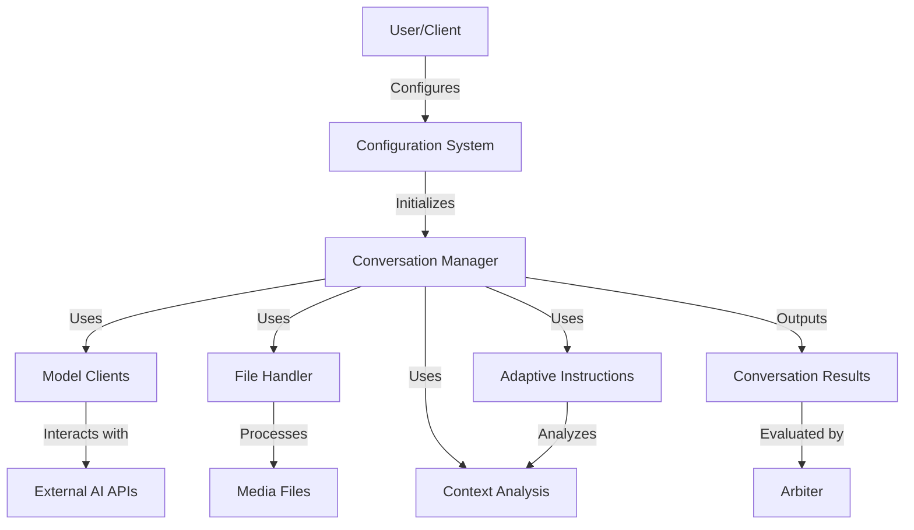
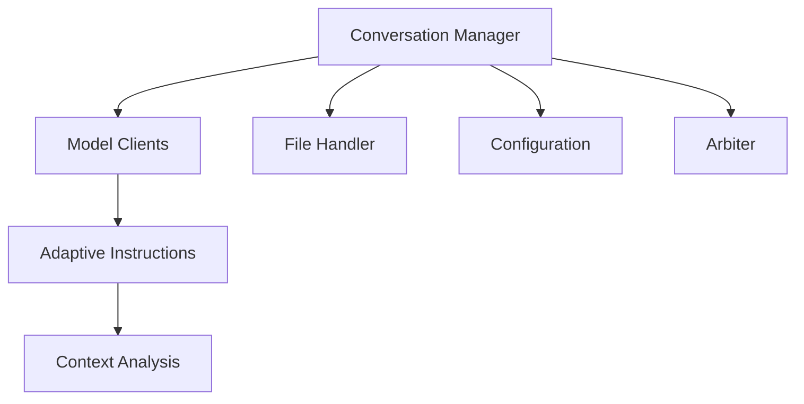
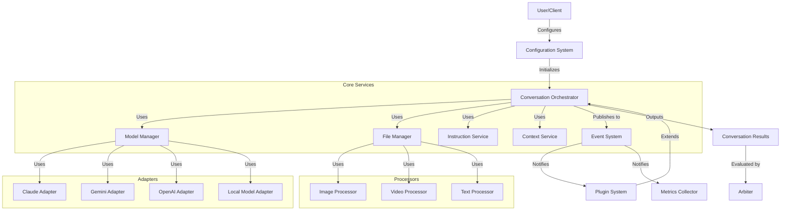

# Architectural Analysis: AI Battle Framework

## 1. System Overview

The AI Battle framework is a sophisticated system designed to orchestrate conversations between multiple AI models, enabling them to interact in various roles and configurations. The framework supports different conversation modes, file-based discussions, and comprehensive analysis of conversation quality.

### 1.1 Key Architectural Components

1. **Conversation Manager** (`ai-battle.py`): The central orchestrator that coordinates the entire conversation flow.
2. **Model Clients** (`model_clients.py`): Adapters for different AI model providers (Claude, Gemini, OpenAI, local models).
3. **Configuration System** (`configuration.py`, `configdataclasses.py`): Manages configuration loading and validation.
4. **File Handler** (`file_handler.py`): Processes and validates media files for inclusion in conversations.
5. **Context Analysis** (`context_analysis.py`): Analyzes conversation context across multiple dimensions.
6. **Adaptive Instructions** (`adaptive_instructions.py`): Generates dynamic instructions based on conversation context.
7. **Arbiter** (`arbiter_v4.py`): Evaluates and compares conversations between different AI models.

### 1.2 Architectural Style

The system primarily follows a **layered architecture** with elements of **component-based architecture**:

- **Presentation Layer**: HTML output generation, visualization components
- **Business Logic Layer**: Conversation management, context analysis, instruction generation
- **Data Access Layer**: Model clients, file handling, configuration loading

There are also elements of **event-driven architecture** in how the conversation flows between different components, though this is not fully realized in a formal event system.

## 2. Core Components Analysis

### 2.1 Conversation Manager

The `ConversationManager` class in `ai-battle.py` serves as the central orchestrator of the entire system.

#### Responsibilities:
- Initializing and managing model clients
- Coordinating conversation turns
- Processing media files
- Managing conversation history
- Handling rate limiting and timeouts

#### Structure:
- Large class (500+ lines) with multiple responsibilities
- Uses lazy initialization for resource-intensive components
- Provides both synchronous and asynchronous interfaces

#### Key Methods:
- `run_conversation`: Orchestrates a standard conversation
- `run_conversation_with_file`: Orchestrates a file-based conversation
- `_get_client`: Factory method for model clients
- `run_conversation_turn`: Executes a single conversation turn

#### Observations:
- The class has grown to handle too many responsibilities
- Some methods are quite long and complex
- Good use of factory methods and lazy initialization
- Lacks clear separation between orchestration and execution logic

### 2.2 Model Clients

The model client system in `model_clients.py` provides adapters for different AI model providers.

#### Structure:
- `BaseClient`: Abstract base class with common functionality
- Specific implementations for different providers:
  - `ClaudeClient`
  - `GeminiClient`
  - `OpenAIClient`
  - `MLXClient`
  - `OllamaClient`
  - `PicoClient`

#### Key Features:
- Template Method pattern for response generation
- Provider-specific API handling
- File content preparation for different model capabilities
- Adaptive instruction management

#### Observations:
- Good use of inheritance for shared functionality
- Some duplication in API handling logic
- Inconsistent error handling across implementations
- Mix of synchronous and asynchronous interfaces

### 2.3 Configuration System

The configuration system spans `configuration.py` and `configdataclasses.py`, providing robust configuration management.

#### Key Components:
- `DiscussionConfig`: Top-level configuration for discussions
- `ModelConfig`: Configuration for individual models
- `FileConfig`: Configuration for file handling
- `TimeoutConfig`: Configuration for timeouts and retries

#### Features:
- YAML-based configuration files
- Strong validation with specific error messages
- Support for template-based system instructions
- Model capability detection

#### Observations:
- Good separation of configuration validation and loading
- Strong use of dataclasses for configuration objects
- Some duplication between configuration validation and runtime validation
- Configuration is primarily static, with limited support for runtime changes

### 2.4 File Handler

The `ConversationMediaHandler` in `file_handler.py` manages media processing for conversations.

#### Responsibilities:
- Validating media files
- Processing images, videos, and text files
- Creating thumbnails and optimizing media
- Preparing media for model consumption

#### Key Methods:
- `process_file`: Main entry point for file processing
- `_process_image`, `_process_video`, `_process_text`, `_process_code`: Type-specific processing
- `prepare_media_message`: Prepares media for inclusion in messages
- `create_media_prompt`: Creates context-aware prompts for media analysis

#### Observations:
- Comprehensive handling of different media types
- Good separation of concerns for different media types
- Some overlap with configuration validation
- Limited error recovery options

### 2.5 Context Analysis

The context analysis system in `context_analysis.py` provides multi-dimensional analysis of conversation context.

#### Key Components:
- `ContextVector`: Data structure for analysis results
- `ContextAnalyzer`: Main analysis engine

#### Analysis Dimensions:
- Semantic coherence
- Topic evolution
- Response patterns
- Engagement metrics
- Cognitive load
- Knowledge depth
- Reasoning patterns
- Uncertainty markers

#### Observations:
- Sophisticated analysis across multiple dimensions
- Good fallback mechanisms when NLP tools are unavailable
- High computational complexity for some analyses
- Limited integration with the rest of the system

### 2.6 Adaptive Instructions

The adaptive instruction system in `adaptive_instructions.py` generates dynamic instructions based on conversation context.

#### Key Components:
- `AdaptiveInstructionManager`: Main manager for instruction generation
- Template selection and customization logic
- Context-aware instruction modification

#### Features:
- Dynamic template selection based on context
- Template customization based on metrics
- Fallback mechanisms for error cases

#### Observations:
- Sophisticated template selection logic
- Strong integration with context analysis
- Complex template customization with many special cases
- Limited extensibility for new template types

### 2.7 Arbiter

The arbiter system in `arbiter_v4.py` evaluates and compares conversations between different AI models.

#### Key Components:
- `ConversationArbiter`: Main evaluation engine
- `AssertionGrounder`: Grounds assertions using external search
- `VisualizationGenerator`: Generates visualizations of results

#### Features:
- Multi-dimensional conversation evaluation
- Fact-checking with external search
- Visualization of comparison results

#### Observations:
- Sophisticated evaluation across multiple dimensions
- Good integration with external search for fact-checking
- Complex visualization generation
- Limited integration with the rest of the system

## 3. Component Interactions and Dependencies

### 3.1 Dependency Flow

### 3.2 Key Interaction Patterns

#### 3.2.1 Conversation Manager to Model Clients
- Factory pattern for client creation
- Direct method calls for response generation
- Synchronous interaction despite some async methods

#### 3.2.2 Adaptive Instructions to Context Analysis
- Direct dependency with tight coupling
- Context analyzer created and owned by instruction manager
- Synchronous interaction with potential for high latency

#### 3.2.3 Conversation Manager to File Handler
- Lazy initialization pattern
- Direct method calls for file processing
- Clear separation of responsibilities

#### 3.2.4 Configuration to Components
- Configuration objects passed directly to components
- Validation happens at configuration load time
- Limited runtime reconfiguration

### 3.3 Communication Mechanisms

The system primarily uses **direct method calls** for component communication, with some use of **return values** and **exceptions** for error handling. There is no formal event system or message bus.

### 3.4 Dependency Management

Dependencies are primarily managed through:
- **Direct instantiation**: Components create their dependencies directly
- **Lazy initialization**: Resource-intensive components are created on demand
- **Factory methods**: Some components are created through factory methods

There is limited use of dependency injection, which creates tight coupling between components.

## 4. Architectural Patterns and Principles

### 4.1 Patterns Used

#### 4.1.1 Template Method
Used in the `BaseClient` class to define the skeleton of the response generation algorithm, allowing subclasses to override specific steps.

#### 4.1.2 Factory Method
Used in the `_get_client` method of `ConversationManager` to create appropriate client instances based on model type.

#### 4.1.3 Adapter
Each model client acts as an adapter between the conversation manager and the specific API of each model provider.

#### 4.1.4 Lazy Initialization
Used for resource-intensive components like the media handler and context analyzer.

#### 4.1.5 Command
The conversation turn execution follows a command pattern, encapsulating a request as an object.

### 4.2 Principles Applied

#### 4.2.1 Separation of Concerns
The system generally separates different responsibilities into distinct components.

#### 4.2.2 Single Responsibility Principle
Most classes have a clear, single responsibility, though the `ConversationManager` has grown to handle multiple concerns.

#### 4.2.3 Open/Closed Principle
The model client hierarchy is open for extension (new model types) but closed for modification.

#### 4.2.4 Interface Segregation
The system does not explicitly define interfaces, but components generally expose focused method sets.

#### 4.2.5 Dependency Inversion
Limited application, as high-level modules often depend directly on low-level modules rather than abstractions.

## 5. Strengths and Weaknesses

### 5.1 Architectural Strengths

1. **Clear Component Boundaries**: Each major component has a well-defined responsibility.

2. **Flexible Configuration System**: The YAML-based configuration with strong validation provides flexibility while maintaining control.

3. **Extensible Model Client Architecture**: The inheritance-based model client architecture makes it easy to add support for new model providers.

4. **Sophisticated Context Analysis**: The multi-dimensional context analysis provides rich insights into conversation quality.

5. **Comprehensive Media Handling**: The file handler supports a wide range of media types with appropriate processing for each.

6. **Adaptive Instruction Generation**: The dynamic instruction generation based on context creates more natural conversations.

### 5.2 Architectural Weaknesses

1. **Monolithic Conversation Manager**: The `ConversationManager` class has grown too large and handles too many responsibilities.

2. **Tight Coupling Between Components**: Many components have direct knowledge of each other's implementation details.

3. **Inconsistent Error Handling**: Error handling varies across components, with some using exceptions and others using return values.

4. **Limited Use of Dependency Injection**: Components often create their dependencies directly, making testing and reconfiguration harder.

5. **Mixed Synchronous and Asynchronous Interfaces**: The inconsistent use of synchronous and asynchronous methods creates complexity.

6. **Duplicate Validation Logic**: Validation logic is duplicated between configuration and runtime components.

7. **Limited Event-Based Communication**: The system lacks a formal event system for loose coupling between components.

## 6. Recommendations for Improvement

### 6.1 Short-term Improvements

1. **Refactor Conversation Manager**:
   - Split into smaller, more focused classes (e.g., `ConversationOrchestrator`, `ModelManager`, `ConversationState`)
   - Use composition over inheritance for flexibility
   - Extract common functionality into utility classes

2. **Standardize Error Handling**:
   - Implement the exception hierarchy outlined in `next-exception-handling-improvements.md`
   - Standardize error propagation across components
   - Add appropriate fallback mechanisms for non-critical errors

3. **Improve Component Interfaces**:
   - Define clear interfaces for component interactions
   - Standardize on either synchronous or asynchronous patterns
   - Document interface contracts explicitly

4. **Enhance Testing Infrastructure**:
   - Add unit tests for core components
   - Implement integration tests for component interactions
   - Create mock implementations for external dependencies

### 6.2 Medium-term Improvements

1. **Introduce Service Layer**:
   - Create a service layer between the conversation manager and model clients
   - Implement the Adapter pattern more formally for different model providers
   - Use the Strategy pattern for different conversation modes

2. **Implement Dependency Injection**:
   - Refactor components to accept dependencies rather than creating them
   - Create a simple dependency injection container
   - Use factory interfaces for component creation

3. **Enhance Configuration System**:
   - Move toward a more hierarchical configuration system
   - Implement runtime configuration changes
   - Add validation for cross-component configurations

4. **Implement Event-Based Communication**:
   - Create a simple event system for loose coupling
   - Allow components to subscribe to relevant events
   - Use events for cross-component communication

### 6.3 Long-term Vision

1. **Microservices Architecture**:
   - Split into separate services for scaling
   - Implement API gateway for client interactions
   - Use message queues for asynchronous processing

2. **Plugin System**:
   - Develop a plugin architecture for extensibility
   - Allow third-party components to integrate seamlessly
   - Create a standardized plugin API

3. **Comprehensive Monitoring**:
   - Implement detailed logging and metrics
   - Create dashboards for system health
   - Add performance monitoring for critical paths

4. **AI-Specific Architecture Patterns**:
   - Develop patterns specific to AI conversation orchestration
   - Create reusable components for common AI tasks
   - Build a domain-specific language for conversation configuration

## 7. Proposed Architecture

This proposed architecture maintains the strengths of the current design while addressing the identified weaknesses. It introduces clearer separation of concerns, better modularity, and more standardized component interactions.

## 8. Conclusion

The AI Battle framework demonstrates a sophisticated architecture with clear component boundaries and a flexible configuration system. The main architectural challenges revolve around the monolithic conversation manager, tight coupling between components, and inconsistent error handling.

By implementing the recommended improvements, the framework can evolve into a more modular, maintainable, and extensible system while preserving its current strengths. The proposed architecture provides a roadmap for this evolution, with a focus on better separation of concerns, looser coupling, and more standardized component interactions.

The framework's unique approach to AI conversation orchestration provides a solid foundation for future development, and with these architectural improvements, it can become an even more powerful tool for AI research and development.