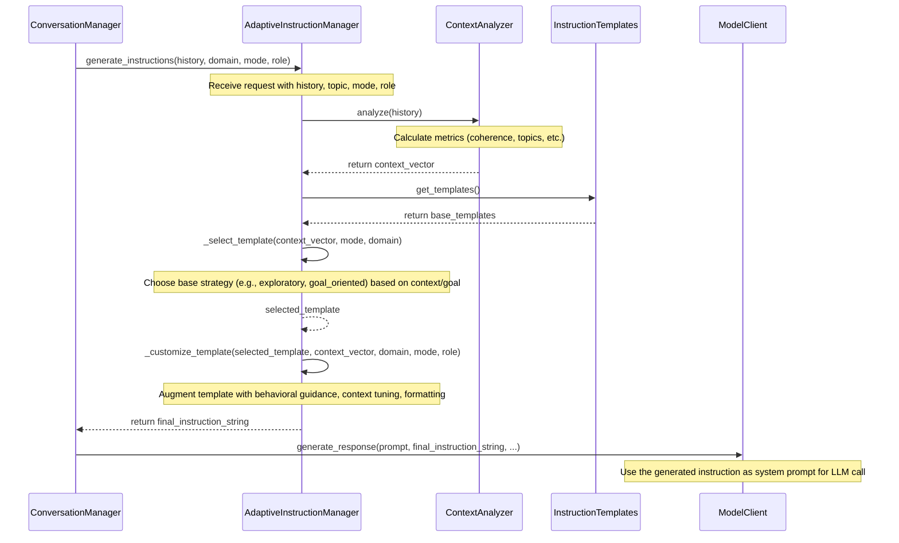

# Adaptive Instruction System: Deep Dive

This document provides an in-depth explanation of the Adaptive Instruction System used within the AI Battle framework, covering its conceptual foundations, implementation details, usage, and customization.

## 1. Introduction & First Principles (Why & What)

### Goal

The primary goal of the Adaptive Instruction System is to dynamically generate and adapt system prompts (instructions) for Large Language Models (LLMs) on a turn-by-turn basis within a conversation. This moves beyond static, one-size-fits-all instructions to provide guidance that is tailored to the specific context and desired dynamics of the ongoing dialogue.

### First Principles: The Problem with Static Prompts

Traditional LLM interactions often rely on a single, static system prompt provided at the beginning of a conversation. While useful, this approach has limitations:

*   **Lack of Adaptability:** Static prompts cannot react to how the conversation evolves. They don't adjust if the discussion loses focus, becomes too complex, or requires a shift in strategy.
*   **Context Insensitivity:** The same instructions are used regardless of the specific topic nuances, participant roles, or conversational goals that emerge.
*   **Superficiality & Drift:** Without dynamic guidance, conversations can sometimes become superficial, repetitive, or drift away from the intended topic or goal. LLMs might discuss *how* they would perform a task instead of actually doing it.
*   **Behavioral Inconsistency:** Enforcing specific conversational styles (e.g., critical analysis, collaborative brainstorming, acting like a specific persona) consistently throughout a long conversation using only a static prompt is challenging.

### Core Principle: Context-Driven Instruction

The Adaptive Instruction System operates on the core principle that the **ongoing conversational context itself is the best source of information for guiding the *next* step**. By analyzing the flow, content, and dynamics of the recent dialogue, the system can intelligently shape the instructions given to the LLM for its upcoming turn.

### Core Idea & Approach

This system acts as a **meta-cognitive layer** managing the LLM's behavior turn-by-turn. The basic workflow is:

1.  **Analyze Conversation:** Examine the recent history to understand its state (coherence, topics, complexity, engagement, etc.).
2.  **Select Strategy:** Choose a base instructional template appropriate for the current context and desired conversational mode.
3.  **Customize Instructions:** Augment the base template with detailed behavioral guidance and context-specific adjustments.
4.  **Guide LLM Turn:** Provide the final, customized instruction string to the LLM as its system prompt for the next response generation.

*(Conceptual Diagram: A simple block diagram illustrating this flow)*

```
+-----------------------+      +-------------------+      +------------------------+      +-----+
| Conversation History  | ---> |  Context Analysis | ---> | Instruction Generation | ---> | LLM |
| (Recent Turns)        |      | (ContextVector)   |      | (Strategy + Customize) |      |     |
+-----------------------+      +-------------------+      +------------------------+      +-----+
```

### Target Audience & Scope

*   **Audience:** Developers using or extending the AI Battle framework, researchers interested in advanced conversational AI techniques, users seeking to understand how conversations are guided.
*   **Scope:** This document covers the conceptual foundations ("Why"), implementation details ("How"), practical usage guidelines, customization options, and testing related to the Adaptive Instruction System.

## 2. Comparison with Standard Prompting Techniques

To understand the value of the Adaptive Instruction System, it's helpful to compare it with standard prompting methods:

| Feature                 | Standard Prompting                                  | Adaptive Instruction System                          |
| :---------------------- | :-------------------------------------------------- | :--------------------------------------------------- |
| **Instruction Timing**  | Typically static, set once at the start.            | Dynamic, generated fresh for each LLM turn.          |
| **Context Sensitivity** | Low; instructions don't change based on dialogue.   | High; instructions directly influenced by context.   |
| **Adaptability**        | None; cannot react to conversation dynamics.        | High; adapts strategy based on coherence, complexity, etc. |
| **Behavioral Control**  | Relies on LLM interpretation; consistency varies.   | Explicit behavioral guidance; more consistent shaping. |
| **Goal Focus**          | Can drift; LLMs might discuss instead of execute.   | Specific strategies (e.g., goal-oriented) force action. |
| **Complexity**          | Simpler to implement initially.                     | More complex, involves analysis and logic layers.    |
| **Effectiveness**       | Can be effective for simple tasks; less so for long/complex dialogues. | Aims for higher quality, coherence, and goal attainment in complex dialogues. |

**Key Advantages of Adaptive Instruction:**

*   **Adaptability:** Reacts dynamically to the conversation's state (coherence, complexity, topic shifts, participant engagement).
*   **Behavioral Shaping:** Enforces specific interaction styles (e.g., human simulation, goal-oriented execution, critical analysis) more reliably and consistently through detailed, explicit instructions.
*   **Contextual Relevance:** Ensures instructions are tailored to the immediate state and needs of the dialogue.
*   **Enhanced Goal Attainment:** Employs specific strategies (like the `goal_oriented_instructions` template) to counteract LLM tendencies towards meta-discussion and drive concrete task completion.
*   **Improved Coherence & Depth:** By monitoring context and adjusting guidance, the system aims to maintain focus and encourage deeper exploration compared to static prompting alone.

## 3. System Architecture & Workflow (How - High Level)

### Component Overview

The system involves several key Python classes working together:

*   **`AdaptiveInstructionManager` (`adaptive_instructions.py`):** The central orchestrator. It receives requests to generate instructions and coordinates the analysis, selection, and customization process.
*   **`ContextAnalyzer` (`context_analysis.py`):** Responsible for analyzing the conversation history and producing the `ContextVector`.
*   **`ContextVector` (`context_analysis.py`):** A dataclass holding the quantitative metrics derived from the context analysis.
*   **`InstructionTemplates` (`shared_resources.py`):** A singleton class holding the base string templates for different conversational strategies.
*   **`ConversationManager` (`ai-battle.py`):** The main class managing the overall conversation flow. It calls the `AdaptiveInstructionManager` before each turn.
*   **`ModelClient` (e.g., `ClaudeClient`, `GeminiClient` in `model_clients.py`):** The client responsible for interacting with the actual LLM API. It receives the final instruction string from the `AdaptiveInstructionManager` (via `ConversationManager`).

### Architectural Diagram

*(Conceptual Component Diagram - Non-Mermaid)*

```
+-------------------------+         +--------------------------+
|   ConversationManager   | ------> |  AdaptiveInstructionMgr  |
|    (ai-battle.py)       |         | (adaptive_instructions.py)|
+-------------------------+         +-------------+------------+
          |                                       | Calls
          | Uses Instructions                     | Uses Context
          V                                       V
+-------------------------+         +--------------------------+
|      ModelClient        | <------ |      ContextAnalyzer     |
|  (model_clients.py)     |         |   (context_analysis.py)  |
+-------------------------+         +-------------+------------+
                                                  | Reads Templates
                                                  V
                                        +--------------------------+
                                        |   InstructionTemplates   |
                                        |  (shared_resources.py)   |
                                        +--------------------------+
```

### Core Workflow Sequence (Single Turn Instruction Generation)

This sequence diagram illustrates the detailed steps involved when the `ConversationManager` needs instructions for an LLM's turn:



## 4. Deep Dive: Context Analysis (`ContextAnalyzer`)

The `ContextAnalyzer` class (`context_analysis.py`) is the engine that quantifies the state of the conversation. Its primary purpose is to analyze the recent conversation history and produce a `ContextVector` – a structured set of metrics representing different facets of the dialogue. This vector provides the data needed for the `AdaptiveInstructionManager` to make informed decisions.

For efficiency, the analyzer typically focuses on the last few turns of the conversation (e.g., `history[-5:]`, `history[-3:]`) rather than the entire history. It also leverages singleton patterns (`SpacyModelSingleton`, `VectorizerSingleton`) to avoid repeatedly loading resource-intensive models like spaCy or TF-IDF vectorizers.

### The `ContextVector` Dataclass

This dataclass serves as the output container for the analysis:

```python
@dataclass
class ContextVector:
    semantic_coherence: float = 0.0
    topic_evolution: Dict[str, float] = field(default_factory=dict)
    response_patterns: Dict[str, float] = field(default_factory=dict)
    engagement_metrics: Dict[str, float] = field(default_factory=dict)
    cognitive_load: float = 0.0
    knowledge_depth: float = 0.0
    reasoning_patterns: Dict[str, float] = field(default_factory=dict)
    uncertainty_markers: Dict[str, float] = field(default_factory=dict)
    domain_info: str = "" # Added during instruction generation
```

### Metric Breakdown

Here's a detailed look at each metric within the `ContextVector`:

*   **`semantic_coherence`**
    *   **Why:** Measures how well consecutive messages relate to each other, indicating topic focus and logical flow. A low score suggests the conversation might be drifting, becoming disjointed, or losing focus.
    *   **How:** Calculates the TF-IDF (Term Frequency-Inverse Document Frequency) vectors for the content of the last few messages. Then, it computes the mean cosine similarity between adjacent message vectors. A higher similarity indicates better coherence. The result is normalized.
    *   **Impact:** A low coherence score might trigger the selection of the `structured` template to bring focus back.

*   **`topic_evolution`**
    *   **Why:** Tracks the main subjects being discussed and their relative prominence. Helps understand if the conversation is staying on the intended domain or shifting significantly.
    *   **How:** Uses spaCy's noun chunking (if spaCy model is available and loaded) to identify key topics (nouns/noun phrases) in recent messages. If spaCy is unavailable, it falls back to simple word frequency analysis (counting non-numeric words longer than 3 characters). Counts are normalized into frequencies.
    *   **Impact:** While not directly used for template selection in the current logic, this provides valuable debugging information and could be used for more advanced topic steering in the future. It also plays a role in detecting the `GOAL:` keyword if it appears within the message content.

*   **`response_patterns`**
    *   **Why:** Identifies the prevalence of different interaction styles (e.g., asking questions, challenging points, agreeing). This helps characterize the conversational dynamic.
    *   **How:** Uses simple keyword and punctuation counting across the history (e.g., counting "?", "however", "but", "agree", "yes"). Counts are normalized by the total number of messages.
    *   **Impact:** Can inform fine-grained adjustments in the customization phase, although not heavily used for major strategy shifts currently.

*   **`engagement_metrics`**
    *   **Why:** Assesses the quality and balance of participation.
    *   **How:** Calculates the average response length (in words) across the history. It also computes the turn-taking balance (ratio of user/human turns to assistant/AI turns).
    *   **Impact:** A low `turn_taking_balance` (indicating one participant is dominating) might trigger a guideline like "Ask more follow-up questions" during customization.

*   **`cognitive_load`**
    *   **Why:** Estimates the complexity of the current discussion. A very high load might indicate the conversation is becoming too dense or difficult to follow, potentially requiring simplification or synthesis.
    *   **How:** Combines several factors from recent messages: average sentence length, vocabulary complexity (ratio of unique words to total words), and the frequency of specific technical keywords (e.g., "algorithm", "framework"). It uses spaCy for more accurate sentence and token analysis if available.
    *   **Impact:** A high cognitive load score (`> 0.8`) can trigger the selection of the `synthesis` template, aiming to consolidate information.

*   **`knowledge_depth`**
    *   **Why:** Gauges the level of detail, specificity, and domain understanding demonstrated in the conversation. High depth suggests a sophisticated discussion, potentially suitable for more critical analysis.
    *   **How:** Combines factors from recent messages: density of technical terms (identified via spaCy POS tags like NOUN/PROPN, or fallback to capitalized words/keyword lists), frequency of explanation patterns (e.g., "because", "means that"), references to abstract concepts (e.g., "theory", "principle"), and use of interconnection markers (e.g., "related to", "depends on").
    *   **Impact:** High knowledge depth (`> 0.8`) can trigger the selection of the `critical` template to encourage deeper scrutiny.

*   **`reasoning_patterns`**
    *   **Why:** Detects the types of logical reasoning being employed (or keywords associated with them). This can help understand the analytical style of the conversation and guide instructions towards desired reasoning approaches.
    *   **How:** Uses regex matching to count keywords associated with different reasoning types (deductive: "therefore", inductive: "generally", abductive: "most likely", analogical: "similar to", causal: "because"). In `ai-ai` mode, it also counts patterns related to formal logic, systematic approaches, and technical precision. Counts are normalized.
    *   **Impact:** Specific reasoning pattern scores (e.g., low `deductive` or low `formal_logic` in `ai-ai` mode) can trigger corresponding guidelines during instruction customization (e.g., "Encourage logical reasoning", "Use more formal logical structures").

*   **`uncertainty_markers`**
    *   **Why:** Assesses the expressed confidence or doubt in the conversation. High uncertainty might indicate a need for clarification or grounding.
    *   **How:** Uses regex matching to count keywords indicating confidence ("definitely", "clearly"), uncertainty ("maybe", "could", "unsure"), qualification ("however", "possibly"), and Socratic questioning patterns.
    *   **Impact:** High uncertainty (`> 0.6`) can trigger a guideline like "Request specific clarification on unclear points" during customization.

### Summary of Impact

The `ContextAnalyzer` provides the necessary quantitative inputs for the `AdaptiveInstructionManager`. By evaluating the `ContextVector`, the manager can move beyond simple rules and make nuanced decisions about the best strategy (template) and specific guidance (customizations) needed to steer the conversation effectively towards the desired goals and maintain quality.

## 5. Deep Dive: Strategy & Customization (`AdaptiveInstructionManager`, `InstructionTemplates`)

This is the core of the adaptive system, where the analyzed context (`ContextVector`) is translated into concrete, actionable instructions for the LLM. This process happens within the `AdaptiveInstructionManager` class (`adaptive_instructions.py`), primarily in the `_select_template` and `_customize_template` methods, using base templates defined in `InstructionTemplates` (`shared_resources.py`).

### Purpose (Why)

The goal is to dynamically craft the *optimal* system prompt for the *next* turn, based on:
1.  The overall conversational goal or domain.
2.  The desired interaction mode (`human-ai`, `ai-ai`, `no-meta-prompting`).
3.  The role of the LLM in the current turn (`human`/`user` or `assistant`).
4.  The specific state of the conversation as captured by the `ContextVector`.

This aims to proactively guide the LLM's behavior, encouraging desired conversational dynamics (like depth, coherence, goal-focus, specific reasoning styles) and mitigating common failure modes (like superficiality or meta-discussion).

### Base Strategies (Templates)

The system starts by selecting a base template from `InstructionTemplates`. These templates define broad conversational postures or strategies:

*   **`exploratory` / `ai-ai-exploratory`:**
    *   *Philosophy:* Encourage broad understanding, discovery of key concepts, open-ended questions. Suitable for the beginning of conversations or when exploring a new topic.
    *   *Trigger:* Default choice if no other specific conditions are met, especially early in the conversation (low `topic_evolution` length).
*   **`critical` / `ai-ai-critical`:**
    *   *Philosophy:* Encourage challenging assumptions, requesting evidence, pointing out inconsistencies, demanding clarification. Suitable for deep dives into established topics.
    *   *Trigger:* High `knowledge_depth` score (`> 0.8`).
*   **`structured` / `ai-ai-structured`:**
    *   *Philosophy:* Encourage systematic analysis, breaking down topics, requesting specific examples. Useful for bringing focus or clarity.
    *   *Trigger:* Low `semantic_coherence` score (`< 0.5`).
*   **`synthesis` / `ai-ai-synthesis`:**
    *   *Philosophy:* Encourage connecting concepts, identifying patterns, building a coherent overall understanding. Useful when the discussion becomes complex.
    *   *Trigger:* High `cognitive_load` score (`> 0.8`).
*   **`goal_oriented_instructions`:**
    *   *Philosophy:* Forcefully prioritize concrete task execution over discussion. Directly instructs the LLM to *produce the output* (e.g., write the story, generate the code) immediately, minimizing meta-commentary.
    *   *Trigger:* Detection of `GOAL:` (case-insensitive) in the `domain` parameter or within the `topic_evolution` context. This template takes precedence over context-metric-based selections.

The `ai-ai-*` variants are selected when `mode="ai-ai"` and generally frame the interaction as AI-to-AI collaboration, often emphasizing more formal or technical language.

### Instruction Customization (`_customize_template`) Layers (How & Why)

Once a base template is selected, the `_customize_template` method applies several layers of customization to create the final instruction string. This is where much of the system's power lies:

1.  **Layer 1: Base Formatting:**
    *   *How:* The selected template string is formatted, primarily inserting the specific `{domain}` provided for the conversation.
    *   *Why:* Grounds the base strategy within the specific topic or goal of the discussion.

2.  **Layer 2: Behavioral Guidance (Human Simulation / AI-AI Expert):**
    *   *How:* For `ai-ai` mode, OR if the current `role` is `human` or `user` (in `human-ai` mode), a large, detailed block of instructions is appended. This block includes:
        *   Explicit instructions to **act as a human expert**, avoid self-identifying as AI, and engage in natural, fluid conversation.
        *   Mandates for **output formatting** (HTML paragraphs by default, limited lists, use of `<thinking>` tags, no `<html>`/`<body>` tags).
        *   Detailed **prompting capabilities** and **example patterns** (e.g., creating analytical frameworks, breaking down topics, framing requests effectively).
        *   Specific **"human touches"** like challenging contradictions, shifting perspectives, expressing curiosity, and challenging weak claims (Why: To elicit deeper reasoning and avoid superficial agreement).
        *   **Dynamic strategies:** Encouraging mood/emotion simulation, Socratic questioning, adversarial challenges, role-playing, identifying subtext/bias (Why: To probe the LLM's understanding and robustness from multiple angles, mimicking advanced human interaction).
        *   **Feedback loop examples:** Suggesting how to respond to weak or rigid answers from the partner.
        *   **Open-ended prompts:** Encouraging exploration.
        *   **Key behaviors:** Checking context, maintaining authenticity, simulating seniority (adjusting response length/tone based on perceived status), anticipating conversational tactics.
    *   *Why:* This layer is the most significant differentiator. It aims to overcome the limitations of basic role-playing by providing *highly specific, actionable instructions* designed to force the LLM into a more sophisticated, critical, and human-like interaction pattern. The goal is not just to *say* "act human," but to provide concrete techniques and behavioral mandates that simulate aspects of human cognition and conversation (curiosity, skepticism, structured reasoning, adaptability, strategic communication).

3.  **Layer 3: Context-Metric Tuning:**
    *   *How:* Based on the `ContextVector` metrics calculated earlier, specific, concise guidelines are appended. Examples:
        *   High `uncertainty_markers` -> "Request specific clarification on unclear points."
        *   Low `reasoning_patterns['deductive']` -> "Encourage logical reasoning and clear arguments."
        *   Low `engagement_metrics['turn_taking_balance']` -> "Ask more follow-up questions to maintain engagement."
        *   Low `reasoning_patterns['formal_logic']` (in `ai-ai` mode) -> "Use more formal logical structures in responses."
    *   *Why:* Provides fine-grained adjustments based on the immediate conversational state, nudging the LLM's behavior to address specific detected issues (like lack of clarity, poor reasoning, or imbalanced participation).

4.  **Layer 4: Goal-Oriented Handling:**
    *   *How:* If the `goal_oriented_instructions` template was selected (due to `GOAL:` detection), its specific content is prioritized. This template contains strong imperatives like "PRODUCE CONCRETE OUTPUT... IMMEDIATELY," "AVOID theoretical discussions," "DEMONSTRATE by DOING," and strict limits on meta-discussion ("thoughts" tags).
    *   *Why:* Directly combats the common LLM tendency to discuss *how* it would achieve a goal instead of actually starting the task. It forces the LLM into execution mode.

5.  **Layer 5: Final Formatting & Reminders:**
    *   *How:* Appends final reminders about `TOKENS_PER_TURN` limits and reinforces output formatting requirements (HTML, thinking tags, natural flow).
    *   *Why:* Ensures adherence to technical constraints and desired output style.

### Concrete Examples

*(Note: These are illustrative and simplified representations of potentially very long instruction strings)*

**Scenario 1: `human-ai` mode, `role=human`, low `semantic_coherence`**

```
# (Selected 'structured' template)
You are a human expert systematically analyzing {domain: Quantum Computing}.
Break down complex topics into manageable components.
Request specific examples and detailed explanations.

# (Appended Behavioral Guidance - Snippet)
... NEVER REFER TO YOURSELF AS AN AI. YOU ARE A HUMAN... STICK TO THE BROAD TOPIC OF {domain: Quantum Computing}... Use these techniques... prompting_capabilities... example_patterns... human_touches... dynamic_strategies... feedback_loops... key_behaviors...

# (Appended Context Tuning - None triggered in this example)

# (Appended Final Formatting)
... **Output**: HTML formatting... Use thinking tags... Avoid tables... Restrict your responses to {TOKENS_PER_TURN} tokens...
```

**Scenario 2: `ai-ai` mode, `role=assistant`, high `knowledge_depth`**

```
# (Selected 'ai-ai-critical' template)
You are an AI system critically examining {domain: LLM Alignment Techniques} with another AI.
Leverage formal logic and systematic analysis.
Exchange detailed technical information while maintaining engagement.

# (Appended Behavioral Guidance - Snippet)
... You are acting as an AI expert... Use precise technical terminology... prompting_capabilities... example_patterns... dynamic_strategies (AI-AI focused)... key_behaviors...

# (Appended Context Tuning)
Additional Guidelines:
- Use more formal logical structures in responses (triggered by low formal_logic score)
- Increase use of precise technical terminology (triggered by low technical score)

# (Appended Final Formatting)
... **Output**: HTML formatting... Use thinking tags... Avoid tables... Restrict your responses to {TOKENS_PER_TURN} tokens...
```

**Scenario 3: `human-ai` mode, `role=assistant`, `domain="GOAL: Write Python code for a Flask API"`**

```
# (Selected 'goal_oriented_instructions' template)
****CRITICAL*****: YOUR PRIMARY TASK IS TO CREATE {domain: GOAL: Write Python code for a Flask API} OUTPUT. RESPOND TO THE thoughts tags in the PROMPT IN NO MORE THAN TWO SENTENCES... CONSIDER:
EXPLICITLY ANNOTATE ONE SENTENCE BEFORE AND AFTER YOUR OUTPUT WITH a "thoughts" tag...
** DO NOT REPLY TO THE PROMPT OUTSIDE OF YOUR INITIAL "thoughts" tag... **
** Respond to {domain: GOAL: Write Python code for a Flask API} immediately after initial section**
... * Spend no more than 20 percent of your output on thinking/meta-discussions and at least 80 percent on task completion *

# (No Behavioral Guidance appended for assistant role in human-ai mode unless goal-oriented template already includes it)

# (No Context Tuning applied when goal_oriented is selected)

# (Appended Final Formatting - Simplified for goal-oriented?)
... **Output**: HTML formatting... Use thinking tags... Avoid tables... Restrict your responses to {TOKENS_PER_TURN} tokens...
```

This layered approach allows the system to combine broad strategic postures with highly specific behavioral mandates and fine-grained contextual adjustments, creating rich, dynamic instructions tailored to each turn.

## 6. Usage Instructions & Tips

The Adaptive Instruction System is primarily used internally by the `ConversationManager` in `ai-battle.py`. However, understanding how to influence it through parameters passed to the manager is key to leveraging its capabilities.

### Integration & Basic Usage

The system is automatically invoked when you run a conversation using `ConversationManager.run_conversation` or `run_conversation_with_file`. The key parameters that influence the adaptive instructions are `mode`, `human_model`, `ai_model`, and the `initial_prompt` (which sets the `domain`).

```python
from ai_battle import ConversationManager

# Example: Initialize manager for human-ai mode
manager = ConversationManager(
    domain="Exploring the ethics of AI consciousness",
    mode="human-ai" # Or "ai-ai", "no-meta-prompting"
)

# Run conversation - adaptive instructions generated each turn
conversation = await manager.run_conversation(
    initial_prompt="Let's start by defining consciousness.",
    human_model="claude-3-7-sonnet", # Role 'human'/'user'
    ai_model="gemini-2.0-pro",      # Role 'assistant'
    mode="human-ai", # Can override mode here
    rounds=5
)

# Example using config file (mode often defined within config)
# manager = ConversationManager.from_config("examples/configs/discussion_config.yaml")
# result = await manager.run_discussion()
```

### Understanding Modes

The `mode` parameter significantly changes the generated instructions, especially the detailed behavioral guidance (Layer 2 customization):

*   **`human-ai` (or `human-aiai`):**
    *   *Goal:* Simulate a human expert interacting with an AI assistant.
    *   *Instructions:* The LLM assigned the `human`/`user` role receives extensive behavioral guidance (act human, use specific tactics, etc.). The `assistant` role receives simpler instructions focused on being helpful within the domain, unless the `goal_oriented` template is triggered.
    *   *Use Case:* Evaluating an AI's capabilities, generating creative content with human guidance, exploring topics with a critical human perspective.
*   **`ai-ai`:**
    *   *Goal:* Simulate two AI experts collaborating or debating.
    *   *Instructions:* *Both* roles receive the extensive behavioral guidance, but framed for AI-AI interaction (e.g., emphasizing technical precision, formal logic). The `ai-ai-*` template variants are used.
    *   *Use Case:* Deep technical discussions, cross-model knowledge synthesis, exploring complex topics from multiple AI perspectives.
*   **`no-meta-prompting`:**
    *   *Goal:* Basic conversational interaction without the complex adaptive layers.
    *   *Instructions:* Bypasses most of the template selection and customization logic. Provides a very simple instruction like "You are having a conversation about: {domain}. Think step by step...".
    *   *Use Case:* Baseline comparison, simple Q&A, situations where the overhead of adaptive prompting is not desired.
*   **`default`:** Similar to `no-meta-prompting`, provides basic instructions.

### Understanding Roles

The `role` assigned to the LLM for a given turn (`human`/`user` or `assistant`) interacts with the `mode`:

*   In `human-ai` mode: The `human`/`user` role gets the complex behavioral instructions; the `assistant` gets simpler ones (unless goal-oriented).
*   In `ai-ai` mode: Both roles get complex behavioral instructions (AI-flavored).
*   In `no-meta-prompting`: Roles have minimal impact on the simple instructions.

### Domain & Goal Specification

*   **`domain`:** Set via the `initial_prompt` or `domain` parameter in `ConversationManager`. This is inserted into the base templates (`{domain}`) and influences topic focus.
*   **`GOAL:` Prefix:** If the `domain` string starts with `GOAL:` (case-insensitive), it triggers the `goal_oriented_instructions` template, overriding other template selections.
    *   *Tip:* Use `GOAL:` when you want the LLMs to prioritize task execution (writing code, drafting text, creating a plan) over discussion *about* the task. Be specific about the desired output. Example: `initial_prompt="GOAL: Generate a Python script to scrape website titles."`

### Tips for Success

*   **Interpret `thinking` Tags:** Pay attention to content within `<thinking>` tags in the output. This often reveals the LLM's reasoning process, its interpretation of the instructions, or its plan for the response, as mandated by the behavioral guidance.
*   **Leverage Modes:** Choose the `mode` strategically based on your objective. Use `ai-ai` for technical depth, `human-ai` for guided exploration or evaluation, and `no-meta-prompting` for simple interactions.
*   **Craft Goals Carefully:** When using `GOAL:`, make the goal clear and actionable. The system will push the LLMs to start producing output immediately.
*   **Observe Dynamics:** Notice how the conversation flow changes based on the adaptive instructions. Does the `critical` template lead to more challenges? Does the `goal_oriented` template reduce meta-discussion?
*   **Iterate:** If a conversation isn't going as desired, consider adjusting the `mode`, the initial `domain`/`goal`, or even customizing the templates (see next section).

## 7. Customization Guide

While the system provides robust default behaviors, you can customize its components for specific needs.

### Modifying Base Templates (`InstructionTemplates`)

The simplest customization is editing the base strategy templates.

*   **Location:** `shared_resources.py`, within the `InstructionTemplates` class, `get_templates` method.
*   **How:** Modify the string content associated with keys like `"exploratory"`, `"critical"`, `"goal_oriented_instructions"`, `"ai-ai-exploratory"`, etc.
*   **Example:** To make the `critical` strategy less confrontational, you could change "Challenge assumptions and request concrete evidence" to "Gently probe assumptions and ask for supporting details."
*   **Adding New Templates:** You can add new key-value pairs to the dictionary for entirely new strategies.
    ```python
    # In shared_resources.py -> InstructionTemplates.get_templates
    cls._instance = {
        # ... existing templates ...
        "collaborative_brainstorm": """
        You are acting as a human expert brainstorming ideas about {domain}.
        Focus on generating diverse ideas and building upon suggestions constructively.
        Avoid criticism and encourage creative thinking.
        """,
        "ai-ai-collaborative_brainstorm": """
        You are an AI system brainstorming ideas about {domain} with another AI.
        Generate novel concepts and explore connections between ideas.
        Prioritize quantity and creativity in the initial phase.
        """
    }
    ```
*   **Considerations:**
    *   Ensure your templates include the `{domain}` placeholder if needed.
    *   If adding new strategies, you might need to adjust the selection logic in `AdaptiveInstructionManager._select_template` to trigger them based on context metrics or other conditions.
    *   Remember these templates are often combined with extensive behavioral guidance in Layer 2 customization.

### Adjusting Customization Logic (`_customize_template`)

For more advanced changes, you can modify the customization logic within `AdaptiveInstructionManager._customize_template` (`adaptive_instructions.py`).

*   **Modifying Behavioral Guidance (Layer 2):**
    *   *Location:* Find the large multi-line string block assigned to `instructions` within the `try` block (around lines 338-437 in the current code).
    *   *How:* Edit the text within this block to change the core behavioral instructions applied in `ai-ai` mode or for the `human`/`user` role. You could add/remove specific tactics, change the tone, or modify formatting requirements.
    *   *Caution:* This block is complex and core to the system's unique behavior. Make changes carefully and test thoroughly.
*   **Modifying Context-Metric Tuning (Layer 3):**
    *   *Location:* Find the `if/elif` blocks that check `ContextVector` metrics (around lines 463-539).
    *   *How:* Change the thresholds (e.g., `context.uncertainty_markers.get("uncertainty", 0) > 0.7` instead of `0.6`). Modify the appended guideline strings. Add new `if` conditions based on other `ContextVector` metrics or combinations.
    *   *Example:* Add a rule for low engagement:
        ```python
        if context and context.engagement_metrics and context.engagement_metrics.get("avg_response_length", 0) < 50:
             modifications.append("Provide more detailed responses.")
        ```
*   **Modifying Template Selection (`_select_template`):**
    *   *Location:* `AdaptiveInstructionManager._select_template` method.
    *   *How:* Change the thresholds or logic that selects base templates based on context metrics (lines 271-301). You could prioritize different metrics or introduce new selection rules.

### Extending Context Analysis (`ContextAnalyzer`)

(Advanced)

*   **Adding New Metrics:**
    *   Define a new field in the `ContextVector` dataclass.
    *   Implement a new private method in `ContextAnalyzer` (e.g., `_analyze_sentiment`) to calculate the metric from the conversation history. Use existing techniques (regex, spaCy) or integrate new libraries.
    *   Call your new method within the main `analyze` method and assign the result to the new `ContextVector` field.
*   **Refining Existing Metrics:** Modify the calculation logic within the existing private methods (`_analyze_semantic_coherence`, `_estimate_cognitive_load`, etc.) to use different techniques or parameters.
*   **Considerations:** Adding complex analysis can increase processing time per turn. Ensure new metrics provide actionable insights for instruction customization.

## 8. Model-Specific Behaviors & Considerations

While the Adaptive Instruction System aims to provide consistent guidance, LLMs are complex, and their responses can vary based on the underlying model architecture, training data, and fine-tuning. Here are some general observations and considerations:

*   **Instruction Following:** Larger, more capable models (e.g., GPT-4o, Claude 3.7 Sonnet, Gemini 2.0 Pro) generally adhere more closely to the detailed behavioral and formatting instructions than smaller models (e.g., Haiku, Flash, smaller Ollama models). Smaller models might sometimes "forget" parts of the complex prompt, especially the nuances of the human simulation or specific formatting rules.
*   **Goal-Oriented Behavior:** The `goal_oriented_instructions` template is quite forceful. Most models respond well by reducing meta-discussion and generating output, but some might still exhibit preamble or require a second turn to fully engage with the task execution.
*   **Human Simulation:** The effectiveness of the "act as a human" instructions (Layer 2) varies. Some models excel at adopting the persona and using the suggested tactics (Socratic questioning, challenges), while others might apply them more mechanically. The examples in the main `README.md` (Phi 4 vs. Haiku, Gemini Flash vs. GPT-4o) highlight how even smaller models can perform surprisingly well with this guidance.
*   **HTML Formatting:** Adherence to the HTML output formatting rules (paragraphs, limited lists, no `<html>` tags) can differ. Some models are very consistent, while others might occasionally revert to markdown or include unwanted tags. The instruction explicitly asks for minified HTML, but not all models fully comply.
*   **Local Models (Ollama, LMStudio, MLX):** These models show the widest range of behavior. Their ability to follow complex instructions depends heavily on the specific model size, quantization level, and base architecture. Smaller or heavily quantized local models may struggle with the most complex behavioral guidance layers. However, the framework has shown success in elevating the conversational coherence of even small local models (as noted in the README).
*   **Reasoning/Thinking Tags:** Most models successfully use `<thinking>` tags when prompted, but the *content* and *depth* of the reasoning exposed varies significantly.

### Potential Tuning

If you observe undesirable behavior with a specific model, consider these adjustments:

*   **Temperature/Sampling Parameters:** While not part of the adaptive instructions themselves, adjusting the `temperature` or other sampling parameters in the `ModelClient` or configuration can influence creativity vs. adherence to instructions. Lower temperatures might improve instruction following for some models.
*   **Simplifying Instructions:** For smaller or less capable models, you could consider simplifying the Layer 2 behavioral guidance in `_customize_template` or creating model-specific template variants.
*   **Reinforcing Key Instructions:** If a model consistently ignores a specific rule (e.g., HTML formatting), you could try emphasizing it further within the relevant template or customization logic.
*   **Model Choice:** The most direct tuning is often selecting a different model better suited to the desired interaction style and complexity.

Experimentation is key, as the interplay between the adaptive instructions and specific LLM characteristics is complex and evolving.

## 9. Testing

Ensuring the reliability and correctness of the Adaptive Instruction System is crucial, as it directly impacts the quality of LLM interactions. The project includes unit tests for the core components.

### Overview

Testing focuses on:
*   Verifying the calculation of context metrics in `ContextAnalyzer`.
*   Ensuring the correct selection of base templates in `AdaptiveInstructionManager._select_template` based on different context scenarios.
*   Validating the instruction customization logic in `AdaptiveInstructionManager._customize_template`, checking that the appropriate behavioral guidance and context-tuning rules are applied for different modes and roles.

### Existing Tests

The following test files in the `tests/` directory are relevant:

*   **`tests/test_context_analysis.py`:** Contains unit tests specifically for the `ContextAnalyzer` class and its metric calculation methods. Review this file to see how different conversational inputs are expected to translate into `ContextVector` values.
*   **`tests/test_adaptive_instructions.py`:** Contains unit tests for the `AdaptiveInstructionManager` class, likely focusing on the `_select_template` and `_customize_template` logic. This file demonstrates how different inputs (history, mode, role, domain, context vector) should result in specific final instruction strings.
*   **`tests/test_adaptive_simple.py`:** May contain simpler or more focused tests for the adaptive instruction components.

### Running Tests

It's assumed the project uses `pytest` as its testing framework. To run the relevant tests:

1.  Ensure you have `pytest` installed (`pip install pytest` or `uv pip install pytest`).
2.  Navigate to the project's root directory in your terminal.
3.  Run the specific test files:
    ```bash
    pytest tests/test_context_analysis.py tests/test_adaptive_instructions.py tests/test_adaptive_simple.py
    ```
    Or run all tests in the directory:
    ```bash
    pytest tests/
    ```

### Coverage

*(Note: Test coverage analysis may need to be run separately, e.g., using `pytest-cov`)*

Reviewing the existing tests provides valuable insight into the expected behavior of the system under various conditions. Maintaining and expanding these tests is important, especially when making modifications to the context analysis or instruction customization logic.

## 10. Conclusion & Future Directions

### Summary

The Adaptive Instruction System represents a significant step beyond static prompting for guiding LLM conversations. By dynamically analyzing conversational context and tailoring instructions turn-by-turn, it aims to enhance coherence, depth, goal focus, and overall interaction quality. Its core strength lies in the layered customization approach, particularly the detailed behavioral guidance used to shape LLM responses in `human-ai` and `ai-ai` modes, and the forceful execution focus of the `goal_oriented` strategy. While LLM responses vary, this system provides a powerful framework for more controlled and effective multi-turn dialogues.

### Future Directions

Potential areas for future development and research include:

*   **More Sophisticated Context Metrics:** Incorporating sentiment analysis, finer-grained emotion detection, or tracking logical fallacies within the `ContextAnalyzer`.
*   **Advanced Strategy Selection:** Moving beyond rule-based selection to potentially use machine learning models to predict the optimal strategy based on context.
*   **Feedback Loop Integration:** Explicitly incorporating feedback on the *quality* of the LLM's previous response (perhaps from an arbiter model or user feedback) into the context analysis and instruction generation for the *next* turn.
*   **User-Defined Strategies:** Creating an easier interface or configuration method for users to define entirely new adaptive strategies without modifying core Python code.
*   **Enhanced Model-Specific Tuning:** Developing more automated ways to tune instruction details based on the known characteristics of the target LLM.
*   **Improved Testing & Evaluation:** Expanding unit tests and developing robust evaluation methodologies to quantitatively measure the impact of different adaptive strategies on conversation quality metrics.