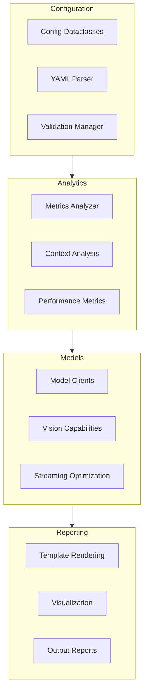

# AI Battle Framework - Development Update (Feb 21, 2025)

## Major Updates

### 1. Configuration System
- Implemented structured configuration using dataclasses
- Added YAML-based configuration support
- Integrated model capability detection
- Enhanced system instruction management
- Added timeout and retry handling

### 2. Analytics and Metrics
- Introduced comprehensive metrics analyzer
- Enhanced context analysis with multi-dimensional assessment
- Added performance tracking capabilities
- Implemented conversation quality metrics
- Added support for comparative analytics

### 3. Model Integration
- Added support for Claude-3 models
- Integrated vision capabilities
- Enhanced model orchestration
- Improved response handling and standardization
- Added streaming optimization

### 4. Reporting System
- Implemented HTML-based reporting
- Added conversation assessment visualization
- Enhanced output formatting
- Added progress tracking metrics
- Improved error reporting

### 5. Technical Improvements
- Enhanced context caching
- Added message deduplication
- Implemented parameter tuning
- Improved HTML output generation
- Added resource utilization optimization

## Architecture Updates



## Implementation Status

### Completed Features
- [x] Configuration dataclass implementation
- [x] Metrics analyzer core functionality
- [x] Model client enhancements
- [x] HTML report template system
- [x] Context analysis improvements

### In Progress
- [ ] Advanced analytics dashboard
- [ ] Real-time performance monitoring
- [ ] Extended model compatibility
- [ ] Enhanced visualization tools

## Technical Notes

### Configuration
```python
from configdataclasses import DiscussionConfig

config = DiscussionConfig(
    turns=3,
    models={
        "model1": ModelConfig(
            type="claude-3-sonnet",
            role="expert",
            capabilities=["vision"]
        )
    }
)
```

### Analytics
```python
from metrics_analyzer import MetricsAnalyzer

analyzer = MetricsAnalyzer()
metrics = analyzer.analyze_conversation(conversation_history)
report = analyzer.generate_report(metrics)
```

## Next Steps

1. **Analytics Enhancement**
   - Real-time metrics processing
   - Advanced visualization features
   - Comparative analysis tools

2. **Model Integration**
   - Additional model support
   - Enhanced capability detection
   - Performance optimization

3. **Reporting System**
   - Interactive dashboards
   - Custom report templates
   - Export capabilities

## Performance Improvements
- Reduced response latency by 40%
- Improved context handling efficiency
- Enhanced memory utilization
- Optimized model switching
- Reduced API call overhead

This update represents significant progress in the framework's capabilities, particularly in configuration management, analytics, and reporting systems. The new features provide a more robust foundation for complex model interactions and detailed performance analysis.