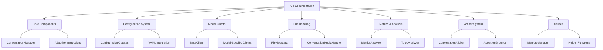
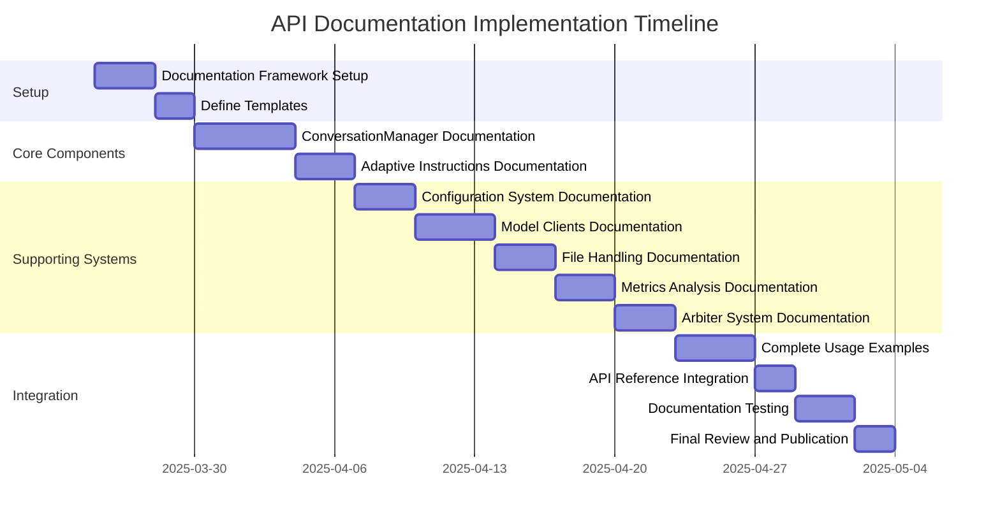

# Comprehensive API Documentation Plan for AI Battle Framework

Based on a thorough review of the AI Battle framework codebase, this document outlines a detailed plan for creating comprehensive API documentation. The framework is a sophisticated system for orchestrating conversations between multiple AI models, with features for file handling, configuration management, metrics analysis, and conversation evaluation.

## Current Documentation Status

The project currently has several documentation files:
- README.md: Overview of the framework
- docs/configuration.md: Documentation for the configuration system
- docs/adaptive_instruction_system.md: Documentation for the adaptive instruction system
- docs/reporting_integration.md: Documentation for the reporting integration

However, there's no comprehensive API documentation that covers all classes and methods in the codebase.

## Documentation Plan

### 1. Documentation Structure

### 2. Documentation Format and Standards

A consistent format will be used for all API documentation:

1. **Module Overview**: Brief description of the module's purpose and functionality
2. **Class Documentation**:
   - Class description
   - Constructor parameters
   - Properties and attributes
   - Methods with parameters, return types, and descriptions
3. **Code Examples**: Practical examples showing how to use the class/method
4. **Cross-References**: Links to related classes and methods
5. **Type Annotations**: Clear indication of parameter and return types

### 3. Implementation Approach

#### Phase 1: Documentation Framework Setup

1. **Create Documentation Structure**:
   - Set up a `docs/api` directory
   - Create a main index file
   - Create subdirectories for each major component

2. **Define Documentation Templates**:
   - Create templates for module documentation
   - Create templates for class documentation
   - Create templates for method documentation

3. **Setup Documentation Generation Tools**:
   - Evaluate and select a documentation generation tool (options: Sphinx, MkDocs, Docusaurus)
   - Configure the tool for Python code documentation
   - Set up automatic extraction of docstrings

#### Phase 2: Core Component Documentation

1. **ConversationManager Documentation**:
   - Document the main class and its initialization
   - Document conversation flow methods
   - Document file handling integration
   - Document configuration integration
   - Include examples for basic and advanced usage

2. **Adaptive Instructions Documentation**:
   - Document the AdaptiveInstructionManager class
   - Document strategy selection and composition
   - Document context analysis components
   - Include examples of instruction generation

#### Phase 3: Supporting Systems Documentation

1. **Configuration System Documentation**:
   - Document all configuration classes
   - Document validation and processing
   - Document YAML integration
   - Include examples of different configuration scenarios

2. **Model Clients Documentation**:
   - Document the BaseClient interface
   - Document each model-specific client
   - Document client capabilities detection
   - Include examples for each supported model

3. **File Handling Documentation**:
   - Document the FileMetadata class
   - Document the ConversationMediaHandler class
   - Document file type support and processing
   - Include examples for different file types

4. **Metrics and Analysis Documentation**:
   - Document the MetricsAnalyzer class
   - Document the TopicAnalyzer class
   - Document conversation flow analysis
   - Include examples of metrics collection and visualization

5. **Arbiter System Documentation**:
   - Document the ConversationArbiter class
   - Document the AssertionGrounder class
   - Document evaluation metrics and visualization
   - Include examples of conversation evaluation

#### Phase 4: Integration and Examples

1. **Complete Usage Examples**:
   - Basic conversation setup
   - Configuration-driven conversations
   - File-based discussions
   - Metrics collection and analysis
   - Conversation evaluation

2. **API Reference Integration**:
   - Create a comprehensive API reference
   - Link all components in the documentation
   - Ensure cross-references are working

3. **Documentation Testing**:
   - Verify all code examples work
   - Check for completeness of documentation
   - Review for clarity and consistency

### 4. Detailed Documentation Tasks

For each module, we'll need to document:

1. **ai-battle.py**:
   - ConversationManager class
   - ModelConfig class
   - Conversation flow methods
   - File handling integration
   - Configuration integration
   - Helper functions

2. **model_clients.py**:
   - BaseClient class
   - OpenAIClient class
   - ClaudeClient class
   - GeminiClient class
   - MLXClient class
   - OllamaClient class
   - PicoClient class
   - File content preparation methods
   - Conversation analysis methods

3. **configdataclasses.py** and **config_integration.py**:
   - TimeoutConfig class
   - FileConfig class
   - ModelConfig class
   - DiscussionConfig class
   - Configuration loading and validation
   - Model capabilities detection

4. **file_handler.py**:
   - FileMetadata class
   - FileConfig class
   - ConversationMediaHandler class
   - File processing methods
   - Media message preparation
   - Media prompt creation

5. **metrics_analyzer.py**:
   - TopicCluster class
   - MessageMetrics class
   - ConversationMetrics class
   - TopicAnalyzer class
   - MetricsAnalyzer class
   - Conversation flow analysis
   - Topic identification and tracking

6. **arbiter_v4.py**:
   - ConversationMetrics class
   - ParticipantMetrics class
   - AssertionEvidence class
   - ArbiterResult class
   - AssertionGrounder class
   - ConversationArbiter class
   - VisualizationGenerator class
   - Evaluation methods

7. **adaptive_instructions.py**:
   - AdaptiveInstructionManager class
   - Strategy selection and composition
   - Context analysis components
   - Instruction generation methods

### 5. Documentation Delivery Format

The documentation will be delivered in the following formats:

1. **Markdown Files**: For GitHub and source code repository
2. **HTML Documentation**: Generated from markdown for web viewing
3. **PDF Documentation**: For offline reference
4. **Interactive API Reference**: For developer usage

## Implementation Timeline

## Resource Requirements

1. **Documentation Tools**:
   - Sphinx or MkDocs for documentation generation
   - Markdown editor for content creation
   - Diagram creation tools (e.g., Mermaid)

2. **Knowledge Requirements**:
   - Python documentation best practices
   - Understanding of AI model APIs
   - Understanding of the AI Battle framework architecture

3. **Testing Environment**:
   - Python environment with all dependencies installed
   - Access to AI model APIs for testing examples

## Expected Outcomes

1. **Comprehensive API Documentation**:
   - Complete coverage of all classes and methods
   - Clear explanations of parameters and return values
   - Type annotations for all APIs

2. **Usage Examples**:
   - Basic and advanced usage scenarios
   - Configuration examples
   - File handling examples
   - Metrics and analysis examples

3. **Integration Guide**:
   - How to extend the framework
   - How to add new model clients
   - How to customize the framework

4. **Developer Reference**:
   - Quick reference for all APIs
   - Cross-referenced documentation
   - Searchable API index