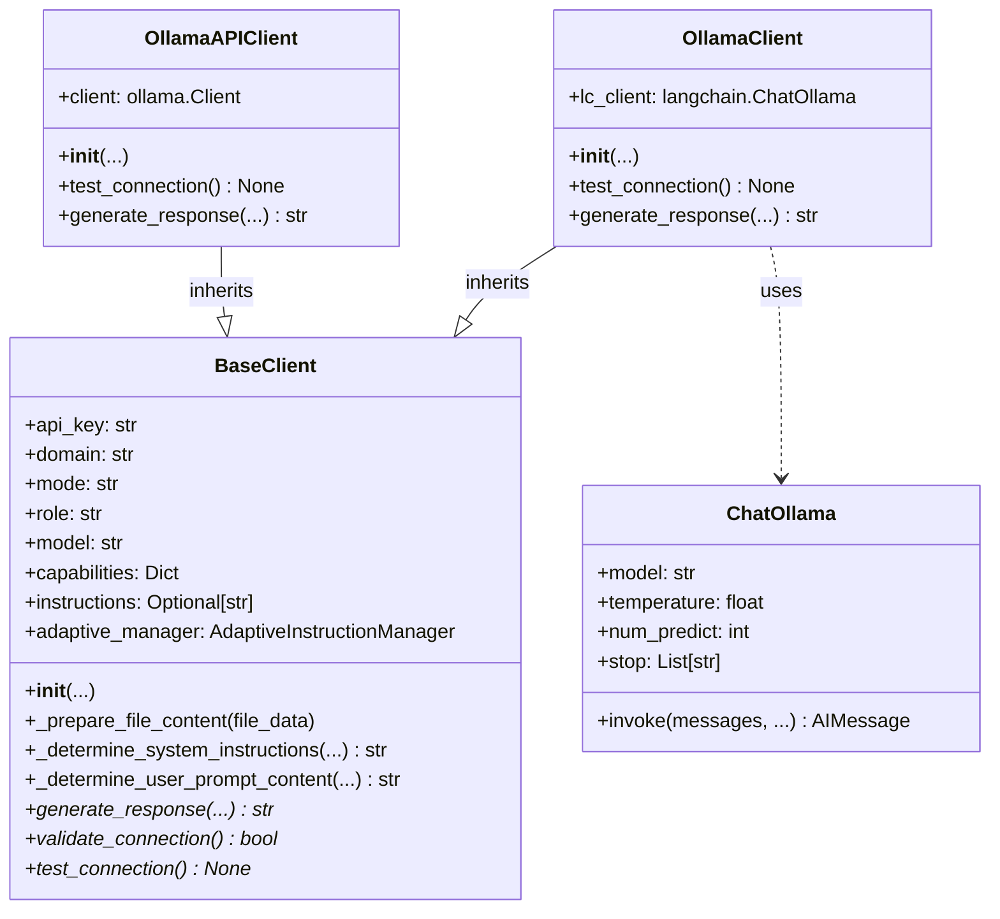

# Design Plan: Ollama LangChain Client Integration

## 1. Goal

To implement an alternative Ollama client (`OllamaClient`) within `model_clients.py` that utilizes the LangChain library (`langchain.chat_models.ChatOllama`) instead of directly using the `ollama` library API. The existing client will be renamed to `OllamaAPIClient` for comparison and fallback purposes.

## 2. Motivation

*   **Leverage LangChain:** Utilize LangChain's abstractions for chat models, prompt templating, and potentially memory management, which might simplify the client implementation and integration with other LangChain components in the future.
*   **Standardization:** Align the Ollama client more closely with potential LangChain patterns used elsewhere.
*   **Comparison:** Allow for direct comparison between the direct API approach (`OllamaAPIClient`) and the LangChain approach (`OllamaClient`).

## 3. Proposed Changes

### 3.1. Rename Existing Client

The current `OllamaClient` class (lines 2590-2757 in `model_clients.py`) will be renamed to `OllamaAPIClient`. Its functionality will remain unchanged.

### 3.2. New `OllamaClient` Implementation (LangChain-based)

A new class named `OllamaClient` will be created, inheriting from `BaseClient`.



**Key Implementation Details:**

*   **Dependencies:** Import `ChatOllama` and message types (`SystemMessage`, `HumanMessage`, `AIMessage`) from `langchain_community.chat_models` and `langchain_core.messages` respectively.
*   **`__init__(self, mode, domain, role=None, model="phi4:latest")`:**
    *   Call `super().__init__(...)`.
    *   Instantiate `ChatOllama`:
        ```python
        from langchain_community.chat_models import ChatOllama
        # Inside __init__
        self.lc_client = ChatOllama(
            model=self.model,
            temperature=0.7, # Default temperature, can be overridden per request
            # Add other default options if needed, e.g., num_ctx
        )
        ```
*   **`test_connection(self)`:**
    *   Implement a basic check, potentially by invoking the client with a simple prompt like "Hi".
    ```python
    try:
        self.lc_client.invoke("Hi")
        logger.info("Ollama (LangChain) connection test successful")
        return True
    except Exception as e:
        logger.error(f"Ollama (LangChain) connection test failed: {e}")
        return False
    ```
*   **`generate_response(self, prompt, system_instruction=None, history=None, file_data=None, model_config=None, mode=None, role=None)`:**
    *   **Instructions & Prompt:** Use `self._determine_system_instructions(...)` and `self._determine_user_prompt_content(...)` from `BaseClient` to get the final system instructions and user prompt text.
    *   **Message Formatting:**
        *   Create a list `lc_messages`.
        *   Add `SystemMessage(content=current_instructions)` if instructions exist.
        *   Convert `history` (list of dicts) into a list of `HumanMessage` and `AIMessage` objects, mapping roles (`human` -> `user`).
        *   Append history messages to `lc_messages`.
        *   **Multimodal Handling:**
            *   Prepare the content for the final `HumanMessage`. If `file_data` (image/video frames) is present:
                *   Extract base64 image data.
                *   Construct the content as a list: `[{"type": "text", "text": final_prompt_content}, {"type": "image_url", "image_url": {"url": "data:image/jpeg;base64,..."}}]`. Handle multiple images/frames by adding more `image_url` dictionaries.
            *   If no `file_data`, content is just `final_prompt_content` (string).
        *   Append the final `HumanMessage(content=...)` to `lc_messages`.
    *   **Configuration:**
        *   Create a dictionary `request_options` from `model_config` if provided (e.g., `temperature`, `stop_sequences` mapped to `stop`, `max_tokens` mapped to `num_predict`).
    *   **Invocation:**
        ```python
        # Inside generate_response
        try:
            response = self.lc_client.invoke(
                lc_messages,
                **request_options # Pass temperature, num_predict, stop etc.
            )
            return response.content
        except Exception as e:
            logger.error(f"Ollama (LangChain) generate_response error: {e}")
            return f"Error generating response: {e}"
        ```

### 3.3. Feature Parity

*   **Multimodal:** Handled by constructing `HumanMessage` content as a list including text and base64 encoded `image_url` data, which `ChatOllama` supports. Video frames are treated as images.
*   **Conversation History:** Handled by converting the `history` list into LangChain message objects before passing them to `invoke`.
*   **System Prompts:** Handled by passing a `SystemMessage` as the first element in the message list to `invoke`.
*   **Configuration (`ModelConfig`):** Parameters from `ModelConfig` will be extracted and passed as keyword arguments to `ChatOllama.invoke()`.

## 4. Example Snippet (New `OllamaClient.generate_response`)

```python
from langchain_community.chat_models import ChatOllama
from langchain_core.messages import SystemMessage, HumanMessage, AIMessage
from typing import List, Dict, Optional, Any
import logging

logger = logging.getLogger(__name__)

# Inside the new OllamaClient class (assuming it inherits from BaseClient and ModelConfig is defined)
# class OllamaClient(BaseClient):
#     def __init__(self, mode: str, domain: str, role: str = None, model: str = "phi4:latest"):
#         super().__init__(mode=mode, api_key="", domain=domain, model=model, role=role)
#         self.lc_client = ChatOllama(model=self.model, temperature=0.7) # Example init

def generate_response(self, prompt: str, system_instruction: str = None, history: List[Dict[str, str]] = None, file_data: Any = None, model_config: Optional['ModelConfig'] = None, mode: str = None, role: str = None) -> str:
    if role: self.role = role
    if mode: self.mode = mode
    history = history if history is not None else []

    # Assuming ModelConfig is available or imported
    if model_config is None:
        # Replace ModelConfig() with how it's actually instantiated/accessed
        # For example, if it's a class attribute or passed differently
        from configdataclasses import ModelConfig # Assuming it's here
        model_config = ModelConfig()


    current_instructions = self._determine_system_instructions(system_instruction, history, role, mode)
    final_prompt_content = self._determine_user_prompt_content(prompt, history, role, mode)

    lc_messages = []
    if current_instructions:
        lc_messages.append(SystemMessage(content=current_instructions))

    for msg in history:
        if msg.get("role") in ["user", "human"]:
            lc_messages.append(HumanMessage(content=msg["content"]))
        elif msg.get("role") == "assistant":
            lc_messages.append(AIMessage(content=msg["content"]))

    # Prepare final user message content (text + optional images)
    user_message_content = []
    user_message_content.append({"type": "text", "text": final_prompt_content})

    images_base64 = []
    if file_data:
        processed_files = file_data if isinstance(file_data, list) else [file_data]
        for item in processed_files:
            if isinstance(item, dict):
                if item.get("type") == "image" and "base64" in item:
                    images_base64.append(item["base64"])
                elif item.get("type") == "video" and "key_frames" in item:
                    images_base64.extend([f["base64"] for f in item.get("key_frames", [])])

    for img_b64 in images_base64:
         # Assuming JPEG for simplicity, might need mime_type from file_data
         user_message_content.append({
             "type": "image_url",
             "image_url": {"url": f"data:image/jpeg;base64,{img_b64}"}
         })

    # If only text, content should be string, otherwise list
    final_user_content = user_message_content if len(user_message_content) > 1 else user_message_content[0]["text"]
    lc_messages.append(HumanMessage(content=final_user_content))


    # Prepare request options from model_config
    request_options = {}
    if model_config:
        if model_config.temperature is not None:
            request_options["temperature"] = model_config.temperature
        if model_config.max_tokens is not None:
            # LangChain's ChatOllama uses num_predict for max tokens
            request_options["num_predict"] = model_config.max_tokens
        if model_config.stop_sequences:
            request_options["stop"] = model_config.stop_sequences
        # Add other relevant options from ModelConfig if needed (e.g., seed)
        if hasattr(model_config, 'seed') and model_config.seed is not None:
             request_options["seed"] = model_config.seed


    try:
        logger.debug(f"--- Ollama (LangChain) Request ---")
        logger.debug(f"Model: {self.model}")
        logger.debug(f"Messages: {[m.to_json() for m in lc_messages]}") # Log serializable messages
        logger.debug(f"Options: {request_options}")

        # Ensure lc_client is initialized
        if not hasattr(self, 'lc_client') or self.lc_client is None:
             self.lc_client = ChatOllama(model=self.model, temperature=0.7) # Re-init if needed

        response = self.lc_client.invoke(lc_messages, **request_options)
        return response.content
    except Exception as e:
        logger.error(f"Ollama (LangChain) generate_response error: {e}", exc_info=True)
        # Consider more specific error handling or re-raising
        return f"Error generating response via LangChain: {e}"