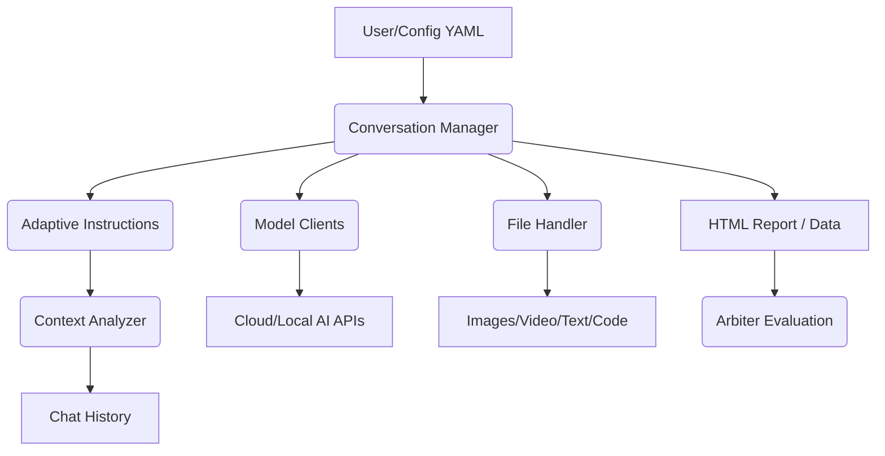
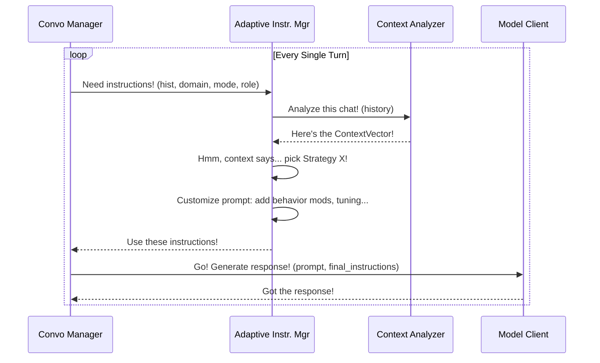

# Supercharging AI Chats: The Adaptive Multi-Model Framework

## TL;DR (Abstract)

Let's face it: most AI chats are stuck in the mud thanks to static system prompts. They just don't *adapt*. We built this framework to fix that, enabling **smarter AI through adaptive, iterative conversation, context, and role-management**. The secret sauce? Our **Adaptive Instruction System** fueled by real-time **Context Analysis**, dynamically tuning the guidance for *each* AI turn-by-turn. This thing juggles a whole zoo of AI models (cloud APIs, local heroes running on your machine), munches on multi-modal inputs (yeah, **full video analysis** included), and even lets AIs convincingly play human roles. Plus, we've got the **Arbiter** – an objective AI ref – to measure quality and fact-check claims. The kicker? Our experiments show that smart conversation structure can boost AI reasoning more than just throwing bigger models at the problem. Size isn't everything!

## 1. Static Prompts are SO Last Season

LLMs? Awesome potential. Getting them to hold a *real*, evolving conversation? That's the hard part. The old way – slapping a static system prompt on at the start – just doesn't cut it. Why?

*   **Clueless on Context:** Static prompts are blind to how the chat's actually going. Topic shifts? New goals? Nope, same old instructions.
*   **Drift King:** Without a dynamic hand on the tiller, chats wander off, repeat themselves, or just fizzle out.
*   **One-Trick Pony:** The AI's stuck in one mode. Need it to switch gears? Tough luck.
*   **Shallow Waters:** You can't dive deep if the initial prompt didn't pack scuba gear.

If you want LLMs for the heavy lifting – real research, deep analysis, complex problem-solving – you need a system that actively manages the flow, tweaks the AI's role on the fly, and steers towards *better* results. That's what we built.

## 2. Framework Overview: The Engine Room for Smarter AI Chats

Think of this framework as the conductor for an AI orchestra. It's built to handle complex, multi-turn dialogues and push AI performance beyond the usual limits. The goal isn't just talking; it's about boosting reasoning, coherence, and getting stuff *done* through smarter, adaptive conversation management.

**The Core Toolkit:**

*   **Conversation Manager:** The main brain, juggling the chat flow, models, and state.
*   **Model Clients:** Plug-and-play adapters for tons of models (Claude, Gemini, OpenAI, Ollama, MLX – we got 'em). Handles the messy API details.
*   **Config System:** Flexible YAML configs to set up your battles – define models, roles, personas, goals, input files. Easy peasy.
*   **File Handler:** The multi-modal powerhouse. Feeds images, *entire videos* (not just frames!), text, and code to the models that can handle them.
*   **Context Analysis (`ContextAnalyzer`):** The real-time dashboard. Constantly checks the chat's pulse (`ContextVector`) – Is it coherent? On topic? Too complex? Confident?
*   **Adaptive Instructions (`AdaptiveInstructionManager`):** This is the **core magic**. Uses the `ContextVector` to cook up custom system prompts and behavioral nudges for *every single turn*.
*   **Arbiter:** The unbiased judge. Scores the conversation, compares models, and uses Google Search to fact-check claims. No more guessing if it actually worked well.

**The Flow:**

It's a feedback loop, baby! The chat's state directly influences the next set of instructions, making the whole thing smarter as it goes.

## 3. The Secret Sauce: Adaptive Instructions & Real-Time Context

Static prompts are out. **Meta-cognitive prompting** is in. This framework's superpower comes from the `ContextAnalyzer` and `AdaptiveInstructionManager` working together like a finely tuned pit crew.

**`ContextAnalyzer`: Reading the Room**
Before an AI even thinks about responding, the `ContextAnalyzer` scans the recent chat history. It spits out a `ContextVector` – a snapshot of the conversation's vibe using metrics like:
*   `semantic_coherence`: Is this chat making sense or just word salad?
*   `topic_evolution`: Are we still talking about the main thing?
*   `response_patterns`: Is it asking questions? Challenging? Agreeing?
*   `engagement_metrics`: Is one side hogging the mic?
*   `cognitive_load`: Is this getting too dense? Brain overload?
*   `knowledge_depth`: How deep are we diving? Is it expert-level talk?
*   `reasoning_patterns`: What kind of logic is being used? Deductive? Causal?
*   `uncertainty_markers`: How sure does the AI sound? Too much "maybe"?
(Wanna geek out on the details? Check `docs/adaptive_instruction_deep_dive.md`)

**`AdaptiveInstructionManager`: The AI Whisperer**
This manager grabs the `ContextVector` and crafts the *perfect* system prompt for the next turn. Here’s how:
1.  **Picking a Strategy:** Based on those metrics, the goal, and the mode (`human-ai` vs `ai-ai`), it picks a game plan. Low coherence? Time for a `structured` approach. High knowledge depth? Let's get `critical`. Got a `GOAL:` prefix? Switch to "just do it" mode.
2.  **Layering on the Guidance:** It doesn't stop there. It layers on specific instructions:
    *   **Behavior Mods:** Super detailed nudges, especially for the "Human" role. Tells the AI *how* to act human – challenge assumptions, show curiosity, avoid saying "As an AI...", use specific prompt tricks.
    *   **Metric Tuning:** Got high uncertainty? The prompt gets tweaked: "Ask for clarification!". Low logic score? "Use more deductive reasoning!".
    *   **Rules & Regs:** Reminders about output format (clean HTML!), using `<thinking>` tags, and staying within token limits.

**The Turn-by-Turn Loop:**

This isn't just prompting; it's active conversation shaping. It pushes for deeper chats, keeps things on track, enforces personas, and gets way better results than just setting and forgetting.

## 4. The Arbiter: Keeping It Real & Measuring What Matters

How do you *know* if one model chat was better than another? Or if your prompting strategy actually worked? Enter the **Arbiter** (`arbiter_v4.py`) – the framework's built-in reality check.

**Purpose:**
Think of the Arbiter as the impartial referee for your AI conversations. It dissects the final transcript, giving you the lowdown on what actually happened and how well the AIs performed.

**What it Does (The Cool Parts):**
*   **Deep Dive Evaluation:** Goes way beyond "looks good". It scores the chat on multiple axes: coherence, depth, relevance, goal completion, topic development.
*   **Fact-Checking with Google:** Got factual claims? The `AssertionGrounder` uses Google Search to check 'em. Adds a much-needed layer of credibility. ✅
*   **Model vs. Model Showdowns:** Lets you compare different runs directly. Was Claude better than Gemini for this task? Did changing the persona help? The Arbiter gives you data.
*   **Role Performance Scores:** Rates the "Human" and "Assistant" roles separately. How good was the prompting? How well did the assistant follow?
*   **Sweet Reports:** Spits out structured reports (JSON or baked into the HTML output) with scores, analysis, strengths/weaknesses, and even charts showing how things like coherence changed over time.

**Why it Matters:**
The Arbiter turns subjective "feelings" about a conversation into objective data. It shows you *what* works, helps you fine-tune your prompts and model choices, and proves the impact of the adaptive system. Check out `docs/architecture-performance-review-sonnet.md` for examples of its analysis in action.

## 5. What's Under the Hood? Features & Capabilities

This framework is packed with goodies for serious AI wrangling:

*   **Model Playground:** Works with pretty much everything you'd want:
    *   **Cloud Kings:** Anthropic (Claude 3.x, Claude 3.7 + Reasoning), Google (Gemini family), OpenAI (GPT-4o, O1/O3 + Reasoning).
    *   **Local Heroes:** Ollama (Llama 3.1, Gemma3, Phi-4, Llava vision), MLX on Apple Silicon, LMStudio via OpenAI API, anything with a Llama.cpp endpoint. Mix and match!
*   **Beyond Text - Multi-Modal Madness:**
    *   **Images:** Handles common formats, resizes smartly, encodes correctly.
    *   **Video:** This is big – **processes the *entire* video**, not just sample frames. Chunks it, adjusts framerate, analyzes sequentially. Works with Gemini & Ollama vision models. Converts MOV to MP4 automatically. 🎬
    *   **Text & Code:** Reads your docs, scripts, data files. Chunks large ones, highlights syntax.
*   **Conversation Control Freak:**
    *   **Roles:** Define 'Human' (often the prompter) and 'Assistant'. Great for setting up specific dynamics.
    *   **Modes:** Dial in the interaction style: `human-ai`, `ai-ai` (peer-to-peer AI smackdown!), `no-meta-prompting` (vanilla mode).
    *   **YAML Configs:** Set up complex scenarios easily. Define models, detailed personas, goals, input files, timeouts – the works. See `docs/configuration.md`.
    *   **Reasoning Knobs:** For Claude 3.7 & OpenAI O1/O3, you can explicitly tell them *how much* reasoning to show (`high`, `medium`, `low`, `none`, `auto`). See `docs/reasoning-models.md`.
*   **Outputs & Insights:**
    *   Clean HTML transcripts that are actually readable.
    *   Visualizes the AI's internal `<thinking>` steps.
    *   Integrates the Arbiter's detailed metrics and analysis right into the reports.

## 6. Show Me the Money! Use Cases & Performance Wins

Okay, theory's cool, but what can you *do* with it? And does it actually work? Yep.

**Real-World Scenarios (Check `examples/configs`):**
*   **AI Pair Programming (`code_review.yaml`):** Get multiple AIs to critique code for quality, bugs, and security flaws.
*   **Vision & Medical Insights (`medical_analysis.yaml`, `vision_discussion.yaml`, `multi_file_vision_discussion.yaml`):** Have AIs analyze MRI scans (from video!), cat behavior videos, or other images using specialized personas and multi-modal power. Full video analysis is key here.
*   **Design Debates (`architecture_review.yaml`):** Let AI agents evaluate your system architecture docs for scalability, security, etc.
*   **Reasoning Rumble (`reasoning_comparison.yaml`):** Pit models with different reasoning levels against each other in philosophical debates. See how explicit reasoning changes the game.

**Performance Highlights (The Juicy Bits from the Docs):**
*   **The "Human" AI Rocks:** Giving one AI a sophisticated "Human" meta-prompt consistently makes the *entire* conversation better. It leads, probes, and reasons more effectively than the "Assistant," no matter which base model is used.
*   **Brains > Brawn (Sometimes):** We've seen tiny local models like Phi-4 (14B) and Gemma3 (4B) hold their own or even *outperform* giants like Claude Haiku 3.5 when given the structured "Human" role. **How you prompt can matter more than model size!**
*   **Level Up Reasoning:** The adaptive system demonstrably makes *both* AIs reason better. They challenge assumptions, refine arguments, and reach deeper insights. The German Reunification example (Gemini Flash flipping GPT-4o's stance) is a wild case study of this.
*   **Measurable Quality Boost:** The Arbiter consistently shows big jumps (40-50%+) in coherence, depth, and density metrics when using the adaptive system vs. basic prompting. Focused chats beat broad ones.

## 7. Why This Matters & What's Next

This isn't just another chatbot framework. It's a step towards something more interesting:

**Significance:**
*   **Better Conversations:** It's a practical way to get more out of AI dialogues, moving past static prompt limits.
*   **Understanding AI Minds:** It's a sandbox for studying how different AIs reason, argue, and collaborate under controlled, dynamic conditions.
*   **Shaking Up Benchmarks:** Challenges the idea that bigger = better. Shows that *interaction quality* and *adaptability* are key metrics we've been ignoring. How well can an AI *dialogue* and *reason dynamically*? That's the real test.
*   **Power Tool for Pros:** Gives researchers, devs, and experts a way to use multiple AIs together for tough tasks needing analysis, creativity, or deep dives.

**The Roadmap:**
We're just getting started. The modular design means we can keep adding cool stuff:
*   **Smarter Analytics:** More real-time metrics, better comparison dashboards, slicker visualizations in the Arbiter.
*   **Memory Upgrades:** Context pruning, summarization, maybe even knowledge graphs to handle epic-length chats without choking.
*   **Auto-Pilot Strategies:** Using ML to figure out the *best* adaptive prompting strategy for a given situation, learning over time.
*   **Better UI:** Making the Streamlit UI (mentioned in README) even better for setup, monitoring, and maybe even live human intervention.
*   **Plugin Power:** Opening it up so folks can easily plug in their own custom models, analysis tools, or metrics.
*   **Self-Tuning:** Letting the framework automatically tweak model params or adaptive strategies based on Arbiter feedback.

## 8. The Bottom Line

This framework is your toolkit for building AI conversations that don't suck. By ditching static prompts and embracing real-time context analysis with adaptive instructions, we're making AI interactions smarter, more coherent, and more effective. The results show that *how* you structure the dialogue can unlock reasoning power you didn't know was there, even in smaller models. It's time to move beyond basic chatbots and build AI dialogues that can actually *think* and *collaborate*. Let's build something cool.