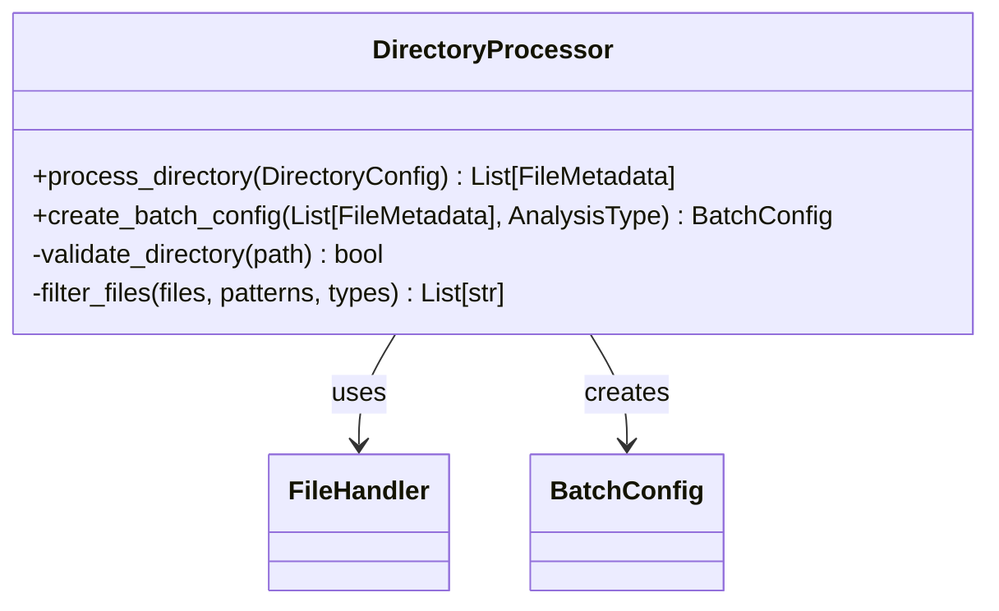
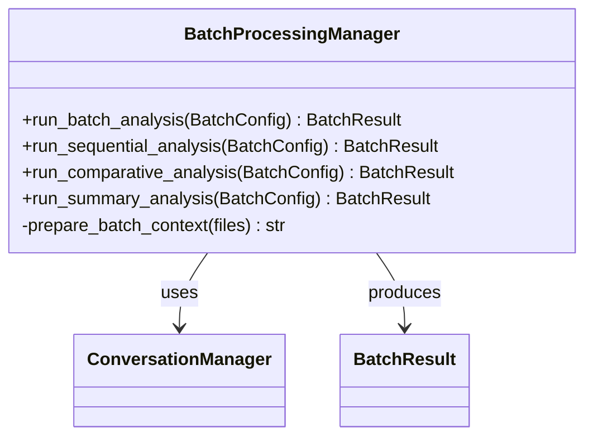
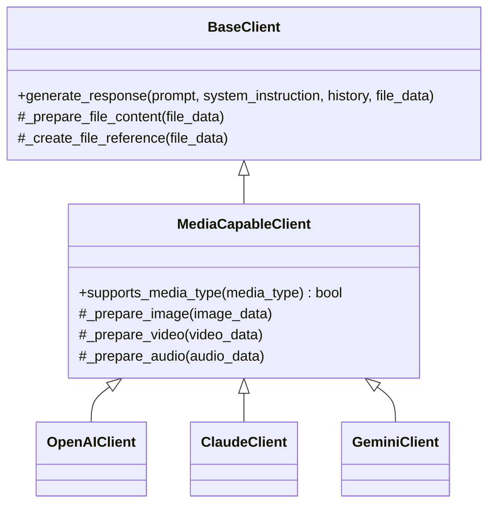
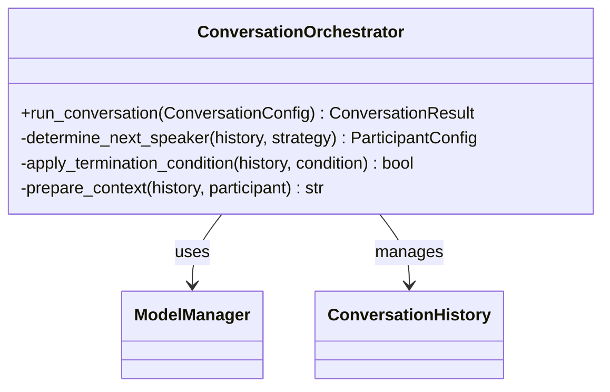
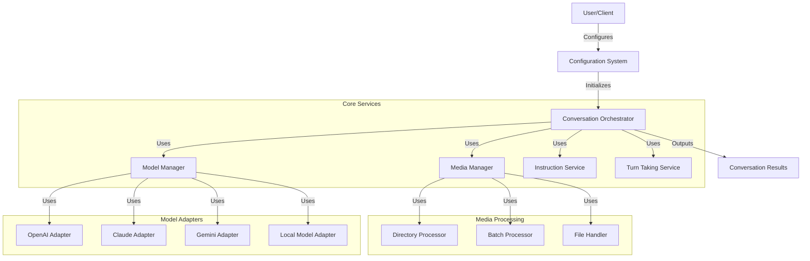

# Extension Plan: Enhancing the AI Battle Framework

Based on the architectural analysis and your specific priorities, this plan focuses on extending the framework to support:

1. Customized analyses over entire directories of images/videos
2. Image support for OpenAI and Anthropic models
3. Multi-agent conversations (beyond 2 participants)

## 1. Directory-Based Media Analysis

### Current Limitations

The current framework is designed primarily for single-file analysis:

```python
# Current approach in run_vision_discussion.py
file_config = FileConfig(
    path=file_path,
    type=file_metadata.type,
    max_resolution="512x512"
)
```

The `ConversationManager` processes one file at a time, and there's no built-in mechanism for batch processing or directory traversal.

### Proposed Solution

#### 1.1 Extended Configuration Schema

Create a new configuration class for directory-based analysis:

```python
@dataclass
class DirectoryConfig:
    """Configuration for directory-based media analysis."""
    path: str
    file_types: List[str]  # e.g., ["image", "video"]
    file_patterns: Optional[List[str]] = None  # e.g., ["*.jpg", "*.mp4"]
    recursive: bool = False
    max_files: Optional[int] = None
    max_resolution: Optional[str] = None
    analysis_type: str = "sequential"  # "sequential", "comparative", "summary"
```

#### 1.2 Directory Processor Component

Create a new component to handle directory processing:



#### 1.3 Batch Processing Manager

Create a component to manage batch processing of files:



#### 1.4 Configuration Integration

Extend the YAML configuration schema to support directory-based analysis:

```yaml
discussion:
  # Existing fields...
  
  # New fields for directory analysis
  input_directory:
    path: "./examples/brain_scans/"
    file_types: ["image", "video"]
    file_patterns: ["*.jpg", "*.mp4"]
    recursive: true
    max_files: 10
    max_resolution: "512x512"
    analysis_type: "comparative"
  
  # Analysis configuration
  analysis_config:
    comparison_method: "sequential"  # "sequential", "pairwise", "all-at-once"
    summary_required: true
    output_format: "html"  # "html", "markdown", "json"
```

#### 1.5 Implementation Steps

1. Create the `DirectoryConfig` and `BatchConfig` data classes
2. Implement the `DirectoryProcessor` component
3. Implement the `BatchProcessingManager` component
4. Extend the configuration parser to handle directory configurations
5. Update the main execution flow to support batch processing

## 2. Image Support for OpenAI and Anthropic Models

### Current Limitations

The current implementation has limited support for image processing in OpenAI and Anthropic models:

```python
# In model_clients.py
class OpenAIClient(BaseClient):
    # Limited image handling capabilities
    
class ClaudeClient(BaseClient):
    # Limited image handling capabilities
```

### Proposed Solution

#### 2.1 Enhanced Model Client Architecture

Refactor the model client architecture to better support different media capabilities:



#### 2.2 OpenAI Image Support

Enhance the OpenAI client to properly handle images:

```python
class OpenAIClient(MediaCapableClient):
    def _prepare_image(self, image_data):
        """Prepare image data for OpenAI API."""
        # Convert to base64 if needed
        if "base64" in image_data:
            return {
                "type": "image_url",
                "image_url": {
                    "url": f"data:{image_data.get('mime_type', 'image/jpeg')};base64,{image_data['base64']}",
                    "detail": "high"
                }
            }
        elif "url" in image_data:
            return {
                "type": "image_url",
                "image_url": {
                    "url": image_data["url"],
                    "detail": "high"
                }
            }
        return None
        
    def generate_response(self, prompt, system_instruction=None, history=None, file_data=None):
        """Generate response with image support."""
        messages = []
        
        # Add system message if provided
        if system_instruction:
            messages.append({"role": "system", "content": system_instruction})
            
        # Add history messages
        if history:
            for msg in history:
                messages.append({"role": msg["role"], "content": msg["content"]})
        
        # Handle file data (images)
        if file_data and file_data.get("type") == "image":
            image_content = self._prepare_image(file_data)
            if image_content:
                messages.append({
                    "role": "user",
                    "content": [
                        {"type": "text", "text": prompt},
                        image_content
                    ]
                })
            else:
                messages.append({"role": "user", "content": prompt})
        else:
            messages.append({"role": "user", "content": prompt})
            
        # Call OpenAI API
        response = self.client.chat.completions.create(
            model=self.model,
            messages=messages,
            temperature=0.7,
            max_tokens=1024
        )
        
        return response.choices[0].message.content
```

#### 2.3 Claude Image Support

Enhance the Claude client to properly handle images:

```python
class ClaudeClient(MediaCapableClient):
    def _prepare_image(self, image_data):
        """Prepare image data for Claude API."""
        if "base64" in image_data:
            return {
                "type": "image",
                "source": {
                    "type": "base64",
                    "media_type": image_data.get("mime_type", "image/jpeg"),
                    "data": image_data["base64"]
                }
            }
        elif "url" in image_data:
            return {
                "type": "image",
                "source": {
                    "type": "url",
                    "url": image_data["url"]
                }
            }
        return None
        
    def generate_response(self, prompt, system_instruction=None, history=None, file_data=None):
        """Generate response with image support."""
        messages = []
        
        # Add system message if provided
        if system_instruction:
            messages.append({
                "role": "system",
                "content": system_instruction
            })
            
        # Add history messages
        if history:
            for msg in history:
                if msg["role"] == "system":
                    continue  # Already added system message
                messages.append({
                    "role": msg["role"],
                    "content": msg["content"]
                })
        
        # Handle file data (images)
        if file_data and file_data.get("type") == "image":
            image_content = self._prepare_image(file_data)
            if image_content:
                messages.append({
                    "role": "user",
                    "content": [
                        {"type": "text", "text": prompt},
                        image_content
                    ]
                })
            else:
                messages.append({
                    "role": "user",
                    "content": prompt
                })
        else:
            messages.append({
                "role": "user",
                "content": prompt
            })
            
        # Call Claude API
        response = self.client.messages.create(
            model=self.model,
            messages=messages,
            max_tokens=1024
        )
        
        return response.content[0].text
```

#### 2.4 Implementation Steps

1. Create the `MediaCapableClient` abstract class
2. Enhance the OpenAI client with proper image support
3. Enhance the Claude client with proper image support
4. Update the model capability detection to accurately reflect image support
5. Add tests for image processing with different model providers

## 3. Multi-Agent Conversations

### Current Limitations

The current framework is designed primarily for two-agent conversations:

```python
# In ai-battle.py
def run_conversation(self,
                    initial_prompt: str,
                    human_model: str,
                    ai_model: str,
                    mode: str,
                    human_system_instruction: str=None,
                    ai_system_instruction: str=None,
                    rounds: int = 1) -> List[Dict[str, str]]:
    # Only supports two models: human_model and ai_model
```

### Proposed Solution

#### 3.1 Extended Conversation Configuration

Create a more flexible conversation configuration that supports multiple participants:

```python
@dataclass
class ParticipantConfig:
    """Configuration for a conversation participant."""
    model: str
    role: str  # "initiator", "responder", "observer", "moderator", etc.
    system_instruction: Optional[str] = None
    persona: Optional[str] = None
    participation_pattern: str = "sequential"  # "sequential", "conditional", "random"
    
@dataclass
class ConversationConfig:
    """Configuration for multi-agent conversations."""
    participants: List[ParticipantConfig]
    initial_prompt: str
    mode: str
    rounds: int = 1
    turn_taking_strategy: str = "round_robin"  # "round_robin", "dynamic", "moderator_controlled"
    termination_condition: Optional[str] = None
```

#### 3.2 Conversation Orchestrator

Create a new component to orchestrate multi-agent conversations:



#### 3.3 Turn Taking Strategies

Implement different turn-taking strategies:

```python
class TurnTakingStrategy:
    """Base class for turn taking strategies."""
    def determine_next_speaker(self, history, participants):
        """Determine the next speaker based on history and participants."""
        raise NotImplementedError()
        
class RoundRobinStrategy(TurnTakingStrategy):
    """Simple round-robin turn taking."""
    def determine_next_speaker(self, history, participants):
        if not history:
            return participants[0]  # Start with first participant
        
        last_speaker_idx = next(
            (i for i, p in enumerate(participants) 
             if p.model == history[-1]["model"]),
            -1
        )
        
        next_idx = (last_speaker_idx + 1) % len(participants)
        return participants[next_idx]
        
class DynamicStrategy(TurnTakingStrategy):
    """Dynamic turn taking based on conversation context."""
    def determine_next_speaker(self, history, participants):
        # Analyze context to determine most appropriate next speaker
        context = self._analyze_context(history)
        scores = {p.model: self._calculate_relevance(p, context) for p in participants}
        return max(participants, key=lambda p: scores[p.model])
        
    def _analyze_context(self, history):
        # Analyze recent conversation history
        pass
        
    def _calculate_relevance(self, participant, context):
        # Calculate how relevant a participant is given the context
        pass
```

#### 3.4 Configuration Integration

Extend the YAML configuration schema to support multi-agent conversations:

```yaml
discussion:
  # Participants configuration
  participants:
    - model: "claude-3-sonnet"
      role: "initiator"
      system_instruction: "You are a medical expert specializing in radiology."
      participation_pattern: "sequential"
    
    - model: "gemini-pro-vision"
      role: "responder"
      system_instruction: "You are a neurologist specializing in epilepsy."
      participation_pattern: "sequential"
      
    - model: "gpt-4o"
      role: "observer"
      system_instruction: "You are a medical researcher observing the conversation."
      participation_pattern: "conditional"
      
  # Conversation configuration
  initial_prompt: "Analyze the provided brain scan video sequence..."
  mode: "multi-agent"
  rounds: 5
  turn_taking_strategy: "round_robin"
  termination_condition: "consensus_reached"
```

#### 3.5 Implementation Steps

1. Create the `ParticipantConfig` and `ConversationConfig` data classes
2. Implement the `ConversationOrchestrator` component
3. Implement different turn-taking strategies
4. Extend the configuration parser to handle multi-agent configurations
5. Update the main execution flow to support multi-agent conversations

## 4. Integration Plan

To ensure these extensions work together seamlessly, we need to integrate them into a cohesive system:

### 4.1 Updated Architecture



### 4.2 Implementation Phases

#### Phase 1: Foundation Refactoring
1. Refactor the model client architecture to support enhanced media capabilities
2. Implement the OpenAI and Claude image support
3. Create basic tests for image processing with different providers

#### Phase 2: Directory Processing
1. Implement the directory processor component
2. Create the batch processing manager
3. Extend the configuration system to support directory-based analysis

#### Phase 3: Multi-Agent Support
1. Implement the conversation orchestrator
2. Create turn-taking strategies
3. Extend the configuration system to support multi-agent conversations

#### Phase 4: Integration and Testing
1. Integrate all components into a cohesive system
2. Create comprehensive tests for different scenarios
3. Update documentation and examples

## 5. Example Use Cases

### 5.1 Directory-Based Medical Image Analysis

```python
# Example code for directory-based analysis
from ai_battle import ConversationManager, DirectoryConfig

# Configure directory analysis
dir_config = DirectoryConfig(
    path="./patient_scans/",
    file_types=["image", "video"],
    file_patterns=["*.jpg", "*.mp4"],
    recursive=True,
    max_files=10,
    analysis_type="comparative"
)

# Initialize manager
manager = ConversationManager()

# Run batch analysis
results = manager.run_directory_analysis(
    dir_config=dir_config,
    initial_prompt="Compare these brain scans and identify any abnormalities",
    models=["claude-3-sonnet", "gemini-pro-vision"],
    mode="ai-ai",
    rounds=3
)

# Save results
manager.save_batch_results(results, "patient_analysis.html")
```

### 5.2 Multi-Agent Medical Consultation

```python
# Example code for multi-agent conversation
from ai_battle import ConversationManager, ParticipantConfig, ConversationConfig

# Configure participants
participants = [
    ParticipantConfig(
        model="claude-3-sonnet",
        role="radiologist",
        system_instruction="You are a radiologist specializing in brain MRI."
    ),
    ParticipantConfig(
        model="gemini-pro-vision",
        role="neurologist",
        system_instruction="You are a neurologist specializing in epilepsy."
    ),
    ParticipantConfig(
        model="gpt-4o",
        role="general_practitioner",
        system_instruction="You are a general practitioner coordinating patient care."
    )
]

# Create conversation config
conv_config = ConversationConfig(
    participants=participants,
    initial_prompt="Analyze this brain scan and develop a treatment plan",
    mode="multi-agent",
    rounds=5,
    turn_taking_strategy="round_robin"
)

# Initialize manager
manager = ConversationManager()

# Run multi-agent conversation
results = manager.run_multi_agent_conversation(
    config=conv_config,
    file_path="./patient_scan.mp4"
)

# Save results
manager.save_conversation(results, "medical_consultation.html")
```

## 6. Conclusion

This extension plan addresses your specific priorities while building on the architectural analysis:

1. **Directory-Based Analysis**: Enables processing entire directories of images/videos with customized analysis types
2. **Enhanced Image Support**: Adds proper image handling for OpenAI and Anthropic models
3. **Multi-Agent Conversations**: Supports conversations with more than 2 participants with flexible turn-taking strategies

The plan maintains the strengths of the current architecture while addressing the specific extensions you need. It provides a clear roadmap for implementation, with concrete steps and example use cases to guide development.