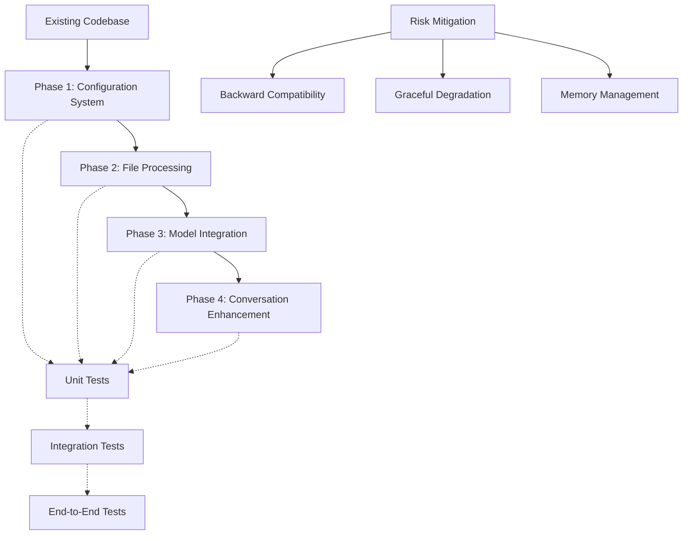

# Implementation Risk Assessment

This document evaluates the risk of implementing the configuration and vision file-based support without causing collateral damage to the existing codebase.

## Confidence Level: Moderate to High (75-80%)

The implementation can be achieved with minimal collateral damage if we follow these principles:

1. **Additive Rather Than Disruptive Changes**: Most of our changes are additive (new classes, methods, parameters) rather than modifying existing core functionality.

2. **Backward Compatibility**: The implementation maintains backward compatibility with existing code paths.

3. **Gradual Integration**: We can implement changes in phases, testing each component before integration.

## Potential Risk Areas

1. **ConversationManager Modifications**: 
   - The `run_conversation_turn` method will need parameter additions (file_data, file_reference)
   - Risk: Medium - This is a core method called throughout the codebase
   - Mitigation: Use optional parameters with defaults to maintain backward compatibility

2. **Model Client Interface Changes**:
   - Adding vision capabilities to client classes requires modifying the `generate_response` method
   - Risk: Medium - All model clients inherit from BaseClient
   - Mitigation: Implement changes in BaseClient first, then extend to specific clients

3. **Memory Management**:
   - Processing large media files could impact the existing memory optimization
   - Risk: Medium-High - The code has explicit memory management (MemoryManager)
   - Mitigation: Implement efficient file handling with proper cleanup

4. **API Compatibility**:
   - Different model providers have varying APIs for handling images/files
   - Risk: Medium - Requires careful adapter implementation
   - Mitigation: Thorough testing with each provider

## Implementation Strategy to Minimize Risk

1. **Phased Approach**:
   - Start with configuration system (lowest risk)
   - Add file processing capabilities
   - Implement model-specific vision support
   - Integrate with conversation flow

2. **Comprehensive Testing**:
   - Unit tests for each new component
   - Integration tests for file handling
   - End-to-end tests with different file types

3. **Fallback Mechanisms**:
   - Implement graceful degradation if file processing fails
   - Add capability detection to skip vision features for unsupported models

4. **Code Structure Preservation**:
   - Maintain the existing class hierarchy
   - Preserve method signatures where possible
   - Follow established patterns for memory management

## Implementation Risk Diagram

## Blind Spots and Additional Considerations

1. **File Type Handling**:
   - The system must handle not just media files (images/videos) but also code files and other text-based content
   - Different file types require different processing approaches
   - Solution: Implement comprehensive file type detection and appropriate handlers for each type

2. **Image/Video Size Limitations**:
   - Large media files could cause performance issues or exceed model context limits
   - Solution: Implement automatic resizing to a reasonable maximum (e.g., 1024x1024) using Pillow for images and appropriate tools for videos

3. **API Differences Between Providers**:
   - Each model provider (OpenAI, Anthropic, Google, Ollama) has different APIs for handling images
   - Solution: Implement adapter patterns to handle these differences transparently

4. **Efficient Image Reference in Conversation**:
   - Need to ensure the source image is available for reference in subsequent turns
   - But shouldn't duplicate the full image data in every message
   - Solution: Store image metadata in history, not the full image data

5. **Local Ollama Model Support**:
   - Only some Ollama models support vision (e.g., gemma3, llava, bakllava, moondream, llava-phi3)
   - Solution: Implement specific detection and handling for these models

## Conclusion

By following this careful approach with awareness of potential blind spots, we can implement the new features while minimizing disruption to the existing codebase. The modular nature of the current implementation works in our favor, as we can extend functionality without major rewrites.