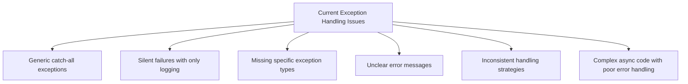
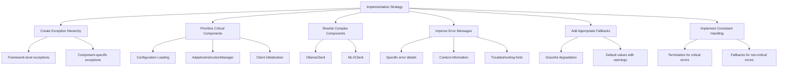
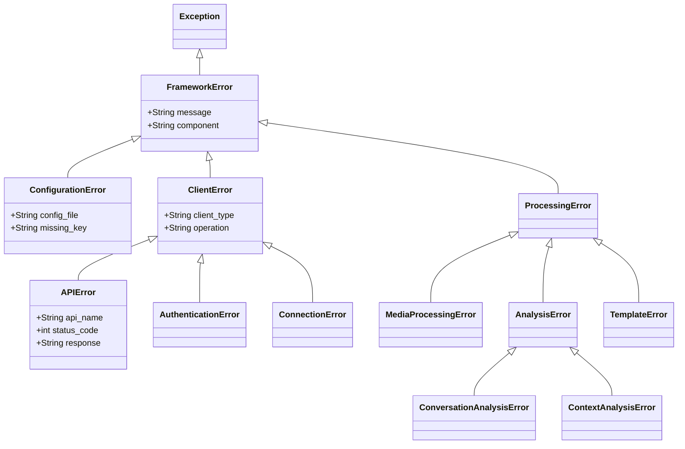
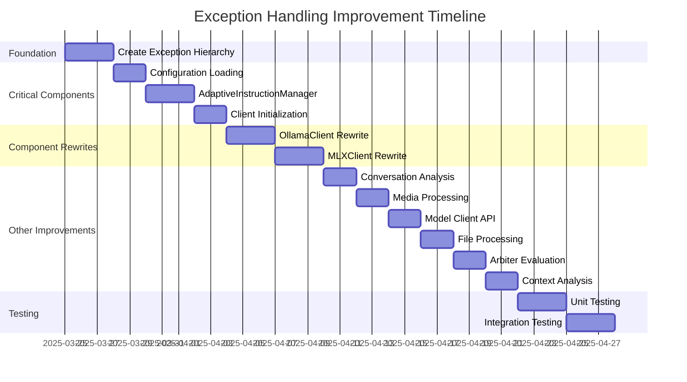

# Detailed Plan: Improving Exception Handling in Critical Areas

Based on the analysis of the codebase and our discussions, I've developed a comprehensive plan to address the most critical areas where generic exception handling could mask serious issues. This plan focuses on making exceptions more specific and meaningful, with appropriate handling strategies for different components.

## 1. Overview of Current Issues

## 2. Top 10 Critical Areas for Improvement

1. **Configuration Loading**
   - Current issue: Generic exception handling could mask missing configuration or invalid formats
   - Severity: Critical - should lead to program termination with clear error messages

2. **AdaptiveInstructionManager**
   - Current issue: Generic exception handling in template selection and customization
   - Severity: Critical - should lead to program termination for severe issues

3. **Media Processing**
   - Current issue: Generic exception handling could mask media format issues
   - Severity: High - should have fallbacks for non-critical issues, termination for critical ones

4. **Client Initialization**
   - Current issue: Generic exception handling during client initialization
   - Severity: Critical - should lead to program termination with clear error messages

5. **OllamaClient and MLXClient**
   - Current issue: Complex async code with poor error handling
   - Approach: Rewrite to be simpler and synchronous

6. **Model Client API Interactions**
   - Current issue: Generic exception handling in API calls
   - Severity: High - should have specific handling for different API errors

7. **Conversation Analysis**
   - Current issue: Generic exception handling with frequent warnings
   - Approach: Make warnings more specific about what's failing

8. **File Processing**
   - Current issue: Generic exception handling could mask file issues
   - Severity: Medium - should have fallbacks with clear warnings

9. **Arbiter Evaluation**
   - Current issue: Generic exception handling in evaluation methods
   - Severity: Medium - should have fallbacks with clear warnings

10. **Context Analysis**
    - Current issue: Generic exception handling returning default values
    - Severity: Medium - should provide more specific error information

## 3. Implementation Strategy

## 4. Detailed Implementation Plan

### 4.1 Create Exception Hierarchy

### 4.2 Critical Components Implementation

#### 4.2.1 Configuration Loading

1. Create specific exceptions:
   - `ConfigurationFileNotFoundError`
   - `ConfigurationFormatError`
   - `ConfigurationValidationError`

2. Refactor `load_config` method to catch specific exceptions:
   - File not found errors
   - YAML parsing errors
   - Validation errors

3. Improve error messages with:
   - File path information
   - Line numbers for format errors
   - Missing or invalid key information

4. Implement termination strategy:
   - Log detailed error
   - Raise specific exception
   - Let main application terminate

#### 4.2.2 AdaptiveInstructionManager

1. Create specific exceptions:
   - `TemplateSelectionError`
   - `TemplateCustomizationError`
   - `ContextAnalysisError`

2. Refactor methods to catch specific exceptions:
   - Template not found errors
   - Template formatting errors
   - Context analysis errors

3. Implement mixed handling strategy:
   - Terminate for missing templates
   - Fallback to default templates for formatting errors
   - Log detailed error information

#### 4.2.3 Client Initialization

1. Create specific exceptions:
   - `ClientInitializationError`
   - `APIKeyValidationError`
   - `ModelNotSupportedError`

2. Refactor client initialization to catch specific exceptions:
   - API key validation errors
   - Model availability errors
   - Connection errors

3. Implement termination strategy:
   - Log detailed error
   - Raise specific exception
   - Let main application terminate

### 4.3 Component Rewrites

#### 4.3.1 OllamaClient Rewrite

1. Simplify by removing async code:
   - Convert to synchronous API calls
   - Use blocking requests
   - Simplify error handling

2. Implement specific exception handling:
   - Connection errors
   - Authentication errors
   - Response parsing errors

3. Improve error messages with:
   - Request details
   - Response information
   - Troubleshooting hints

#### 4.3.2 MLXClient Rewrite

1. Simplify by removing async code:
   - Convert to synchronous API calls
   - Use blocking requests
   - Simplify error handling

2. Implement specific exception handling:
   - Connection errors
   - Model loading errors
   - Response parsing errors

3. Improve error messages with:
   - Model information
   - Request details
   - Troubleshooting hints

### 4.4 Conversation Analysis Improvements

1. Identify specific exceptions that can occur:
   - Data format errors
   - Processing errors
   - Resource availability errors

2. Make warnings more specific:
   - Include context about what's failing
   - Provide details about the data causing issues
   - Suggest potential fixes

3. Implement better fallback mechanisms:
   - Return partial results when possible
   - Clearly indicate when analysis is incomplete
   - Provide meaningful default values

### 4.5 Other Components

Similar detailed plans for:
- Media Processing
- Model Client API Interactions
- File Processing
- Arbiter Evaluation
- Context Analysis

## 5. Implementation Prioritization

## 6. Testing Strategy

1. **Unit Tests**:
   - Test each exception type
   - Test exception handling in each refactored method
   - Test fallback mechanisms

2. **Integration Tests**:
   - Test error propagation across components
   - Test system behavior under error conditions
   - Test recovery mechanisms

3. **Chaos Testing**:
   - Simulate various failure scenarios
   - Verify system behavior under stress
   - Ensure proper error handling in edge cases

## 7. Expected Outcomes

1. **Improved Reliability**: System will handle errors more gracefully
2. **Better Diagnostics**: Error messages will be more specific and helpful
3. **Consistent Handling**: Similar errors will be handled consistently
4. **Appropriate Termination**: Critical errors will lead to clean termination
5. **Graceful Degradation**: Non-critical errors will have fallback mechanisms

## 8. Guidelines for Future Development

1. **Never use bare `except:` or `except Exception:` without specific handling**
2. **Always catch specific exceptions when possible**
3. **Provide context in error messages**
4. **Use custom exceptions for domain-specific errors**
5. **Implement proper error propagation**
6. **Add fallback mechanisms for non-critical operations**
7. **Use appropriate log levels for different error types**
8. **Include debugging information in error logs**

This plan provides a comprehensive approach to improving exception handling in the most critical areas of the codebase, with a focus on making errors more specific and meaningful, and implementing appropriate handling strategies for different components.